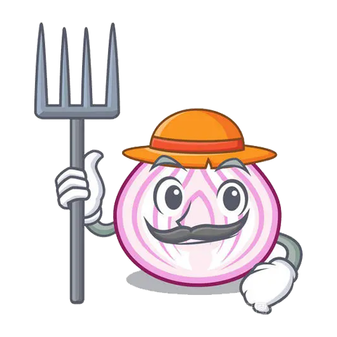
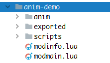
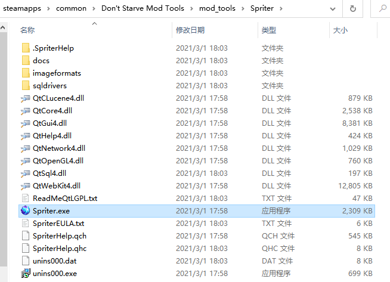
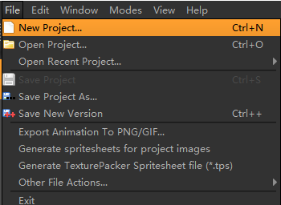
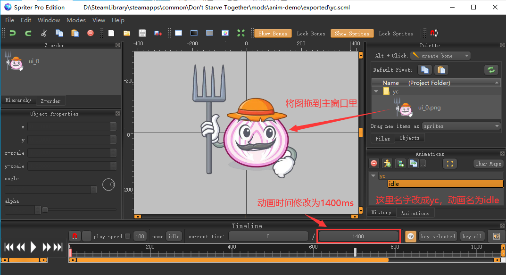
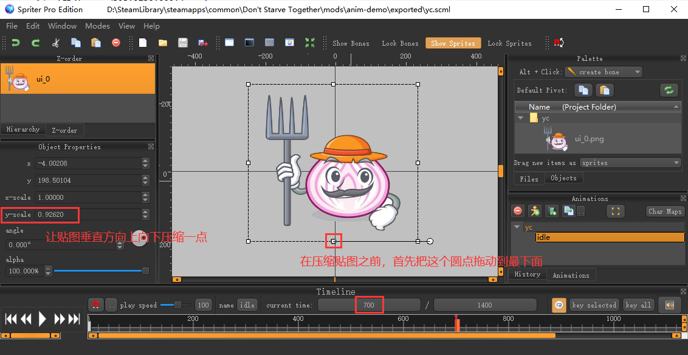
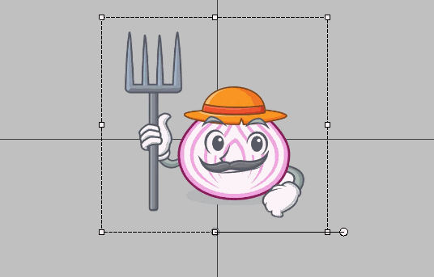
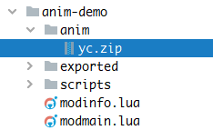
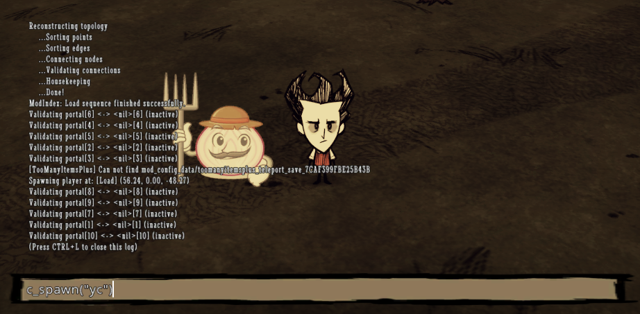
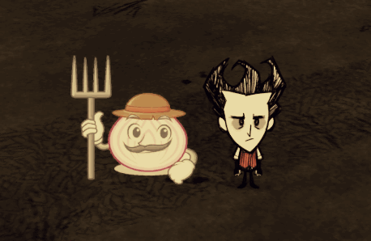

听说官方做动画用的工具不是spriter,但在 `Don't Starve Mod Tools` 里提供的做动画的工具就是 spriter，这篇来介绍一下用spriter做简单动画的方法

## 找贴图



创建mod，结构如下



在exported里创建文件夹 yc ，然后将上面贴图放在yc文件夹里

## 制作动画

找到spriter打开，位置如下



点击File -> New Project 弹窗点OK，选择mod文件夹的里的 exported 目录



定义动画名称，修改动画时间



在第700ms处鼠标点击一下，然后将贴图压缩一下



然后播放一下看看效果



制作好之后，CTRL+S 保存，命名为 `yc.scml` 保存在 exported 目录下

## 编译

双击 `Don't Starve Mod Tools` 目录下的 `mod_tools/autocompiler.exe`，执行完后，会发现在mod文件夹下出现了 anim 文件夹，里面有个 yc.zip 文件，这个就是动画文件了



## 代码

有了动画，在mod里创建一个预制体，将动画添加到预制体上，然后进行播放

创建预制体文件 `scripts/prefabs/yc.lua`

```lua
local assets = { Asset("ANIM", "anim/yc.zip") }

function fn()
    local inst = CreateEntity()

    local inst = CreateEntity() -- 创建实体
    inst.entity:AddTransform() -- 添加xyz形变对象
    inst.entity:AddAnimState() -- 添加动画状态
    inst.entity:AddNetwork() -- 添加这一行才能让所有客户端都能看到这个实体

    inst.AnimState:SetBank("yc") -- 地上动画
    inst.AnimState:SetBuild("yc") -- 材质包，就是anim里的zip包
    inst.AnimState:PlayAnimation("idle", true) -- 默认播放哪个动画 第二个参数是true表示重复播放

    if not TheWorld.ismastersim then
        return inst
    end

    -- 从这里开始可以添加一些组件来给这个预制体添加功能

    return inst
end

return Prefab("yc", fn, assets, prefabs)
```

在modmain.lua里引入mod里添加的预制体

```lua
PrefabFiles = { "yc" }
```

进游戏，通过 `c_spawn("yc")` 命令生成一个出来，看看效果





## 知识点

> 此处知识点是在看棱镜源码的时候发现的，感谢棱镜作者的注释

```lua
------------------------------------------------------
--知识点----------------------------------------------
--[[
    play的动画和push的动画结束之后都会发出animover事件，但是只有push的会发出animqueueover事件
    一旦push的动画结束，就没有动画播放了(循环播放除外)，所以animqueueover事件就代表了所有动画的播放结束
    另一个判断整个动画播放流程是否结束的方法是使用inst.AnimState:AnimDone()函数，和animqueueover事件相似
    所以如果不确定动画播放是否为播放序列或者单个动画，可以animover事件与AnimDone()函数一起使用来判断
]]----------------------------------------------------
------------------------------------------------------

------------------------------------------------------
--冰糖补充----------------------------------------------
--[[
    play会强制中断当前动画，去播放要求的动画
    push是讲要播放的动画加入后续队列，不会中断当前动画，等待当前动画结束后，才会继续队列
]]----------------------------------------------------
------------------------------------------------------
```

## 其它

```lua
inst.AnimState:SetBank("yc") -- 地上动画
inst.AnimState:SetBuild("yc") -- 材质包，就是anim里的zip包
inst.AnimState:PlayAnimation("idle", true) -- 默认播放哪个动画 第二个参数是true表示重复播放
```

这三个东西里填的东西分别对应的着spriter里的哪些名字呢？如下图


