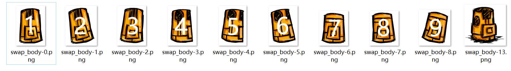
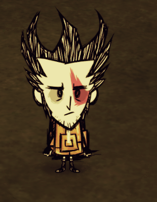

饥荒中的动画有些解包出来会有很多贴图，长的都差不多，但形态上稍微会有些变化，我分析了一下在游戏中对应的动作，整理如下

以铥矿甲为例，解包出来后有10张贴图

最后一张很明显就是扔在地上的贴图，前面9张分别被标上1-9数字，打包好动画，进游戏测试

站立状态，正对着屏幕的是1号

站立状态，挠头动作是2号

铲，锄时中间动画有一帧是3号

侧面站立是4号

侧面站立踢脚是5号

背对屏幕是7号

背对屏幕抓痒是8号

**6，9号没有试出来，哪位大佬试出来或者知道的话，还望告知，谢谢！**