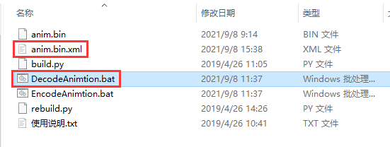
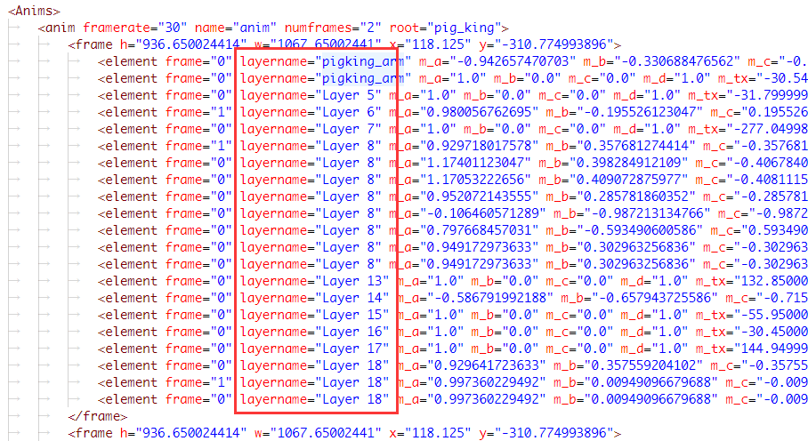
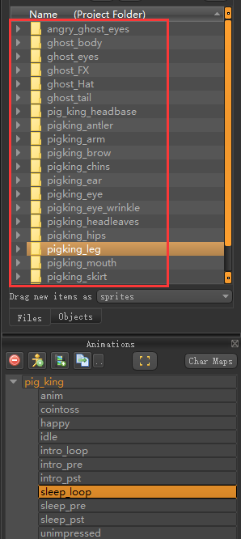
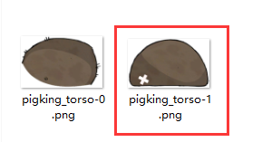
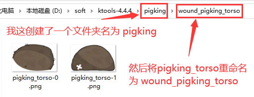
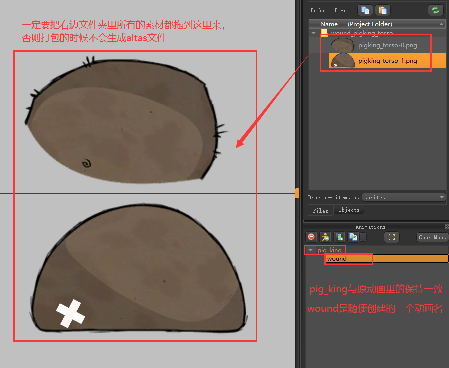
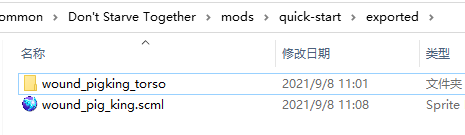
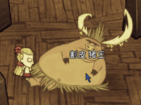

> 声明：本篇文章通过`五年一班 冰糖`的讲解整理而成
>
> 文章中用到的工具由`五年一班 风铃䓍`提供

## 内置方法

在游戏里通过控制台输入 `for k,v in pairs(AnimState)do print(k,v)end` 打印出来的

我知道什么意思的都给写个解释了，不知道的就没写

| 方法名                         | 类型                                     | 解释                                                   |
|--------------------------------|------------------------------------------|--------------------------------------------------------|
| OverrideShade                  | function                                 |                                                        |
| SetFinalOffset                 | function                                 |                                                        |
| SetSymbolExchange              | function                                 |                                                        |
| SetOrientation                 | function                                 |                                                        |
| GetSortOrder                   | function                                 |                                                        |
| GetInheritsSortKey             | function                                 |                                                        |
| SetSortOrder                   | function                                 |                                                        |
| SetClientSideBuildOverrideFlag | function                                 |                                                        |
| SetBloomEffectHandle           | function                                 |                                                        |
| GetSkinBuild                   | function                                 |                                                        |
| SetDepthBias                   | function                                 |                                                        |
| SetDepthTestEnabled            | function                                 |                                                        |
| CompareSymbolBuilds            | function                                 |                                                        |
| ClearOverrideBuild             | function                                 |                                                        |
| Show                           | function(layername)                      | 显示图层(Layer)                                        |
| OverrideSkinSymbol             | function                                 |                                                        |
| AssignItemSkins                | function                                 |                                                        |
| SetSortWorldOffset             | function                                 |                                                        |
| OverrideItemSkinSymbol         | function                                 |                                                        |
| SetMultColour                  | function(r,g,b,a)                        | 颜色叠乘，受原图颜色影响，参数0-1                        |
| SetHaunted                     | function                                 |                                                        |
| GetCurrentAnimationTime        | function                                 |                                                        |
| ClearAllOverrideSymbols        | function()                               | 清除所有覆盖通道                                       |
| SetOceanBlendParams            | function                                 |                                                        |
| PushAnimation                  | function                                 |                                                        |
| GetMultColour                  | function                                 |                                                        |
| ClearDefaultEffectHandle       | function                                 |                                                        |
| SetPercent                     | function("transform_ent_mad", 1)         | 动画播放百分比，固定帧，不会动（动画名，百分比）            |
| SetAddColour                   | function(r,g,b,a)                        | 颜色叠加，几乎不受原图颜色影响，参数0-1                  |
| ClearBloomEffectHandle         | function                                 |                                                        |
| SetBank                        | function(bankname)                       | spriter里动画的父级节点的名字                          |
| UsePointFiltering              | function                                 |                                                        |
| GetCurrentFacing               | function                                 |                                                        |
| SetBankAndPlayAnimation        | function                                 |                                                        |
| GetAddColour                   | function                                 |                                                        |
| HideSymbol                     | function                                 |                                                        |
| SetLayer                       | function                                 |                                                        |
| SetRayTestOnBB                 | function                                 |                                                        |
| SetWorldSpaceAmbientLightPos   | function                                 |                                                        |
| IsCurrentAnimation             | function(name)                           | 当前动画名是否是name                                   |
| SetManualBB                    | function                                 |                                                        |
| SetHighlightColour             | function                                 |                                                        |
| Hide                           | function(layername)                      | 隐藏图层(Layer)                                        |
| ClearOverrideSymbol            | function                                 | 清除覆盖的通道                                         |
| GetSymbolOverride              | function                                 | 获取覆盖通道名                                         |
| GetCurrentAnimationLength      | function()                               | 动画总长度，单位：秒，1 帧是 1/30 秒，0.33333 秒           |
| Pause                          | function                                 |                                                        |
| Resume                         | function                                 |                                                        |
| SetDeltaTimeMultiplier         | function(multiplier)                     | 动画播放速度（速度倍数）                                 |
| SetUILightParams               | function                                 |                                                        |
| SetErosionParams               | function                                 |                                                        |
| BuildHasSymbol                 | function(build, symbol)                  | 是否有该build下的通道                                  |
| ShowSymbol                     | function                                 |                                                        |
| ClearSymbolExchanges           | function                                 |                                                        |
| UseColourCube                  | function                                 |                                                        |
| OverrideSymbol                 | function(oldsymbol, newbuild, newsymbol) | 覆盖旧通道                                             |
| SetClientsideBuildOverride     | function                                 |                                                        |
| OverrideMultColour             | function                                 |                                                        |
| SetDefaultEffectHandle         | function                                 |                                                        |
| FastForward                    | function                                 |                                                        |
| SetBuild                       | function(buildname)                      | buildname就是scml文件的名字                            |
| SetScale                       | function(x,y,z)                          | 贴图缩放,值范围：(0-1]                                    |
| SetFloatParams                 | function                                 |                                                        |
| SetMultiSymbolExchange         | function                                 |                                                        |
| GetBuild                       | function                                 |                                                        |
| GetSymbolPosition              | function                                 |                                                        |
| GetCurrentAnimationFrame       | function                                 |                                                        |
| AnimDone                       | function                                 |                                                        |
| IsSymbolOverridden             | function                                 |                                                        |
| SetDepthWriteEnabled           | function                                 |                                                        |
| AddOverrideBuild               | function                                 |                                                        |
| SetInheritsSortKey             | function                                 |                                                        |
| PlayAnimation                  | function(animname, loop)                 | 播放动画，animname：动画名，loop：是否循环播放，默认是false |
| SetTime                        | function(time)                           | 设置当前动画从第几秒开始播放（秒）                       |
| SetLightOverride               | function                                 |                                                        |
| SetSkin                        | function                                 |                                                        |

## 层，通道

动画`层`是在`anim.bin`里的，使用反编译工具将`anim.bin`转成`xml`文件，即可看到`layer`的名字

点击下载 [反编译工具](attachment/反编译anim.binv0.2.zip)

解压，配置环境变量

打开`DecodeAnimtion.bat` `EncodeAnimtion.bat` 这两个文件，将里面的`D:\SteamLibrary\steamapps\common\Don't Starve Mod Tools`这个路径换成自己电脑上的安装路径即可

随便找一个动画zip包，把里面的 `anim.bin` 给解压到当前目录下，然后双击 `DecodeAnimtion.bat` 即可反编译成 xml 文件



打开 `anim.bin.xml` 文件，就可以看到层的名字了



-----

通道(symbol)就是spriter里右边项目文件夹，如下图



## 实操

> 做过人物mod的都知道，人物在idle状态的时候，是有三只手的，当在游戏中拿武器时，第三只手显示出来同时再隐藏掉一只手，这样看起来会合理的多。这里显示和隐藏图层就是用到了 `层` `通道` 相关的方法

如上反编译出来的xml里的layername，其中`pigking_arm`就是猪王的胳膊，如果想在游戏里隐藏，代码如下

```lua
AddPrefabPostInit("pigking", function(inst)
    inst.AnimState:Hide("pigking_arm")
end)
```

重新显示出来也非常简单

```lua
AddPrefabPostInit("pigking", function(inst)
    inst.AnimState:Show("pigking_arm")
end)
```

----

如果没有找到对应的layername怎么办呢？还可以对通道进行更新，比如给猪王换一个皮，我这以给猪王屁股上贴个膏药为例

首先找到猪王的屁股贴图在哪个文件夹里(pigking_torso)，然后将里面的图片替换掉即可



然后在电脑上的某个位置创建一个文件夹，随便叫啥名都行，把换好贴图的文件夹给拷贝到新文件夹里去，也可以对原文件夹改个名



打开spriter，在刚创建的文件夹(pigking)里创建一个项目，保存名为 `wound_pig_king.scml`，如下图



最后把sp文件与文件夹都拷贝到exported里启动游戏打包即可



打包好后，在mod文件夹里的anim里会找到一个名为 `wound_pig_king.zip`的文件，打开它，把里面的 `anim.bin` 给删掉即可

最后就是代码里使用了

modmain.lua
```lua
Assets = {Asset("ANIM", "anim/wound_pig_king.zip")}

AddPrefabPostInit("pigking", function(inst)
    -- 先让猪王进入睡眠状态，这样它的屁股才能显示出来
    inst.sg:GoToState("sleep")
    -- 调用覆盖通道的方法，参数有三个，第一个是旧通道名（就是文件夹名），第二个是新的build名（就是新创建的scml文件名），第三个是新的通道名（就是上面修改的文件夹名）
    inst.AnimState:OverrideSymbol("pigking_torso", "wound_pig_king", "wound_pigking_torso")

    -- 清除覆盖的通道
    -- inst.AnimState:ClearOverrideSymbol("pigking_torso")
end)
```

效果图



----

骚操作

当使用 `inst.AnimState:OverrideSymbol()` 方法试图去覆盖旧通道时，当传的第二个或者第三个参数不存在时，贴图则会消失，也是一种变相的隐藏贴图的方式

## 人物通道

**人物的手持通道有坑，这里单独拿出来说一下**

当做一件武器时，装备到手上，手部的通道名是 `swap_object` ，替换的话，一般写法都是 `owner.AnimState:OverrideSymbol("swap_object", "swap_spear", "swap_spear")`

但是如果按照上面实操中的方法来创建新通道时，进入游戏会发现贴图丢失了

解决办法：

人物手持的贴图在制作时，添加动画的名字就不能随便写了，一定要写`BUILD`，在spriter里把动画做好后，打成zip包，再将zip包里的 `anim.bin` 给删掉，然后再用就能在游戏里显示贴图了

至于原理，貌似挺复杂的，我也不是太清楚，在这就不解释了 :)
