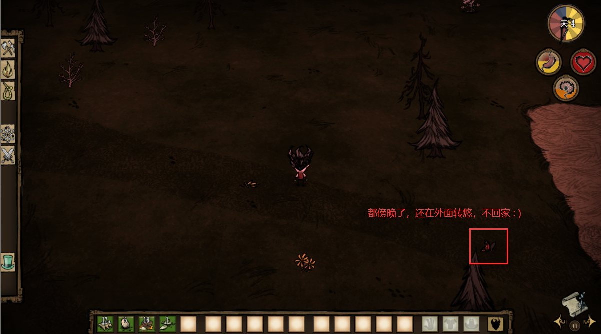

## 前言

**前面梳理stategraph那篇文章里直译的名是状态图(stategraph)，这篇整理的是行为树(behaviourtree)，它俩组合到一块就是开发游戏必不可少的状态机(statemachine)**

直译：脑子，在饥荒里面就是各种生物的AI，比如青蛙在玩家不在旁边时，会来随处蹦跶，旁边有玩家时就会跑来攻击玩家，这些行为都是在brain里定义的

每个行为都是一个节点，一个生物所有的行为整合起来就组成了一棵树，也就是行为树，在饥荒里，行为树的定义文件是 `behaviourtree.lua`

所有的行为都继承自 `BehaviourNode` 类

```lua
BehaviourNode = Class(function (self, name, children) end)
```

饥荒里用的最多的行为节点类是 `PriorityNode` 优先选择节点，子节点按优先级运行，优先级更高有更大的机会先运行，特点是一旦有节点返回成功，则父节点返回成功

在脑子里定义好一堆的行为节点后，会被包装在 `PriorityNode` 节点里，然后 `PriorityNode`节点与当前实例(inst)再被包装到一块生成一个 `BT` 对象

> BT可不是变态的意思，它是 behaviourtree 的首字母缩写，意为行为树

```lua
BT = Class(function(self, inst, root)
    self.inst = inst
    self.root = root
end)
```

下面拿一个蝴蝶的脑子例子来看一下结构

```lua
function ButterflyBrain:OnStart()
    local root =
        PriorityNode(
        {
            WhileNode( function() return self.inst.components.hauntable and self.inst.components.hauntable.panic end, "PanicHaunted", Panic(self.inst)),
            WhileNode( function() return self.inst.components.health.takingfiredamage end, "OnFire", Panic(self.inst)),
            RunAway(self.inst, "scarytoprey", RUN_AWAY_DIST, STOP_RUN_AWAY_DIST),
            IfNode(function() return not TheWorld.state.isday end, "IsNight",
                DoAction(self.inst, GoHomeAction, "go home", true )),
            IfNode(function() return self.inst.components.pollinator:HasCollectedEnough() end, "IsFullOfPollen",
                DoAction(self.inst, GoHomeAction, "go home", true )),
            FindFlower(self.inst),
            Wander(self.inst, NearestFlowerPos, MAX_WANDER_DIST)
        },1)
    self.bt = BT(self.inst, root)
end
```

## 概念

前言里最后贴了蝴蝶的行为树代码，里面有一堆的 `WhileNode` `RunAway` `IfNode` .. 这些东西都是什么意思，它们都是什么呢？

首先它们都是`BehaviourNode`的子类，有的是直接被定义在`behaviourtree.lua`文件里的方法，它们的参数基本上都一致，在`behaviourtree.lua`里定义的方法的返回值也是一个`BehaviourNode` 的子类，有的就是 `BehaviourNode` 的子类

```lua
-- cond 命名是 condition 意思是条件
-- name 名称 没啥用，写啥都行
-- node 子节点，继承自 BehaviourNode 类的子类对象
function WhileNode(cond, name, node)
    return ParallelNode
        {
            ConditionNode(cond, name),
            node
        }
end
```

至于它们都是什么意思，请看下面总结，这部分总结来自 **五年一班 Cane** 整理

**行为树（Unity为例）**

- 组合结点（Composites）
    - `Sequence`：次序节点（与门，所有成功才成功，一直运行，遇到失败）
      1. 从左到右执行子节点
      2. 一旦有节点返回失败，则父节点返回失败
      3. 所有节点返回成功，父节点才返回成功
    - `Selector`：选择节点（或门，有一个成功即成功，一直运行，遇到成功返回）
      1. 从左到右执行子节点
      2. 一旦有节点返回成功，则父节点返回成功
      3. 所有节点返回失败，父节点才返回失败
    - `Parallel`：并行节点
      1. 子节点同时运行
      2. 某个子节点返回失败则父节点返回失败，并结束所有子节点的运行
      3. 所有节点都返回成功，父节点才返回成功
    - `Parallel Complete`：并行结束节点
      1. 子节点同时运行
      2. 某个子节点返回成功或失败，则父节点返回成功或失败，并结束所有子节点的运行
    - `Parallel Selector`：并行选择节点
      1. 子节点同时运行
      2. 某个子节点返回成功则父节点返回成功，并结束所有子节点的运行
      3. 所有节点都返回失败，父节点才返回失败
    - `Priority Selector`：优先选择节点
      1. 子节点按优先级运行，优先级更高有更大的机会先运行
      2. 一旦有节点返回成功，则父节点返回成功
    - `Random Selector`：随机选择节点
      1. 随机执行子节点。
      2. 一旦有节点返回成功，则父节点返回成功
      3. 所有节点返回失败，父节点才返回失败
    - `Random Sequence`：随机队列节点
      1. 随机执行子节点
      2. 一旦有节点返回失败，则父节点返回失败
      3. 所有节点返回成功，父节点才返回成功
    - `Selector Evaluator`：重复判断选择节点
      1. 从低优先级到高优先级执行
      2. 一旦有节点返回成功，则父节点返回成功
      3. 所有节点返回失败，父节点才返回失败
      如果有高优先级的子节点处于Running状态，下一帧有个低优先级的子节点想要运行，则会中断高优先级的子节点任务。
- 条件节点
    类似于动作节点，区别是他们不会执行具体的动作
    - `Int Comparison`：比较两个数值的大小，符合条件返回成功，否则返回失败
- 装饰节点
    修饰节点也可以拥有子节点，但是不同于组合节点，它只能拥有一个子节点。取决于修饰节点的类型，它的功能要么是修改子节点返回的结果、终止子节点，或是重复执行子节点等等。
    一个比较常见的修饰节点的例子是 Inverter（逆变节点），它可以将子节点的结果倒转，比如子节点返回了 Failure，则这个修饰节点会向上返回 Success，以此类推。
    - `Inverter`：逆变节点
    - `Succeeder`：成功节点，总是返回Success
    - `Repeater`：重复节点会在它的子节点返回结果后反复继续执行它
    - `Repeat Until Fail`：重复直至失败节点
- 动作节点
    节点是最低层的节点，它们不会拥有子节点，负责执行具体的动作

**饥荒行为树**

- 状态说明

    ```lua
    READY -- 准备状态，节点还没有被调用过。或者已经调用结束被Reset之后的状态
    RUNNING -- 正在运行的状态，通常父节点会等待子节点Runing结束才会将自己的状态标示为结束
    SUCCESS -- 运行成功
    FAILED -- 运行失败
    ```

    需要注意的是，行为树会有被打断的情况，被打断时，子节点的Reset函数会被调用（必要的情况下重写`Reset`函数可以处理被打断的情况）

- 行为树暂停（整棵树暂停）

    行为树在某些情况下也会被暂停。这棵树中留下相关的暂停（`Suspend`）与重启（`Restart`）函数。需要树被暂停的时候外部调用，这个方法内部会将对应的方法传播到每一个节点之中

- 行为树节点

    - `BehaviourTree`：树节点

      主要用于子节点的调用，状态保存等。没有实际的业务功能

    - `BehaviourNode`：所有节点的父节点

      所有节点的父节点，没有实际的业务意义，主要是维护了各种基础状态的方法

    - `DecoratorNode`：装饰节点

      没有实际的业务意义，不过通常是只有一个子节点的节点的父类

    - `ConditionNode`：判定节点

      创建这个节点的时候传入一个能够获取判定值的方法，这个节点会根据运行到这个节点时，传入方法的调用后返回的值，改变当前节点的状态。nil 或者 false 转换为FAILED，否则转换为SUCCESS

    - `ConditionWaitNode`：条件等待节点

      与判定基本相同。不同的是在原本会判定为FAILED的情况下判定为RUNNING

    - `ActionNode`：动作节点

      创建这个节点的时候传入一个函数。当运行到这个节点的时候。会调用这个函数，并且将节点的状态标示为SUCCESS

    - `WaitNode`：等待节点

      创建这个节点时传入一个时间值。当运行到这个节点时，从开始到时间结束这个节点的状态会一直是RUNNING。等待时间结束后，节点状态会修改为SUCCESS。

      （等待过程中，这个节点会休眠。用于减少性能消耗，其他类似功能节点在编写时，应该也需要做出适当的休眠）

    - `SequenceNode`：顺序节点

      创建这个节点时，需要传入一个**节点列表**。当运行到这个节点时。他的子节点会一个接一个的运行。如果他的子节点状态是SUCCESS，那么他会运行下一个；如果他的子节点状态是RUNNING，那么他会将自身也标识成RUNNING，并且等待节点返回结果；如果他的子节点状态是FAILED，那么他会把自己的状态标识为FAILED并且直接返回。所有节点都返回结尾为SUCCESS那么他会将自身标识成为SUCCESS并且返回。

    - `SelectorNode`：选择节点

      与顺序节点类似，创建时需要传入一个**节点列表**，当运行到这个节点时，他的节点会一个接一个的运行。如果他的子节点是SUCCESS，那么他会将自身标识成为SUCCESS并且直接返回；如果他的子节点状态是RUNNING，那么他会将自身也标识成RUNNING，并且等待节点返回其他结果；如果他的子节点状态是FAILED，那么他会运行下一个。任何一个节点都没有返回SUCCESS的情况下，他将会将自身标识成为FAILED并且返回

    - `NotDecorator`：取反节点

      创建这个节点的时候需要传入一个子节点。并且将子节点的运行结果除了RUNNING外颠倒下结果并且返回

    - `FailIfRunningDecorator`

      创建这个节点的时候需要传入一个子节点。并且将子节点的除了RUNNING结果以外标示为自己的结果；如果子节点的状态是RUNNING那么就讲自身的状态标识为FAILED。并且返回

    - `RunningIfFailDecorator`

      创建这个节点的时候需要传入一个子节点。并且将子节点的除了FAILED结果以外标示为自己的结果；如果子节点的状态是FAILED那么就讲自身的状态标识为RUNNING。并且返回

    - `LoopNode`：循环节点

      创建这个节点的时候需要传入一个节点队列和最多循环的次数。循环节点将尝试执行N次后将自身标识为SUCCESS后返回结果。运行中的状态与顺序节点的逻辑大体一致，子节点的RUNNING会阻止下一个的运行，子节点的FAILED会中断运行

    - `RandomNode`：随机节点

      创建这个节点的时候需要传入一个节点队列和可以不传的列表对应的权重。在没有权重的情况下，所有的子节点完全随机。在有权重的情况下，子节点会按照权重的设置值来选择某一个节点来运行，并且将这个节点的运行结果标识为自己的状态，并且返回。
      （权重的个数可以与子节点列表的个数不同。权重个数不足的将以1填充，超过的部分会被截断）

    - `ParallelNode`：并行节点

      创建这个节点的时候需要传入一个节点队列。一个接一个的运行子节点。如果子节点的状态是FAILED，那么它会将自己标识为FAILED并且直接返回；如果子节点的状态是SUCCESS或者RUNNING，那么它会运行下一个节点（与`SequenceNode`的区别是，`SequenceNode`会一直等待这个节点运行结束才会去运行下一个节点）。只有所有的节点都标识为SUCCESS它会将自己的标识为SUCCESS并且返回，否则他会将自己标识为RUNNING。

      - 部分节点（ConditionNode、NotDecorator）会在运行前被强制重启，用于判定

      - 一般行为树的`ParallelNode`，`Failed`状态下会把子节点中处于`RUNNING`状态的子节点结束掉，但是饥荒中似乎没有这个行为

    - `ParallelNodeAny`

      与ParallelNode基本相同，唯一不同的地方在于任何一个节点标识为SUCCESS的时候，它就会将自己的状态标识为SUCCESS并且返回

    - `WhileNode`

      ParallelNode节点的扩展节点，创建这个节点的时候需要传入一个可以获取判定值的方法和一个子节点。当运行到这个节点的时候，需要先做判定，然后在执行后边的节点。如果判定失败则直接将自身标识为FAILED并且返回。否则将子节点的状态标识为自己的状态并且返回

    - `IfNode`

      SequenceNode节点的扩展节点。与WhileNode节点基本一致，不同的是，判定的条件只有第一次进入的时候生效，之后的运行将直接运行后边的节点

    - `WeightSelectNode`

      WeightSelectNode权重选择节点，与选择节点功能类似。重新运行的时候会按照权重进行排序。权重大的选在在前。权重值可以设置为数字或者函数。如果使用函数返回数据必须是一个数字。可以做一些动态调整节点顺序的相关AI

## 解释

再回头看一下前言里贴的蝴蝶的行为代码

```lua
function ButterflyBrain:OnStart()

    local root = PriorityNode(
        {
            -- 判断是否受到惊吓，当受到惊吓时调用 Panic()方法处理相应的行为
            WhileNode(function()
                return self.inst.components.hauntable and self.inst.components.hauntable.panic
            end, "PanicHaunted", Panic(self.inst)),

            -- 判断是否着火，着火了也一样调用Panic()方法，跟惊吓时的行为一样
            WhileNode(function()
                return self.inst.components.health.takingfiredamage
            end, "OnFire", Panic(self.inst)),

            -- 被猎物吓着时的行为，RUN_AWAY_DIST表示在这个范围内会受到惊吓，STOP_RUN_AWAY_DIST表示在这个范围外会停止受到惊吓
            RunAway(self.inst, "scarytoprey", RUN_AWAY_DIST, STOP_RUN_AWAY_DIST),

            -- 判断世界状态如果不是白天，就执行行为DoAction（DoAction也是一个BehaviourNode的子类）调用GoHomeAction函数回到花里去
            IfNode(function()
               return not TheWorld.state.isday
            end, "IsNight",
               DoAction(self.inst, GoHomeAction, "go home", true)),

            -- 判断蝴蝶身上是否充满了花粉，，当充满时，也执行回家的行为
            IfNode(function()
                return self.inst.components.pollinator:HasCollectedEnough()
            end, "IsFullOfPollen",
                DoAction(self.inst, GoHomeAction, "go home", true)),

            -- 找花，也是一个BehaviourNode的子类
            FindFlower(self.inst),

            -- 游走行为，NearestFlowerPos表示附近花的位置，MAX_WANDER_DIST表示最大游走范围
            Wander(self.inst, NearestFlowerPos, MAX_WANDER_DIST)
        }, 1)
    self.bt = BT(self.inst, root)
end
```

是不是一目了然了

## 实验

创建一个mod，在mod里创建文件夹 `scripts/brains` 在brains文件夹里创建一个 `mybutterflybrain.lua` 文件，将蝴蝶的行为修改一处

```lua
require "behaviours/runaway"
require "behaviours/wander"
require "behaviours/doaction"
require "behaviours/findflower"
require "behaviours/panic"

local RUN_AWAY_DIST = 5
local STOP_RUN_AWAY_DIST = 10
local POLLINATE_FLOWER_DIST = 10
local SEE_FLOWER_DIST = 30
local MAX_WANDER_DIST = 20

local FLOWER_TAGS = { "flower" }

local function NearestFlowerPos(inst)
    local flower = GetClosestInstWithTag(FLOWER_TAGS, inst, SEE_FLOWER_DIST)
    if flower and
        flower:IsValid() then
        return Vector3(flower.Transform:GetWorldPosition())
    end
end

local function GoHomeAction(inst)
    local flower = GetClosestInstWithTag(FLOWER_TAGS, inst, SEE_FLOWER_DIST)
    if flower and
        flower:IsValid() then
        return BufferedAction(inst, flower, ACTIONS.GOHOME, nil, Vector3(flower.Transform:GetWorldPosition()))
    end
end

local ButterflyBrain = Class(Brain, function(self, inst)
    Brain._ctor(self, inst)
end)

function ButterflyBrain:OnStart()
    local root = PriorityNode(
        {
            -- 判断是否受到惊吓，当受到惊吓时调用 Panic()方法处理相应的行为
            WhileNode(function()
                return self.inst.components.hauntable and self.inst.components.hauntable.panic
            end, "PanicHaunted", Panic(self.inst)),

            -- 判断是否着火，着火了也一样调用Panic()方法，跟惊吓时的行为一样
            WhileNode(function()
                return self.inst.components.health.takingfiredamage
            end, "OnFire", Panic(self.inst)),

            -- 被猎物吓着时的行为，RUN_AWAY_DIST表示在这个范围内会受到惊吓，STOP_RUN_AWAY_DIST表示在这个范围外会停止受到惊吓
            RunAway(self.inst, "scarytoprey", RUN_AWAY_DIST, STOP_RUN_AWAY_DIST),

            -- 判断世界状态如果不是白天，就执行行为DoAction（DoAction也是一个BehaviourNode的子类）调用GoHomeAction函数回到花里去
            --IfNode(function()
            --    return not TheWorld.state.isday
            --end, "IsNight",
            --    DoAction(self.inst, GoHomeAction, "go home", true)),

            -- ++++++++++++++++++++++++++++++++++++++++++++++++++++++++++++++++++++++++++++++++++++++++++++

            IfNode(function()
                return TheWorld.state.isnight -- 这里我把这个判断不是白天就回家的行为改成夜里才回家
            end, "IsNight",
                DoAction(self.inst, GoHomeAction, "go home", true)),

            -- ++++++++++++++++++++++++++++++++++++++++++++++++++++++++++++++++++++++++++++++++++++++++++++

            -- 判断蝴蝶身上是否充满了花粉，，当充满时，也执行回家的行为
            IfNode(function()
                return self.inst.components.pollinator:HasCollectedEnough()
            end, "IsFullOfPollen",
                DoAction(self.inst, GoHomeAction, "go home", true)),

            -- 找花，也是一个BehaviourNode的子类
            FindFlower(self.inst),

            -- 游走行为，NearestFlowerPos表示附近花的位置，MAX_WANDER_DIST表示最大游走范围
            Wander(self.inst, NearestFlowerPos, MAX_WANDER_DIST)
        }, 1)
    self.bt = BT(self.inst, root)
end

return ButterflyBrain
```

然后在`modmain.lua`里通过api `AddPrefabPostInit()` 对蝴蝶的brain重新赋值

```lua
local brain = require "brains/mybutterflybrain"

AddPrefabPostInit("butterfly", function(inst)
    inst:SetBrain(brain)
end)
```

进游戏查看一下，傍晚蝴蝶还在不？



> **关于脑子的修改，官方也提供了api `AddBrainPostInit()` 所以并不推荐这种覆盖的方式来修改脑子**
