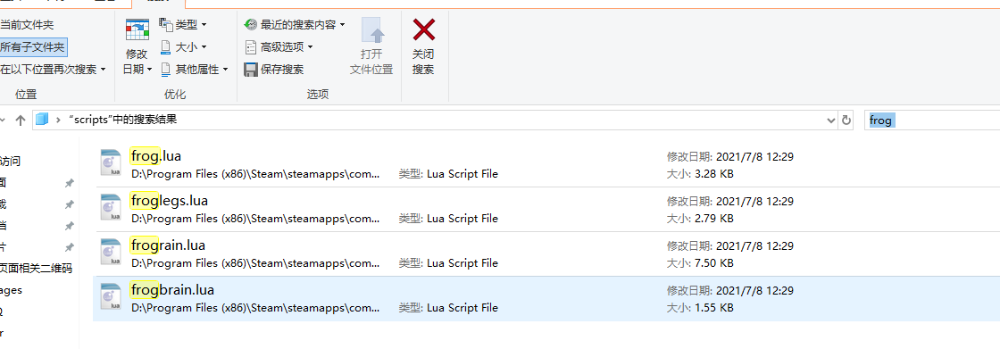
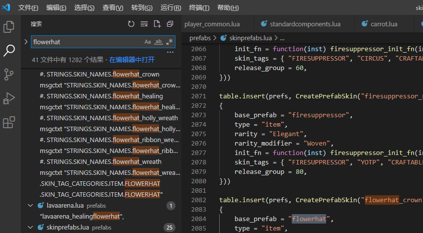
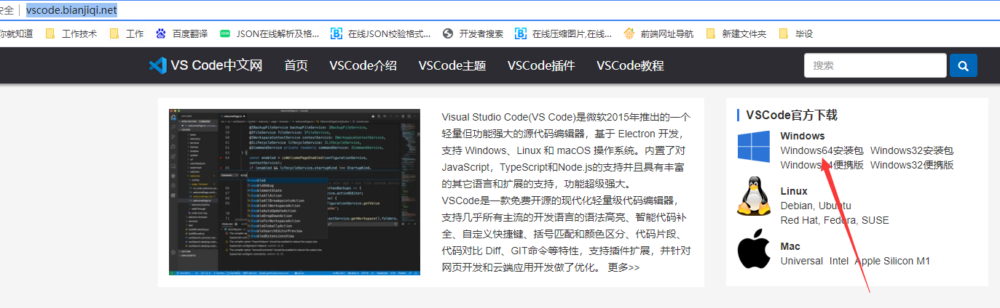

#### 这部分教大家如何查找饥荒源码、物品代码、动画代码等等

饥荒源码在 Steam\steamapps\common\Don't Starve Together\data\databundles ，这里有一个scripts.zip的压缩包，解压开就是饥荒的lua代码。
其他的压缩包也是饥荒中使用的资源，比如动画，贴图什么的。

如何查找物品代码和动画代码。
下载这个[查看物品代码和动画代码的mod](https://pan.baidu.com/s/1nJtYaN1S3dldzLNsd_ULdw)链接：https://pan.baidu.com/s/1nJtYaN1S3dldzLNsd_ULdw 
提取码：uwom，mod作者为花花大佬，花花nb!
启用mod后进入游戏，鼠标指向需要查看的东西，就会显示物品代码动画代码什么的了。

得到物品代码后，就可以直接在scripts(就是你解压scripts.zip后的)文件夹中搜索这个物品代码，如果这个物品是单独的lua文件，一般都能查找到。
如果没有说明它可能是在某一个文件中集中处理的，比如各种帽子（hats.lua），各种法杖（staff.lua）。这种呢，就需要全局搜索物品代码，慢慢找了。
暂时我还不知道有啥方便的方法。推荐编辑器为[vsCode](http://vscode.bianjiqi.net/)看下图。

