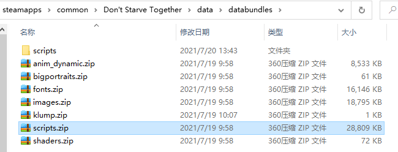
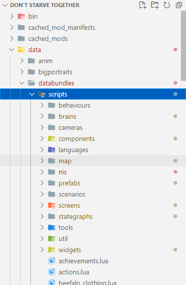
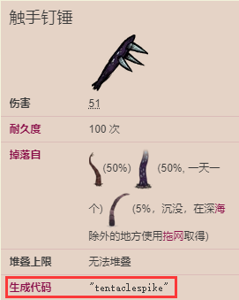

## 位置

饥荒联机里的源码被放在安装目录下的 `data/databundles/scripts.zip` 里



将其解压出来，用编辑器打开结构如下



## 目录分类

下面就文件夹介绍一下里面都放的是什么东西

- behavious: 行为，给brains目录里定义的类使用的
- brains: 大脑，可以理解为AI，定义各种生物的默认行为的，比如猪人闲逛，看见东西就吃，看见蜘蛛就打等
- cameras: 摄像头，引擎上的东西，不用管它
- components: 各种各样的组件，如果想写大型mod，最好把这里面每个组件都看一遍，学习一下klei怎么定义组件的
- languages: 各国语言翻译
- map: 游戏中的地形生成的定义。比如马赛克地形，月岛地形，都是在这里面定义的
- prefabs: 预制体，饥荒里的所有实体都是预制体，比如人物，花，鸟，鱼，树等等
- scenarios: 情景，游戏中的彩蛋
- screens: 场景，游戏里每个界面都是一个场景，比如创建世界，生成世界，加载世界，进入游戏的界面都是场景
- stategraphs: 状态图（区别于状态机，饥荒把行为逻辑抽到了行为树(behavious)里，stategraph就只管理动画逻辑），定义不同状态播放什么动作，比如人物站立时的动画，猎犬攻击的动画，同样还能定义不同状态下的event(事件)，handler(处理程序)
- tools/utils: 各种工具
- widgets: 小窗口，比如显示血量，季节的那个表盘就是 widget

## 重要

**什么是组件(components)呢？**

可以把组件理解为属性，比如人物身上都有`eater`组件，这个组件就是管理哪个人物吃什么的，换句话说就是这个人物有什么属性（挑食，不挑食，素食主义...）都是在这个组件里定义的，一般组件通过 `inst:AddComponent("组件名")` 方法添加到预制体(prefab)上

**组件名从哪来的呢？**

组件名就是文件名，比如 eater 组件，对应的文件就是 eater.lua 文件

**什么是预制体(prefabs)**

饥荒里的所有实体都是预制体，比如人物，花，鸟，鱼，树等等

**预制体的名字从哪来**

一般要看某个预制体的代码，首先去wiki上直接搜 [wiki地址](https://dontstarve.fandom.com/zh/wiki/Don%27t_Starve_%E4%B8%AD%E6%96%87%E7%B6%AD%E5%9F%BA)

然后在搜过到的页面上有一个生成代码，如下图



这个生成代码就是预制体的名字了，一般情况下直接搜这个名字的文件就能找到，不过一个文件里可能会定义多个预制体，比如斧头的预制体 `prefabs/axe.lua` 里就定义了三个斧头，这就需要自己进行鉴别了

```lua
Prefab("axe", normal, assets),   -- 普通斧头
    Prefab("goldenaxe", golden, golden_assets),  -- 金斧头
    Prefab("moonglassaxe", moonglass, moonglass_assets)   -- 玻璃斧
```
