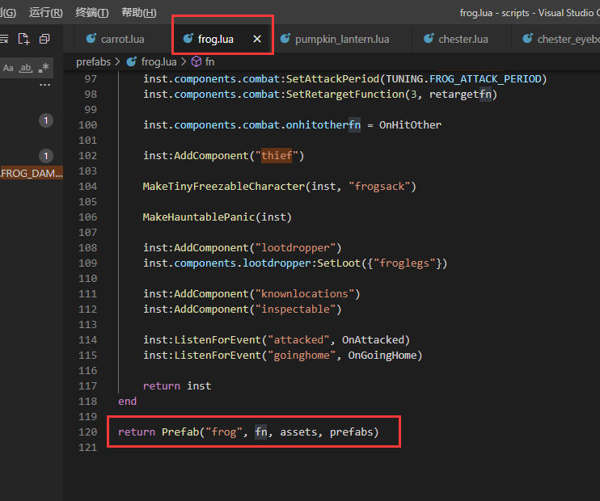
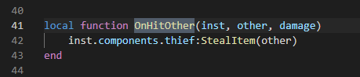
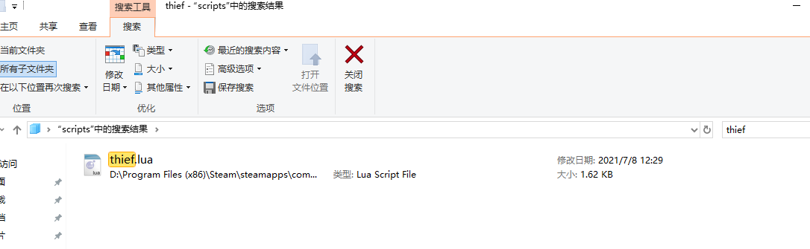
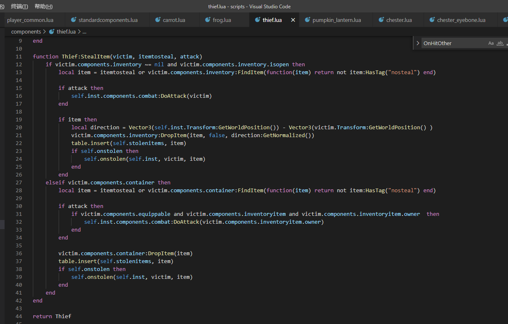

#### 这里写一点关于常用hook的思路，个人觉得对于萌新灰常有用，分享一下。

hook，英文翻译钩子，一般用于拦截原有逻辑，插入自己的修改。 科雷官方提供了灰常多的api(详见[Mod中常用的API](https://tomoya92.github.io/dstmod-tutorial/#/api))。
我们可以利用这些来实现很多功能。

例如`AddPrefabPostInit`，`AddComponentPostInit`，`AddXXXPostInit` 顾名思义，添加在XXX初始化之后执行。这就意味着我们可以拿到这个已经生成好的预制物进行处理。

比如我觉得青蛙太烦人了，攻击掉血不说，还会掉东西。现在写一段代码让青蛙攻击我们不掉东西。我的做法入下：

1.首先分析一下，我们东西是怎么掉出来的。进入游戏被青蛙打几下就能看出来了，我们被青蛙攻击了，然后就掉了血和东西。
很容易我们就得出掉东西的条件=被青蛙攻击。与此同时我们还掉了血，掉东西和掉血有关联么？我们不得而知，但这个触发的起始点是被青蛙攻击，
只要我们从攻击开始进行排查就肯定能找到，然后进行第二步。
（当有很多相关联的因素时，就从一个确定的源头开始排查，如果查找不到，肯定是源头没找对，可以再上一级源头或者换个方向查找，熟悉后就很容易找到了。）

2.找到青蛙攻击的代码。在源码中找到frog相关的代码（不会的同学看上一篇[如何查找源码以及物品代码](https://tomoya92.github.io/dstmod-tutorial/#/findcode)），
找到frog.lua文件后直接拉到最下面，如下图：

通过[Prefab](https://tomoya92.github.io/dstmod-tutorial/#/prefab)篇我可以知道，最后一行中的fn是青蛙生成时调用的代码。攻击相关的设定应该也在这里，我们逐行排查。
或者直接搜索combat，之后我们会在fn方法中找到这样一段代码:

```lua
    inst:AddComponent("combat")--添加攻击组件
    inst.components.combat:SetDefaultDamage(TUNING.FROG_DAMAGE)--设置攻击伤害
    inst.components.combat:SetAttackPeriod(TUNING.FROG_ATTACK_PERIOD)--设置攻击间隔
    inst.components.combat:SetRetargetFunction(3, retargetfn)--设置攻击目标搜索方法（用来索敌）

    inst.components.combat.onhitotherfn = OnHitOther--设置命中目标时的处理函数

```

这里没有放截图，是为了加一点注释，源码一般都是没这些注释的。不知道这些注释是哪里来的同学，直接复制单词一个个翻译一下，顾名思义，稍微猜测一点点就知道了。
很好，这里已经发现了可能触发的点，就是 OnHitOther 函数，然后我们在frog.lua文件中搜索OnHitOther函数。如下：



这里我们发现，这个方法里调用了thief组件的StealItem。然后我们查找一下thief组件的文件。然后在thief组件中查找StealItem方法。





仔细阅读StealItem方法，结合frog中调用StealItem方法传入的参数，我们就得到一个结果：青蛙攻击玩家，将玩家对象传入StealItem方法，
然后StealItem方法里判断如果玩家有inventory物品栏组件并且物品栏是打开的或者有容器组件,就查找物品栏或者容器中没有nosteal标签的物品。
然后将其掉出来。至此我们就得到了青蛙攻击玩家掉了身上物品的全部代码流程。然后思考一下解决方案。直接的方法就是看StealItem方法中
查找物品的条件，通过这个条件我们分析后可以得到如果给身上的物品都加上nosteal标签，那就不会掉了。理论上的确如此，但这样会导致一些问题，
假如这个nosteal标签在其他地方使用到了，就会影响其他代码的运行，可能会出现意外的bug。而且我们给身上每一个物品都加nosteal标签，
那么在什么时候加，身上物品那么多，处理也比较麻烦。所以这里我们换一个思路，如果我们更换frog中combat组件的onhitotherfn函数。
让青蛙攻击后不进行后面掉落这一系列的处理，是否可行呢。我们通过阅读代码得知。onhitotherfn这里赋值的方法是OnHitOther。而OnHitOther中
仅仅调用了thief组件的StealItem，而且只传入了攻击对象。之后再通过阅读StealItem函数得知，仅传入攻击对象时，StealItem函数仅执行掉落物品
相关的逻辑。所以我们得到结果，更换frog中combat组件的onhitotherfn函数达到青蛙攻击玩家不掉落物品的逻辑是可行的。然后开始写代码：

```lua
-- 青蛙友好，被攻击不会掉东西。
AddPrefabPostInit("frog", function(inst)
    if TheWorld.ismastersim then
         --得到旧的onhitotherfn函数
        local oldOnHitOther = inst.components.combat.onhitotherfn
        -- 给onhitotherfn赋值新的处理函数
        inst.components.combat.onhitotherfn =
            function(inst, other, damage)--新函数的参数与旧函数参数相同。
            -- 如果攻击对象不是玩家就走原来旧的攻击掉落逻辑，否则就不走掉落。
            -- inst一般是当前对象，这里是青蛙，other是攻击对象，参数含义分析代码逻辑得到。
                if not other:HasTag("player") then
                    oldOnHitOther(inst, other, damage)
                end
            end
    end
end)
```

然后进入游戏测试一下，正常运行即可。这一类hook方法基本上可以归结为以下几点：
1. 得到原有处理函数
2. 赋值新的处理函数
3. 在新的处理函数中加上自己的逻辑判断，特定时候执行原有处理函数。

注意事项：当原有处理函数中有使用的self关键字时，如果新的处理函数中需要执行原有处理函数也要传入self.
比如下面这个，让带有misakaTrader标签的物品可以一次交易一组(原版只能一次一个)。
原有的AcceptGift函数中有使用到self。而AcceptGift函数的参数是三个：giver, item, count
所以在我们新写的函数中调用oldAcceptGift时，也要额外传入self，入参就变成了self, giver, item, count。
如果没有用到self,可以不用传入。当初不了解语法时踩了很多坑，希望刚入坑的同学少走一点弯路。

```lua
-- 交易组件相关（一次可以填子弹一组）
AddComponentPostInit("trader", function(Trader)
    local oldAcceptGift = Trader.AcceptGift
    function Trader:AcceptGift(giver, item, count)
        if self.inst:HasTag("misakaTrader") and item.components.stackable and
            count == nil then
            if self.inst.cantrader then
                count = self.inst:cantrader(giver, item)
            else
                count = item.components.stackable.stacksize
            end
            if count < 1 then count = 1 end
        end
        return oldAcceptGift(self, giver, item, count)
    end
end)
```

第二个例子是通过修改动作函数来实现功能，反正意思就是在处理某个功能的时候，从你鼠标点击什么的开始，到
结果出现这一整个流程结束，任意一点处理都可以，只要能实现你想要的功能，选择一个合适的切入点比较重要。
除了饥荒本身提供的一系列AddXXXX这样的函数之外，所有你能调用到的饥荒自带函数都可以通过这种方式hook，
这里主要是提供一个思路。

```lua
-- 控制偷的动作，防止被偷，让带有 prohibit_steal_container 标签的容器不被地下猴子偷走东西。
-- (猴子会做出偷的动作，但不会偷走东西)
local oldStealFn = GLOBAL.ACTIONS.STEAL.fn
GLOBAL.ACTIONS.STEAL.fn = function(act)
    local owner = act.target.components.inventoryitem ~= nil and
                      act.target.components.inventoryitem.owner or nil
    if owner ~= nil and owner:HasTag("prohibit_steal_container") then
        return false
    end
    return oldStealFn(act)
end
```