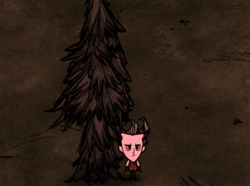

给boss级生物添加攻击的击飞效果，在永不妥协里有用到，原版里在猪年活动里有用到，猪人守卫拿木牌打玩家，玩家直接被击飞



实现起来特别简单，下面代码是给树人添加击飞效果的

```lua
AddPrefabPostInit("leif", function(inst)
    local function OnHitOther(inst, other)
        other:PushEvent("knockback", {
            knocker = inst, -- 攻击者
            radius = 200, -- 击飞范围
            strengthmult = 1 -- 力量倍率
        })
    end
    if inst.components.combat ~= nil then
        inst.components.combat.onhitotherfn = OnHitOther
    end
end)
```