## 内置地皮

感谢 **五年一班 老司机** 提供的地皮与编号对应图

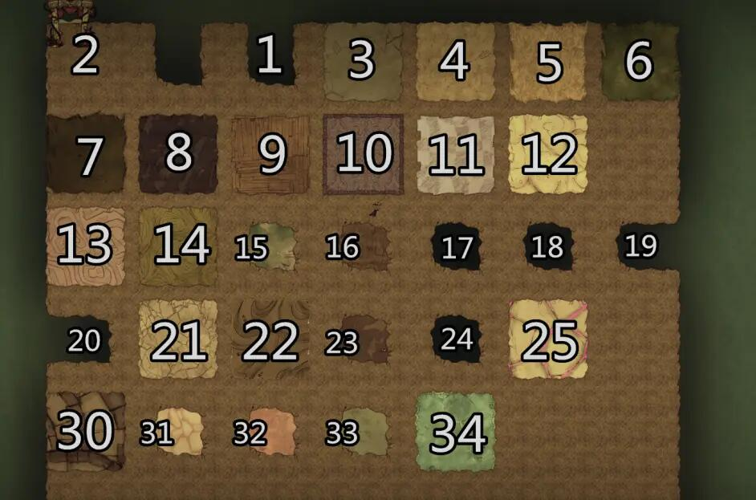

## 准备

饥荒工具包里提供了一个tiled软件，它就是用来做地图的，不过它的版本太低了，我在官网上又下载了新版本的

tiled官网地址：https://www.mapeditor.org

它有三个平台的版本，选择自己需要的下载即可，安装

另外找到一张klei提供的地皮tiles.png图，位置如下图

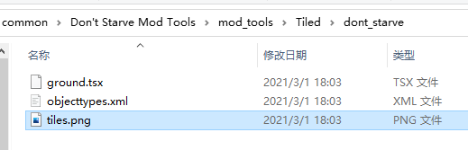

## 地形类型

饥荒里有两种地形

**静态**

静态地形典型例子就是隐士岛，它在每个档里的形状都是那样，且上面生成的实体位置也都是固定的

**动态**

大陆地形上基本上都是动态生成的地形，每种地形在每个档里都不一样，且有的大点，有的小点，地形上的资源每个档都不一样，这种随机分布且大小随机资源随机的地形就是动态地形

创建自己的动态地形比较复杂，涉及到了room, task, level的相关操作

## 静态地形

原版里的隐士岛，神话mod里的桃岛，广寒宫，竹林都属于静态地形，下面就来介绍用tiled软件生成一张自己定义形状的地形

打开tiled，选择 file -> new map

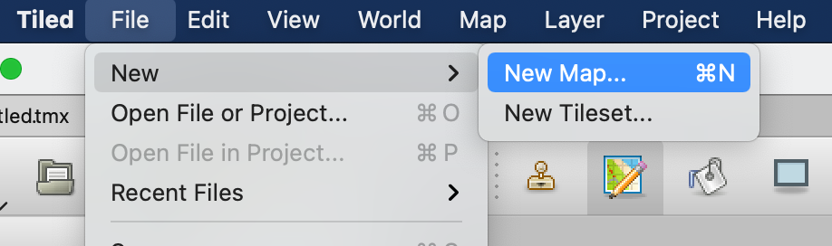

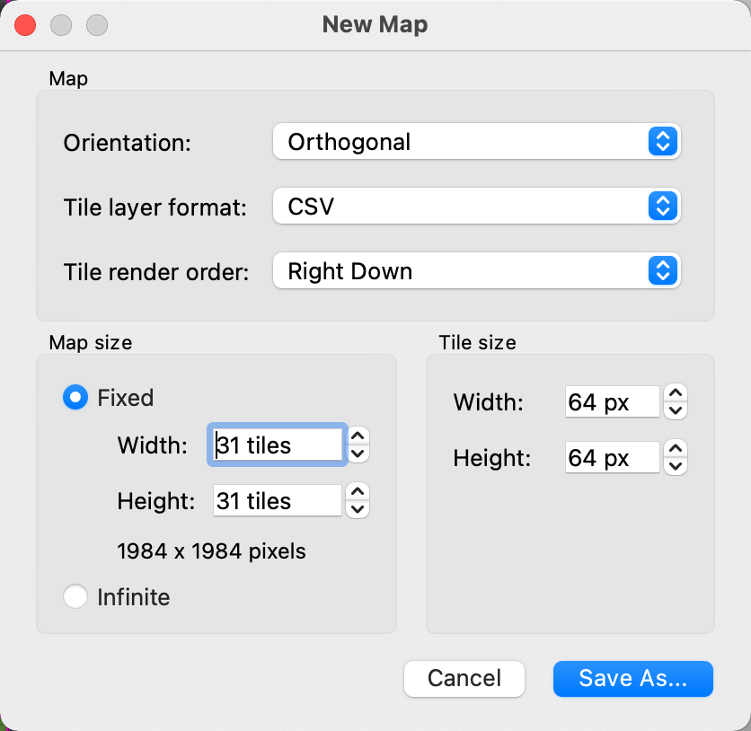

在弹出窗口里，上面Map部分就按照图中选择，下面Map Size部分，左边是地形大小，右边是每个地皮的像素，这个像素后面会用来指定上面的生成资源位置

填完后，点击 Save as，将创建的一个地图文件保存在硬盘上随便一个位置（要保证自己能找到的）

然后创建tileset

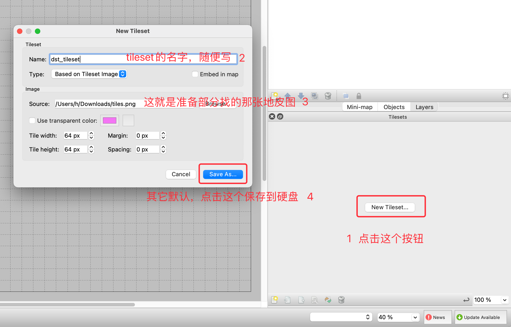

接下来就是画地图了

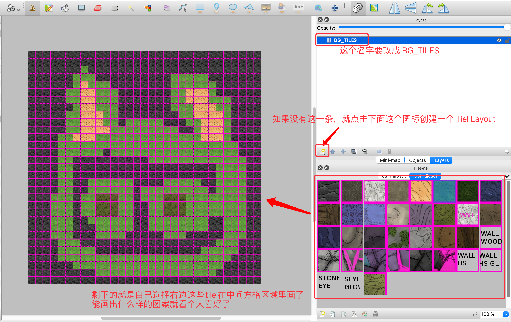

全都画好之后，选择File -> Export as

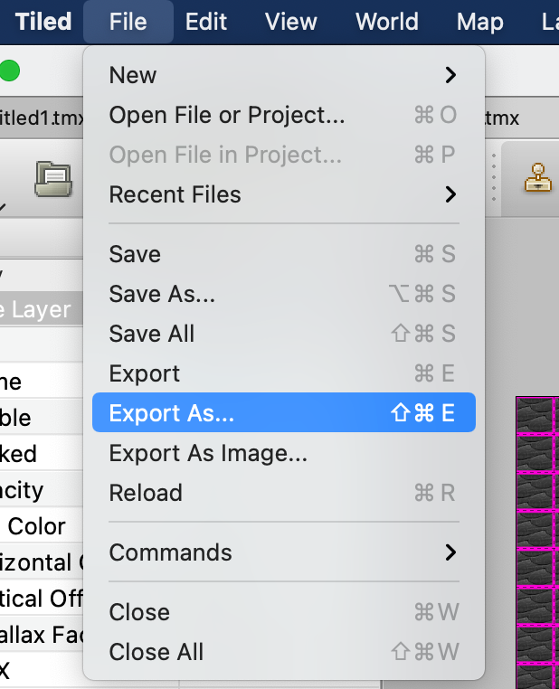


到此地图文件就做好了

--------

创建一个mod，在文件文件夹里创建文件夹 `scripts/map/static_layouts`

然后在 `static_layouts` 文件夹里创建文件 `layout_cat.lua`，文件的内容就是刚导出的文件

```lua
return {
    version = "1.5",
    luaversion = "5.1",
    tiledversion = "1.6.0",
    orientation = "orthogonal",
    renderorder = "right-down",
    width = 31,
    height = 31,
    tilewidth = 64,
    tileheight = 64,
    nextlayerid = 2,
    nextobjectid = 1,
    properties = {},
    tilesets = {{
        name = "ds_mapset",
        firstgid = 1,
        filename = "ds_mapset.tsx"
    }},
    layers = {{
        type = "tilelayer",
        x = 0,
        y = 0,
        width = 31,
        height = 31,
        id = 1,
        name = "BG_TILES",
        visible = true,
        opacity = 1,
        offsetx = 0,
        offsety = 0,
        parallaxx = 1,
        parallaxy = 1,
        properties = {},
        encoding = "lua",
        data = {1, 1, 1, 1, 1, 1, 1, 1, 1, 1, 1, 1, 1, 1, 1, 1, 1, 1, 1, 1, 1, 1, 1, 1, 1, 1, 1, 1, 1, 1, 1, 1, 1, 1, 1,
                1, 1, 1, 1, 1, 1, 1, 1, 1, 1, 1, 1, 1, 1, 1, 1, 1, 1, 1, 1, 1, 1, 1, 1, 1, 1, 1, 1, 1, 1, 1, 1, 1, 1, 6,
                1, 1, 1, 1, 1, 1, 1, 1, 1, 1, 1, 1, 1, 1, 1, 1, 1, 1, 1, 1, 1, 1, 1, 1, 1, 1, 1, 1, 1, 6, 6, 6, 1, 1, 1,
                1, 1, 1, 1, 1, 1, 1, 6, 6, 6, 6, 6, 1, 1, 1, 1, 1, 1, 1, 1, 1, 1, 1, 1, 1, 6, 5, 6, 6, 6, 1, 1, 1, 1, 1,
                1, 1, 1, 6, 6, 6, 6, 6, 6, 1, 1, 1, 1, 1, 1, 1, 1, 1, 1, 1, 6, 6, 5, 5, 6, 6, 6, 1, 1, 1, 1, 1, 1, 1, 6,
                6, 5, 5, 5, 6, 1, 1, 1, 1, 1, 1, 1, 1, 1, 1, 1, 6, 6, 5, 5, 6, 6, 6, 1, 1, 1, 1, 1, 1, 1, 6, 6, 5, 5, 5,
                6, 6, 6, 1, 1, 1, 1, 1, 1, 1, 1, 1, 1, 6, 5, 5, 6, 6, 6, 1, 1, 1, 1, 1, 1, 1, 6, 6, 6, 5, 5, 5, 6, 6, 1,
                1, 1, 1, 1, 1, 1, 1, 1, 6, 6, 5, 5, 5, 6, 6, 1, 1, 1, 1, 1, 1, 1, 1, 6, 6, 5, 5, 5, 5, 6, 1, 1, 1, 1, 1,
                1, 1, 1, 1, 6, 6, 5, 5, 5, 6, 6, 1, 6, 6, 6, 6, 6, 1, 1, 1, 6, 6, 5, 5, 5, 6, 1, 1, 1, 1, 1, 1, 1, 1, 1,
                6, 6, 5, 5, 5, 5, 6, 6, 6, 6, 6, 6, 6, 6, 6, 1, 1, 6, 5, 5, 5, 6, 1, 1, 1, 1, 1, 1, 1, 1, 6, 6, 5, 5, 5,
                6, 6, 6, 6, 6, 6, 6, 6, 6, 6, 6, 6, 6, 6, 5, 5, 5, 6, 1, 1, 1, 1, 1, 1, 1, 1, 6, 6, 6, 6, 6, 6, 6, 6, 6,
                6, 6, 6, 6, 6, 6, 6, 6, 6, 6, 6, 6, 6, 6, 6, 1, 1, 1, 1, 1, 1, 1, 6, 6, 6, 6, 6, 6, 1, 6, 6, 6, 6, 6, 6,
                6, 6, 6, 6, 6, 6, 6, 6, 6, 6, 6, 1, 1, 1, 1, 1, 1, 1, 6, 6, 1, 1, 1, 1, 1, 1, 1, 1, 1, 1, 6, 6, 6, 6, 6,
                6, 6, 6, 6, 6, 6, 6, 6, 1, 1, 1, 1, 1, 1, 6, 6, 1, 1, 1, 1, 1, 1, 1, 1, 1, 1, 1, 1, 1, 1, 1, 1, 1, 1, 1,
                6, 6, 6, 6, 1, 1, 1, 1, 1, 1, 6, 6, 1, 1, 1, 1, 1, 1, 1, 1, 1, 1, 1, 1, 1, 1, 1, 1, 1, 1, 1, 6, 6, 6, 6,
                1, 1, 1, 1, 1, 1, 6, 6, 1, 1, 6, 6, 6, 6, 6, 6, 1, 1, 1, 1, 6, 6, 6, 6, 6, 1, 1, 6, 6, 6, 6, 1, 1, 1, 1,
                1, 1, 6, 6, 1, 1, 6, 6, 6, 6, 6, 6, 1, 6, 6, 6, 6, 6, 6, 6, 6, 6, 1, 6, 6, 6, 6, 1, 1, 1, 1, 1, 6, 6, 6,
                1, 6, 6, 14, 14, 14, 6, 6, 1, 6, 6, 6, 14, 14, 14, 6, 6, 6, 6, 6, 6, 6, 6, 1, 1, 1, 1, 1, 6, 6, 6, 1, 6,
                6, 14, 14, 14, 6, 6, 1, 1, 6, 6, 14, 14, 14, 6, 6, 6, 6, 6, 6, 6, 6, 1, 1, 1, 1, 1, 6, 6, 6, 1, 6, 6,
                14, 14, 14, 6, 6, 1, 1, 6, 6, 14, 14, 14, 6, 6, 6, 6, 6, 6, 6, 6, 1, 1, 1, 1, 1, 6, 6, 6, 1, 1, 6, 6, 6,
                6, 6, 6, 1, 1, 6, 6, 6, 6, 6, 6, 6, 6, 1, 1, 6, 6, 6, 1, 1, 1, 1, 1, 6, 6, 6, 1, 1, 1, 6, 6, 6, 6, 6, 1,
                1, 6, 6, 6, 6, 6, 6, 6, 6, 1, 1, 6, 6, 6, 1, 1, 1, 1, 1, 6, 6, 6, 1, 1, 1, 6, 6, 6, 6, 1, 1, 1, 1, 1, 6,
                6, 6, 1, 1, 1, 1, 1, 6, 6, 6, 1, 1, 1, 1, 1, 1, 6, 6, 6, 1, 1, 1, 1, 1, 1, 1, 1, 1, 1, 1, 1, 1, 1, 1, 1,
                1, 1, 6, 6, 6, 1, 1, 1, 1, 1, 1, 1, 6, 6, 6, 6, 6, 1, 1, 1, 1, 1, 1, 1, 1, 1, 1, 1, 1, 1, 1, 6, 6, 6, 6,
                6, 1, 1, 1, 1, 1, 1, 1, 6, 6, 6, 6, 6, 6, 6, 6, 6, 6, 6, 6, 6, 6, 6, 6, 6, 6, 6, 6, 6, 6, 6, 1, 1, 1, 1,
                1, 1, 1, 1, 1, 1, 6, 6, 6, 6, 6, 6, 6, 6, 6, 6, 6, 6, 6, 6, 6, 6, 6, 6, 6, 6, 1, 1, 1, 1, 1, 1, 1, 1, 1,
                1, 1, 1, 1, 1, 6, 6, 6, 6, 6, 6, 6, 6, 6, 6, 6, 6, 6, 6, 6, 6, 1, 1, 1, 1, 1, 1, 1, 1, 1, 1, 1, 1, 1, 1,
                1, 1, 1, 1, 1, 1, 1, 1, 1, 1, 1, 1, 1, 1, 1, 1, 1, 1, 1, 1, 1, 1, 1}
    }}
}
```

然后在mod文件夹里创建文件 `modworldgenmain.lua`

```lua
require("map/tasks")
require("map/lockandkey")

local Layouts = require("map/layouts").Layouts
local StaticLayout = require("map/static_layout")

-- 将刚定义的地图放在静态地图表里
Layouts["CAT_HOME"] = StaticLayout.Get("map/static_layouts/layout_cat", {
    start_mask = GLOBAL.PLACE_MASK.IGNORE_IMPASSABLE_BARREN_RESERVED,
    fill_mask = GLOBAL.PLACE_MASK.IGNORE_IMPASSABLE_BARREN_RESERVED,
    layout_position = GLOBAL.LAYOUT_POSITION.CENTER,
    disable_transform = true
})

-- 将刚定义的地图添加到主世界里，放在ocean_prefill_setpieces这个对象里，隐士岛的静态地图也是放在这个对象里
-- ocean_prefill_setpieces 这个对象里的地形都是随机生成在海上的
AddLevelPreInitAny(function(level)
    if level.location == "forest" then -- forest 是森林，就是主世界
        if level.ocean_prefill_setpieces ~= nil then
            level.ocean_prefill_setpieces["CAT_HOME"] = {count = 2} -- count 表示要生成几个
        end
    end
end)
```

进游戏创建世界看看效果

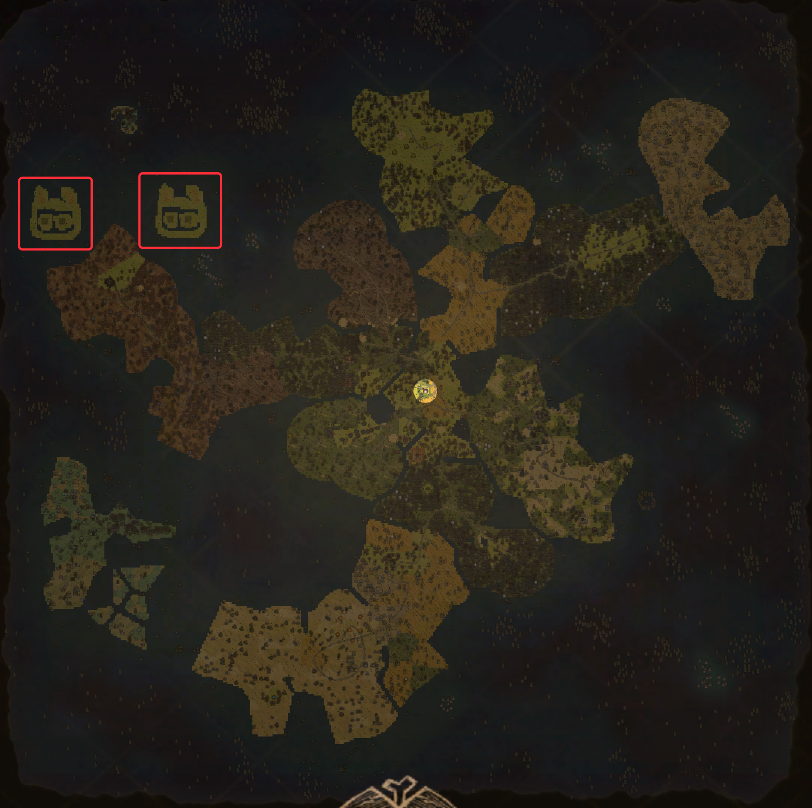

地形生成好了，但上面还是光秃秃的，也不好看，下面就来在上面指定位置生成一些东西吧

> 在地形上定义生成的实体的方式有两种，一种是自己算坐标，硬写，一种是进游戏，通过控制台把相应的物品资源都生成好，然后扫描地图获取坐标来直接使用
>
> 第二种方式可以参见教程：https://www.bilibili.com/read/cv4336821
>
> 我这就简单点介绍一下怎么定义的，就随便指定一下坐标了

坐标计算，前面在tiled软件里创建地图的时候，选择了 31x31大小，每个tile的大小都是64x64像素的，所以坐标可选范围就是 (0,0) - (1980,1980)

下面就是修改生成好的地图文件了，在`layers`对象里再定义一个对象，类型是 `objectgroup` ，名字是 `FG_OBJECTS` 为什么是它们呢？因为隐士岛里写的就是这个

```lua
return {
    version = "1.5",
    luaversion = "5.1",
    tiledversion = "1.6.0",
    orientation = "orthogonal",
    renderorder = "right-down",
    width = 31,
    height = 31,
    tilewidth = 64,
    tileheight = 64,
    nextlayerid = 2,
    nextobjectid = 1,
    properties = {},
    tilesets = {{
        name = "ds_mapset",
        firstgid = 1,
        filename = "ds_mapset.tsx"
    }},
    layers = {{
        type = "tilelayer",
        x = 0,
        y = 0,
        width = 31,
        height = 31,
        id = 1,
        name = "BG_TILES",
        visible = true,
        opacity = 1,
        offsetx = 0,
        offsety = 0,
        parallaxx = 1,
        parallaxy = 1,
        properties = {},
        encoding = "lua",
        data = {1, 1, 1, 1, 1, 1, 1, 1, 1, 1, 1, 1, 1, 1, 1, 1, 1, 1, 1, 1, 1, 1, 1, 1, 1, 1, 1, 1, 1, 1, 1, 1, 1, 1, 1,
                1, 1, 1, 1, 1, 1, 1, 1, 1, 1, 1, 1, 1, 1, 1, 1, 1, 1, 1, 1, 1, 1, 1, 1, 1, 1, 1, 1, 1, 1, 1, 1, 1, 1, 6,
                1, 1, 1, 1, 1, 1, 1, 1, 1, 1, 1, 1, 1, 1, 1, 1, 1, 1, 1, 1, 1, 1, 1, 1, 1, 1, 1, 1, 1, 6, 6, 6, 1, 1, 1,
                1, 1, 1, 1, 1, 1, 1, 6, 6, 6, 6, 6, 1, 1, 1, 1, 1, 1, 1, 1, 1, 1, 1, 1, 1, 6, 5, 6, 6, 6, 1, 1, 1, 1, 1,
                1, 1, 1, 6, 6, 6, 6, 6, 6, 1, 1, 1, 1, 1, 1, 1, 1, 1, 1, 1, 6, 6, 5, 5, 6, 6, 6, 1, 1, 1, 1, 1, 1, 1, 6,
                6, 5, 5, 5, 6, 1, 1, 1, 1, 1, 1, 1, 1, 1, 1, 1, 6, 6, 5, 5, 6, 6, 6, 1, 1, 1, 1, 1, 1, 1, 6, 6, 5, 5, 5,
                6, 6, 6, 1, 1, 1, 1, 1, 1, 1, 1, 1, 1, 6, 5, 5, 6, 6, 6, 1, 1, 1, 1, 1, 1, 1, 6, 6, 6, 5, 5, 5, 6, 6, 1,
                1, 1, 1, 1, 1, 1, 1, 1, 6, 6, 5, 5, 5, 6, 6, 1, 1, 1, 1, 1, 1, 1, 1, 6, 6, 5, 5, 5, 5, 6, 1, 1, 1, 1, 1,
                1, 1, 1, 1, 6, 6, 5, 5, 5, 6, 6, 1, 6, 6, 6, 6, 6, 1, 1, 1, 6, 6, 5, 5, 5, 6, 1, 1, 1, 1, 1, 1, 1, 1, 1,
                6, 6, 5, 5, 5, 5, 6, 6, 6, 6, 6, 6, 6, 6, 6, 1, 1, 6, 5, 5, 5, 6, 1, 1, 1, 1, 1, 1, 1, 1, 6, 6, 5, 5, 5,
                6, 6, 6, 6, 6, 6, 6, 6, 6, 6, 6, 6, 6, 6, 5, 5, 5, 6, 1, 1, 1, 1, 1, 1, 1, 1, 6, 6, 6, 6, 6, 6, 6, 6, 6,
                6, 6, 6, 6, 6, 6, 6, 6, 6, 6, 6, 6, 6, 6, 6, 1, 1, 1, 1, 1, 1, 1, 6, 6, 6, 6, 6, 6, 1, 6, 6, 6, 6, 6, 6,
                6, 6, 6, 6, 6, 6, 6, 6, 6, 6, 6, 1, 1, 1, 1, 1, 1, 1, 6, 6, 1, 1, 1, 1, 1, 1, 1, 1, 1, 1, 6, 6, 6, 6, 6,
                6, 6, 6, 6, 6, 6, 6, 6, 1, 1, 1, 1, 1, 1, 6, 6, 1, 1, 1, 1, 1, 1, 1, 1, 1, 1, 1, 1, 1, 1, 1, 1, 1, 1, 1,
                6, 6, 6, 6, 1, 1, 1, 1, 1, 1, 6, 6, 1, 1, 1, 1, 1, 1, 1, 1, 1, 1, 1, 1, 1, 1, 1, 1, 1, 1, 1, 6, 6, 6, 6,
                1, 1, 1, 1, 1, 1, 6, 6, 1, 1, 6, 6, 6, 6, 6, 6, 1, 1, 1, 1, 6, 6, 6, 6, 6, 1, 1, 6, 6, 6, 6, 1, 1, 1, 1,
                1, 1, 6, 6, 1, 1, 6, 6, 6, 6, 6, 6, 1, 6, 6, 6, 6, 6, 6, 6, 6, 6, 1, 6, 6, 6, 6, 1, 1, 1, 1, 1, 6, 6, 6,
                1, 6, 6, 14, 14, 14, 6, 6, 1, 6, 6, 6, 14, 14, 14, 6, 6, 6, 6, 6, 6, 6, 6, 1, 1, 1, 1, 1, 6, 6, 6, 1, 6,
                6, 14, 14, 14, 6, 6, 1, 1, 6, 6, 14, 14, 14, 6, 6, 6, 6, 6, 6, 6, 6, 1, 1, 1, 1, 1, 6, 6, 6, 1, 6, 6,
                14, 14, 14, 6, 6, 1, 1, 6, 6, 14, 14, 14, 6, 6, 6, 6, 6, 6, 6, 6, 1, 1, 1, 1, 1, 6, 6, 6, 1, 1, 6, 6, 6,
                6, 6, 6, 1, 1, 6, 6, 6, 6, 6, 6, 6, 6, 1, 1, 6, 6, 6, 1, 1, 1, 1, 1, 6, 6, 6, 1, 1, 1, 6, 6, 6, 6, 6, 1,
                1, 6, 6, 6, 6, 6, 6, 6, 6, 1, 1, 6, 6, 6, 1, 1, 1, 1, 1, 6, 6, 6, 1, 1, 1, 6, 6, 6, 6, 1, 1, 1, 1, 1, 6,
                6, 6, 1, 1, 1, 1, 1, 6, 6, 6, 1, 1, 1, 1, 1, 1, 6, 6, 6, 1, 1, 1, 1, 1, 1, 1, 1, 1, 1, 1, 1, 1, 1, 1, 1,
                1, 1, 6, 6, 6, 1, 1, 1, 1, 1, 1, 1, 6, 6, 6, 6, 6, 1, 1, 1, 1, 1, 1, 1, 1, 1, 1, 1, 1, 1, 1, 6, 6, 6, 6,
                6, 1, 1, 1, 1, 1, 1, 1, 6, 6, 6, 6, 6, 6, 6, 6, 6, 6, 6, 6, 6, 6, 6, 6, 6, 6, 6, 6, 6, 6, 6, 1, 1, 1, 1,
                1, 1, 1, 1, 1, 1, 6, 6, 6, 6, 6, 6, 6, 6, 6, 6, 6, 6, 6, 6, 6, 6, 6, 6, 6, 6, 1, 1, 1, 1, 1, 1, 1, 1, 1,
                1, 1, 1, 1, 1, 6, 6, 6, 6, 6, 6, 6, 6, 6, 6, 6, 6, 6, 6, 6, 6, 1, 1, 1, 1, 1, 1, 1, 1, 1, 1, 1, 1, 1, 1,
                1, 1, 1, 1, 1, 1, 1, 1, 1, 1, 1, 1, 1, 1, 1, 1, 1, 1, 1, 1, 1, 1, 1}
    }, {
        type = "objectgroup",
        name = "FG_OBJECTS",
        visible = true,
        opacity = 1,
        properties = {},
        objects = {{
            name = "",
            type = "evergreen", -- 预制体的名字，这个是常青树的预制体名字
            shape = "rectangle", -- 形状，貌似所有的实体都是这个形状，距形
            x = 444, -- x坐标
            y = 766, -- y坐标
            width = 0,
            height = 0,
            visible = true, -- 是否可见
            properties = {}
        }, {
            name = "",
            type = "grass", -- 预制体的名字，这个是䓍的预制体名字
            shape = "rectangle", -- 形状，貌似所有的实体都是这个形状，距形
            x = 798, -- x坐标
            y = 682, -- y坐标
            width = 0,
            height = 0,
            visible = true, -- 是否可见
            properties = {}
        }}
    }}
}
```

进游戏看效果

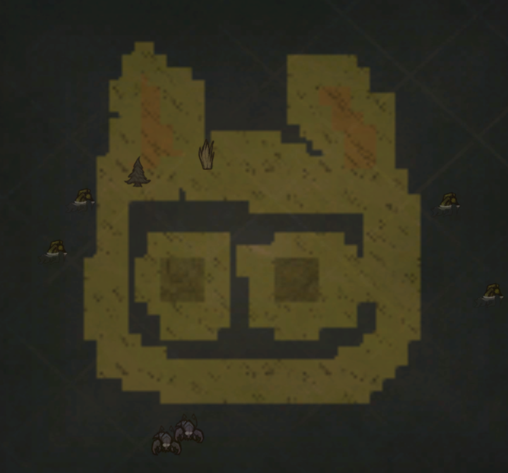

## 动态地形

写动态地形之前首先要弄明白 room, task, taskset, level是啥，关于这点可以去 [节点](https://tomoya92.github.io/dstmod-tutorial/#/room) 里了解

它们之前的关系如下图

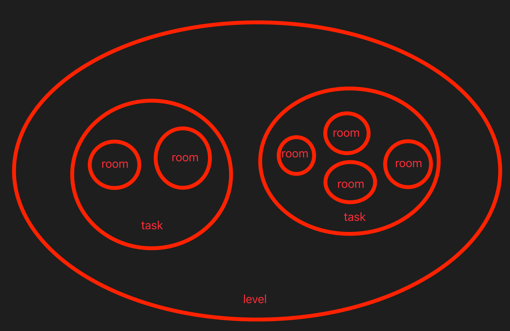

taskset 就是把不同的task给集合到一起去，最后还是被添加进了level里

taskset对应的有四个值

- default 联机版生物群落
- classic 经典生物群落
- lavaarena_taskset 熔炉生物群落（猜测）
- quagmire_taskset 暴食生物群落（猜测）

其中 default, classic 对应的就是创建存档时选择的生物群落

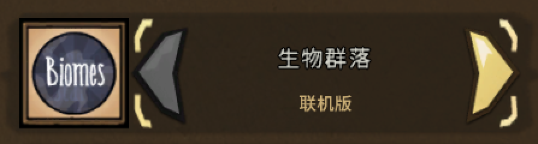

下面开始自定义一个地形

首先定义一个room

```lua
AddRoom("CUS_MoonLand", { -- 名字随便取，不过不要跟游戏默认的重复了
    colour = { -- 调试用的，不用管它
        r = .5,
        g = .8,
        b = .5,
        a = .50
    },
    value = GLOBAL.GROUND.METEOR, -- 地皮，我这选择的是月岛的地皮，可去 constants.lua 文件里查看 GROUND 对象
    tags = {"ExitPiece"}, -- room的标签，用于触发一些事件的，比如月岛地形走上去反转理智
    contents = { -- 这里定义的是地形上的资源分布
        countprefabs = {},
        distributepercent = .6,
        distributeprefabs = { -- 分布的资源（都是预制体名）后面数字是占比，下面添加的都是月岛上的实体
            moon_tree = 0.3, -- 月树
            sapling_moon = 0.3,
            carrat_planted = 0.2,
            moon_tree_blossom_worldgen = 0.2,
            ground_twigs = 0.1,
            rock_avocado_bush = 0.1,
            moonglass_rock = 0.05, -- 玻璃
            moon_fissure = 0.2
        }
    }
})
```

然后定义一个task

```lua
AddTask("CUS_MoonLand_TASK", { -- 名字随便取，也不要跟游戏默认的重复了
    locks = {GLOBAL.LOCKS.NONE},
    keys_given = {},
    room_tags = {},
    room_choices = { -- 给当前task添加room，我这就只添加上面定义的那一个room，后面数字是节点数，节点数越大，地形就越大
        ["CUS_MoonLand"] = 3
    },
    room_bg = GLOBAL.GROUND.METEOR, -- 地皮类型
    background_room = "CUS_MoonLand",
    colour = {
        r = 0.6,
        g = 0.6,
        b = 0.0,
        a = 1
    }
})
```

接着将上面定义好的task添加到生物群落里去

```lua
AddTaskSetPreInit("default", function(task)
    table.insert(task.tasks, "CUS_MoonLand_TASK")
end)
-- AddTaskSetPreInit("classic", function(task)
--     table.insert(task.tasks, "CUS_MoonLand_TASK")
-- end)
```

最后将上面定义的room, task, taskset的代码都放到 `modworldgenmain.lua` 文件里，注意，必须要放在这个文件里，放在 modmain.lua 里是不会生效的

创建一个新游戏进游戏看效果


可以看到刚定义的月岛地形跟主大陆相连了

