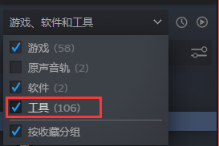
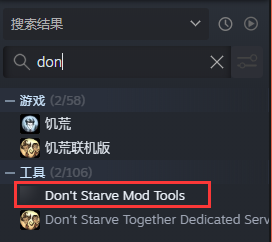
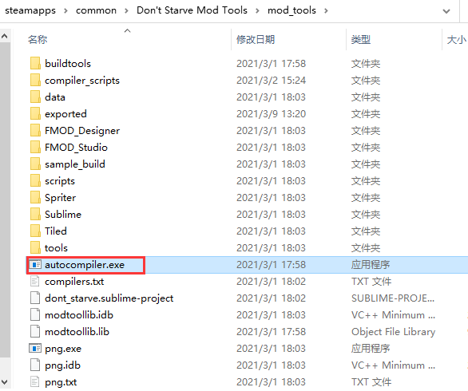
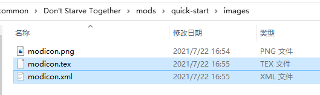
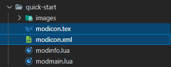
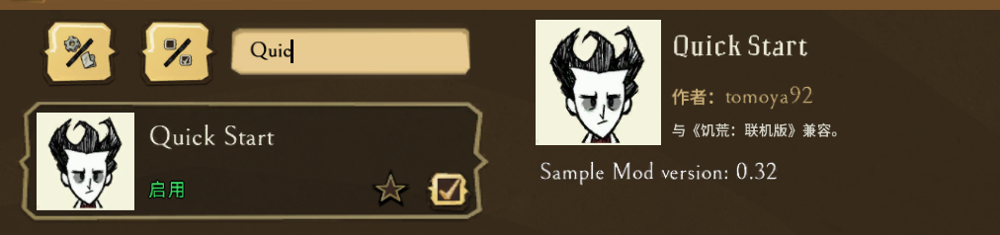

打开饥荒进入模组列表中看到别的模组都有图标，自己写的是个空白，难免不好看，下面就来介绍modicon怎么生成

## 准备图片

在 `quick-start` 文件里里创建一个文件夹 `images` 然后把一个 `png` 格式的图片复制进去，最好改一下名字，比如大家约定俗成的 `modicon.png`

## 安装Don't Starve Mod Tools

打开steam，勾选上工具



然后再搜索 `don` 就能找到这个 `Don't Starve Mod Tools`



## 运行脚本

找到安装目录，打开 `mod_tools` 文件夹，里面有个 `autocompiler.exe` 文件，双击即可



运行完后会发现 `images` 文件夹里多出了两个文件



## 修改modinfo.lua

上一篇注释掉的modicon部分的代码可以放开了，然后将`images`里的 `modicon.tex` 和 `modicon.xml` 两个文件拷贝到 mod 文件夹里

```lua
-- 名称
name = "Quick Start"
-- 版本
version = "0.32"
-- 描述
description = "Sample Mod version: " .. version
-- 作者
author = "tomoya92"
-- klei官方论坛地址，为空则默认是工坊的地址
forumthread = ""
-- modicon 下一篇再介绍怎么创建的
icon_atlas = "modicon.xml"
icon = "modicon.tex"
-- dst兼容
dst_compatible = true
-- 是否是客户端mod
client_only_mod = true
-- 是否是所有客户端都需要安装
all_clients_require_mod = false
-- 饥荒api版本，固定填10
api_version = 10

-- mod的配置项，后面介绍
configuration_options = {}
```



进游戏就可以看到图标了

