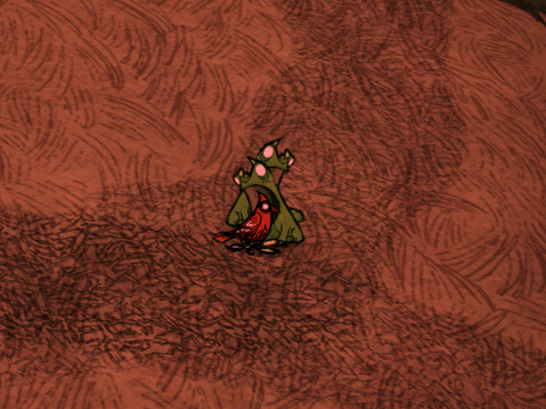
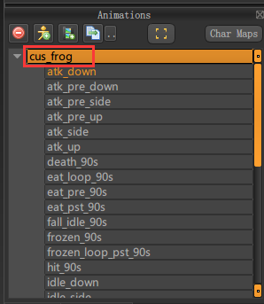
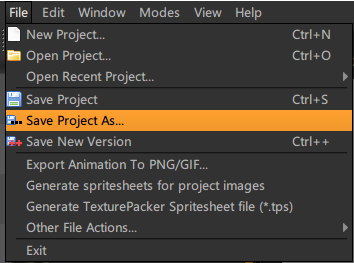
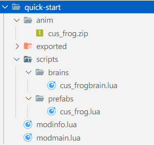

## 简介

写mod教程文档到现在，才发现最难的原来是怪物，要写一个怪物，首先要做贴图，然后用贴图做动画，接着创建prefab，还要为怪物写AI(brain)，状态(stategraph)，以及动作(action)，和它的生成机制

这么看来，要想弄一个怪物出来，就要把高级部分基本上都要弄明白了才行

碰巧之前玩过永不妥协mod，里面的青蛙(确切的说应该是蟾蜍)会找东西吃的一个行为让我印象很深，这篇就把永不妥协里的青蛙单独拿出来介绍一下开发一个怪物的流程

先看看效果



> 青蛙吃东西这个动画是原版饥荒里青蛙动画文件里自带的，但不知道为啥klei没有把它实现出来，永不妥协里用的就是这个吃东西的动画

## 贴图

先处理贴图，我这是找到原版青蛙贴图(文件名 frog.zip)通过ktools工具解包出来

> ktools 下载地址 https://forums.kleientertainment.com/files/file/583-ktools-cross-platform-modding-tools-for-dont-starve/

把frog.zip打开，将里面的 anim.bin, build.bin, atlas-0.tex 给解压到 ktools 文件夹里然后执行下面命令

```
krane.exe build.bin anim.bin output
```

执行完后，贴图，动画就在output文件夹里了

把里面的贴图用PS都给换了个色，换好之后

将 `frog.scml` 文件用Spriter软件打开，修改一下Animations的名字



然后点击 File -> Save Project As 重命名为 `cus_frog.scml` 保存好之后就可以把 frog.scml 给删了



最后把output下面的所有文件都拷贝到创建的mod里的 exported 文件夹里，运行饥荒工具包里的 autocompiler.exe 将动画给打包一下，然后在mod文件夹里就会多出一个anim文件夹，**打开里面的 cus_frog.zip 把里面的 anim.bin 文件给删除掉**

## 代码

青蛙的SG里是没有吃这个动作和状态的，所以首先要添加一个吃的动作(action)，然后再给青蛙sg里补一个吃的状态，代码如下

modmain.lua
```lua
-- 给青蛙的sg里添加一个动作处理器
AddStategraphActionHandler("frog", GLOBAL.ActionHandler(GLOBAL.ACTIONS.EAT, "eat"))

-- 给青蛙sg里添加吃的状态
AddStategraphPostInit("frog", function(inst)
    local states = {GLOBAL.State { -- 准备吃
        name = "eat",
        tags = {"busy"},

        onenter = function(inst, forced)
            inst.Physics:Stop()
            inst.AnimState:PlayAnimation("eat_pre")
            inst.SoundEmitter:PlaySound("dontstarve/frog/attack_voice")
            inst.sg.statemem.forced = forced
        end,

        events = {GLOBAL.EventHandler("animover", function(inst)
            inst.sg:GoToState((inst:PerformBufferedAction() or inst.sg.statemem.forced) and "eat_loop" or "idle")
        end)}
    }, GLOBAL.State { -- 循环吃
        name = "eat_loop",
        tags = {"busy"},

        onenter = function(inst)
            inst.Physics:Stop()
            inst.AnimState:PlayAnimation("eat_loop", true)
            inst.SoundEmitter:PlaySound("dontstarve/frog/grunt")
            inst.sg:SetTimeout(1 + math.random() * 1)
        end,

        ontimeout = function(inst)
            inst.sg:GoToState("eat_pst", "idle")
        end
    }, GLOBAL.State { -- 吃的过程
        name = "eat_pst",
        tags = {"busy"},

        onenter = function(inst)
            inst.Physics:Stop()
            inst.AnimState:PlayAnimation("eat_pst")
        end,

        events = {GLOBAL.EventHandler("animover", function(inst)
            inst.sg:GoToState("idle")
        end)}
    }}

    for k, v in pairs(states) do
        GLOBAL.assert(v:is_a(GLOBAL.State), "Non-state added in mod state table!")
        inst.states[v.name] = v
    end

end)
```

sg准备好了，接下来写AI(brain)

把青蛙的AI拿过来，在行为节点里添加一个吃的动作即可，官方青蛙的brain文件名为 `frogbrain.lua`

下面是我拷贝过来，改过且重命名为 cus_frogbrain.lua

scripts/brains/cus_frogbrain.lua
```lua
require "behaviours/wander"
require "behaviours/doaction"
require "behaviours/chaseandattack"
require "behaviours/standstill"

local STOP_RUN_DIST = 10
local SEE_PLAYER_DIST = 5
local MAX_WANDER_DIST = 20
local SEE_TARGET_DIST = 6

local MAX_CHASE_DIST = 7
local MAX_CHASE_TIME = 8

local function GoHomeAction(inst)
    if inst.components.homeseeker and inst.components.homeseeker.home and inst.components.homeseeker.home:IsValid() then
        return BufferedAction(inst, inst.components.homeseeker.home, ACTIONS.GOHOME)
    end
end

local function ShouldGoHome(inst)
    return TheWorld.state.iswinter
end

---------------------------------------------------------------------------------------------------------
-- 这部分是实现青蛙找附近食物，然后找到的话就通过 BufferedAction 调用 Action.EAT 动作开始吃
local SEE_DIST = 20
local FINDFOOD_CANT_TAGS = {"outofreach"}
local function EatFoodAction(inst)
    if inst.sg.currentstate.name == "fall" then
        return nil
    end
    --[[local target = FindEntity(inst, SEE_DIST, function(item) return inst.components.eater:CanEat(item) and item:IsOnPassablePoint(true) end)
    return target ~= nil and BufferedAction(inst, target, ACTIONS.EAT) or nil
	]]
    local target = FindEntity(inst, SEE_DIST, function(item)
        return item.prefab ~= "mandrake" and item.components.edible ~= nil and item:IsOnPassablePoint() and
                   item:IsOnValidGround() and not (item:HasTag("bee") or item:HasTag("mosquito")) and
                   (inst.components.eater ~= nil and inst.components.eater:CanEat(item))
    end, nil, FINDFOOD_CANT_TAGS)
    if target ~= nil then -- 当找到食物时，就开吃
        return BufferedAction(inst, target, ACTIONS.EAT) or nil
    end
end
---------------------------------------------------------------------------------------------------------

local CusFrogBrain = Class(Brain, function(self, inst)
    Brain._ctor(self, inst)
end)

function CusFrogBrain:OnStart()

    local root = PriorityNode({
        WhileNode(function()
            return self.inst.components.hauntable and self.inst.components.hauntable.panic
        end, "PanicHaunted", Panic(self.inst)),

        ChaseAndAttack(self.inst, MAX_CHASE_TIME),

        WhileNode(function()
            return ShouldGoHome(self.inst)
        end, "ShouldGoHome", DoAction(self.inst, function()
            return GoHomeAction(self.inst)
        end, "go home", true)),

        -- 下面这行是添加的吃的行为
        DoAction(self.inst, EatFoodAction, "eat food", true),

        WhileNode(function()
            return TheWorld and not TheWorld.state.isnight
        end, "IsNotNight", Wander(self.inst, function()
            return self.inst.components.knownlocations:GetLocation("home")
        end, MAX_WANDER_DIST)),

        StandStill(self.inst, function()
            return self.inst.sg:HasStateTag("idle")
        end, nil)
    }, .25)

    self.bt = BT(self.inst, root)

end

return CusFrogBrain
```

有brain了，下面来添加prefab，新增的部分我都加了注释，其它的就跟原版 prefabs/frog.lua 的内容是一样的

scripts/prefabs/cus_frog.lua
```lua
-- 贴图用的就是上面处理好的，声音用的还是原版里青蛙的声音
local assets = {Asset("ANIM", "anim/cus_frog.zip"), Asset("SOUND", "sound/frog.fsb")}

local prefabs = {"froglegs", "frogsplash"}

-- 引入上面自定义的脑子
local brain = require "brains/cus_frogbrain"

local RESTARGET_MUST_TAGS = {"_combat", "_health"}
local function retargetfn(inst)
    if not inst.components.health:IsDead() and not inst.components.sleeper:IsAsleep() then
        return FindEntity(inst, TUNING.FROG_TARGET_DIST, function(guy)
            if not guy.components.health:IsDead() then
                return guy.components.inventory ~= nil
            end
        end, RESTARGET_MUST_TAGS -- see entityreplica.lua
        )
    end
end

local function ShouldSleep(inst)
    return false -- frogs either go to their home, or just sit on the ground.
end

local function OnAttacked(inst, data)
    inst.components.combat:SetTarget(data.attacker)
    inst.components.combat:ShareTarget(data.attacker, 30, function(dude)
        return dude:HasTag("frog") and not dude.components.health:IsDead()
    end, 5)
end

local function OnGoingHome(inst)
    SpawnPrefab("frogsplash").Transform:SetPosition(inst.Transform:GetWorldPosition())
end

local function OnHitOther(inst, other, damage)
    inst.components.thief:StealItem(other)
end

local function fn()
    local inst = CreateEntity()

    inst.entity:AddTransform()
    inst.entity:AddAnimState()
    inst.entity:AddSoundEmitter()
    inst.entity:AddDynamicShadow()
    inst.entity:AddNetwork()

    MakeCharacterPhysics(inst, 1, .3)

    inst.DynamicShadow:SetSize(1.5, .75)
    inst.Transform:SetFourFaced()

    inst.AnimState:SetBank("frog")
    inst.AnimState:SetBuild("cus_frog") -- 这地方的贴图要换成新的
    inst.AnimState:PlayAnimation("idle")

    inst:AddTag("animal")
    inst:AddTag("prey")
    inst:AddTag("hostile")
    inst:AddTag("smallcreature")
    inst:AddTag("frog")
    inst:AddTag("canbetrapped")
    inst:AddTag("toad")

    inst.entity:SetPristine()

    if not TheWorld.ismastersim then
        return inst
    end

    inst:AddComponent("locomotor") -- locomotor must be constructed before the stategraph
    inst.components.locomotor.walkspeed = 4
    inst.components.locomotor.runspeed = 8

    -- boat hopping enable.
    inst.components.locomotor:SetAllowPlatformHopping(true)
    inst:AddComponent("embarker")
    inst:AddComponent("drownable")

    inst:SetStateGraph("SGfrog")

    inst:SetBrain(brain)

    inst:AddComponent("sleeper")
    inst.components.sleeper:SetSleepTest(ShouldSleep)

    inst:AddComponent("health")
    inst.components.health:SetMaxHealth(TUNING.FROG_HEALTH)

    inst:AddComponent("combat")
    inst.components.combat:SetDefaultDamage(TUNING.FROG_DAMAGE)
    inst.components.combat:SetAttackPeriod(TUNING.FROG_ATTACK_PERIOD)
    inst.components.combat:SetRetargetFunction(3, retargetfn)

    inst.components.combat.onhitotherfn = OnHitOther

    inst:AddComponent("thief")

    -------------------------------------------------------------------
    -- 给青蛙添加上吃的组件
    inst:AddComponent("eater")
    inst.components.eater:SetDiet({FOODGROUP.OMNI}, {FOODGROUP.OMNI})
    inst.components.eater:SetCanEatHorrible()
    inst.components.eater:SetCanEatRaw()
    inst.components.eater.strongstomach = true -- can eat monster meat!
    -------------------------------------------------------------------

    MakeTinyFreezableCharacter(inst, "frogsack")

    MakeHauntablePanic(inst)

    inst:AddComponent("lootdropper")
    inst.components.lootdropper:SetLoot({"froglegs"})

    inst:AddComponent("knownlocations")
    inst:AddComponent("inspectable")

    inst:ListenForEvent("attacked", OnAttacked)
    inst:ListenForEvent("goinghome", OnGoingHome)

    return inst
end

-- 最后给新定义的青蛙起个名字 cus_frog
return Prefab("cus_frog", fn, assets, prefabs)
```

有了prefab，首先在modmain.lua里引入

接着要给设定生成机制，原版青蛙的生成是在池塘位置刷新的，所以我这就通过 `AddPrefabPostInit` api将池塘刷新的原版青蛙给改成自定义的青蛙

modmain.lua
```lua
PrefabFiles = {"cus_frog"}

AddPrefabPostInit("pond", function(inst)
    if inst.components.childspawner then
        inst.components.childspawner.childname = "cus_frog"
    end
end)
```

项目结构如下


