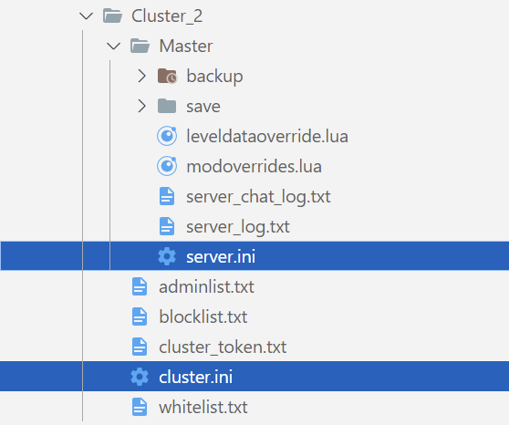
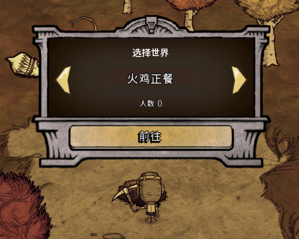

## 前言

这篇介绍一下多层世界搭建的方法

在搭建多层之前首先也要将steamcmd安装好，可参见上一篇 [SteamCMD创建专服](https://atjiu.github.io/dstmod-tutorial/#/steamcmd_dedicated_server)

这篇就以三台服务器为例，两个地面世界，一个洞穴世界

| 服务器 | ip              | 身份         | 公网ip |
|-----|-----------------|------------|------|
| 清风服 | 123.123.123.123 | 主世界(地面) | 需要   |
| 碎梦服 | 123.123.123.124 | 从世界(地面) | 不需要 |
| 火鸡服 | 123.123.123.125 | 从世界(洞穴) | 不需要 |

由此可见，其实只需要一台云服就行了，其它的从世界因为不需要公网ip，所以个人电脑，家里闲置的电脑都是可以充当的

需要借用的mod：[多层世界选择器](https://steamcommunity.com/sharedfiles/filedetails/?id=1438233888)

## 主世界

首先看一下存档结构



其中被选中的两个文件就是开多层要修改配置的文件

首先 `cluster.ini`

主要修改的就是

`bind_ip` 和 `master_ip`

- `bind_ip` 因为主世界是需要从世界来连接的，所以这个ip要填上当前机器的ip，但我试过如果填上当前机器的公网ip，从世界还是连不上，所以就直接写 `0.0.0.0` ，表示不限ip地址
- `master_ip` 就是当前服务器的公网ip

完整配置如下

```ini
[GAMEPLAY]
game_mode = endless
max_players = 11
pvp = false
pause_when_empty = true


[NETWORK]
lan_only_cluster = false
cluster_password =
cluster_description = 主世界：清风抚月，从地面：碎梦樱雪，从洞穴：火鸡正餐
cluster_name = 清风服
offline_cluster = false
cluster_language = zh


[MISC]
console_enabled = true


[SHARD]
shard_enabled = true
bind_ip = 0.0.0.0
master_ip = 123.123.123.123
master_port = 10888
cluster_key = defaultPass
```

其次是 `server.ini`

主要修改的就是

- `server_port` 服务的端口，这个保持默认就好
- `is_master` 是否是主世界，主世界就填 true, 从世界就填 false
- `name` 世界名，可以随便起一个名字
- `id` 这个比较重要，务必要记住这个id都填的是啥，因为后面配置模组的时候要用到

```ini
[NETWORK]
server_port = 10999


[SHARD]
is_master = true
name = 清风抚月
id = 1


[ACCOUNT]
encode_user_path = true

```

## 从世界

这里以一个从世界为例，也是要改`cluster.ini`和`server.ini`这两个文件的配置

首先 `cluster.ini`

- `bing_ip` 因为从世界没有其它的世界来连接，所以填本机ip就好，比如可以填上 `127.0.0.1`
- `master_ip` 这个表示主世界的ip

完整配置如下

```ini
[GAMEPLAY]
game_mode = endless
max_players = 11
pvp = false
pause_when_empty = true


[NETWORK]
lan_only_cluster = false
cluster_password =
cluster_description = 主世界：清风抚月，从地面：碎梦樱雪，从洞穴：火鸡正餐
cluster_name = 清风服
offline_cluster = false
cluster_language = zh


[MISC]
console_enabled = true


[SHARD]
shard_enabled = true
bind_ip = 127.0.0.1
master_ip = 123.123.123.123
master_port = 10888
cluster_key = defaultPass

```

其次是 `server.ini`

- `server_port` 服务的端口，如果多层世界都在一个服务器上开，就需要与其它世界分开，如果是分散在多台服务器上开，就无所谓了，当然如果不放心，也可以填成不一样的
- `is_master` 是否是主世界，主世界就填 true, 从世界就填 false
- `name` 世界名，可以随便起一个名字
- `id` 这个比较重要，务必要记住这个id都填的是啥，因为后面配置模组的时候要用到

完整配置如下

```ini
[NETWORK]
server_port = 11000


[SHARD]
is_master = false
name = 碎梦樱雪
id = 2


[ACCOUNT]
encode_user_path = true

```

从世界的配置都是一样的，另一个从世界我就不列出来了

## 配置世界和模组

可参见上一篇 [SteamCMD创建专服](https://atjiu.github.io/dstmod-tutorial/#/steamcmd_dedicated_server)

## 启动服务

可参见上一篇 [SteamCMD创建专服](https://atjiu.github.io/dstmod-tutorial/#/steamcmd_dedicated_server)

## 模组配置（选择世界）

模组 [多层世界选择器](https://steamcommunity.com/sharedfiles/filedetails/?id=1438233888) 的功能是当点击洞穴时，会弹出一个选择世界的窗口

配置如下

```lua
["workshop-1438233888"]={
    configuration_options={
        auto_balancing=false,
        extra_worlds={  },
        ignore_sinkholes=false,
        invisible_worlds={  },
        language="chs",
        migration_postern=false,
        no_bat=true,
        population_limit={  },
        say_dest=true,
        world_name={ ["1"]="清风抚月", ["2"]="碎梦樱雪", ["3"]="火鸡正餐" },
        world_prompt=true
    },
    enabled=true
},
```

主要看 `world_name` 的配置，数据结构是一个表，key是世界的id，value是世界名字

进游戏的效果如下图



## 可能会出现的问题

如果从世界都配置好了，但就是一直在重连主世界，那有可能是主世界没有开放端口

端口号就是 `cluster.ini` 里的 `master_port`，默认是 10888

> 如果你的服务器是阿里云或者腾讯云，则需要去阿里或者腾讯的网站控制台上去开放端口，其它平台的服务器根据平台来修改开放

## 注意事项

1. 所有世界的模组必须一样，模组的选项配置理论上应该是可以不一样的，我没试过，不过最好保持一样，复制也方便
2. 所有世界启动时用的令牌必须要一样，就是 `cluster_token.txt` 文件里的内容要一样
3. 如果游戏本体更新，则所有世界的游戏本体都需要更新
4. 增减模组也是需要所有世界都要统一修改并重启服务
5. 从世界里不能开天体
6. 从世界里不能换人


**快叫上有云服的小伙伴，弄个七八十几台服务器，开个超级多层:)**

