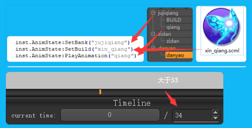
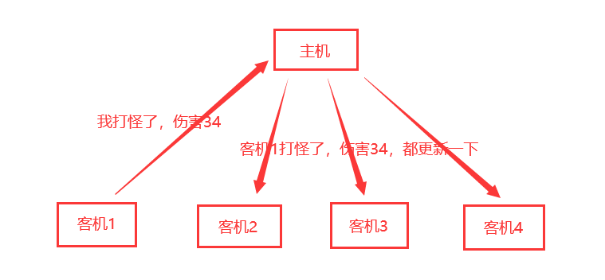
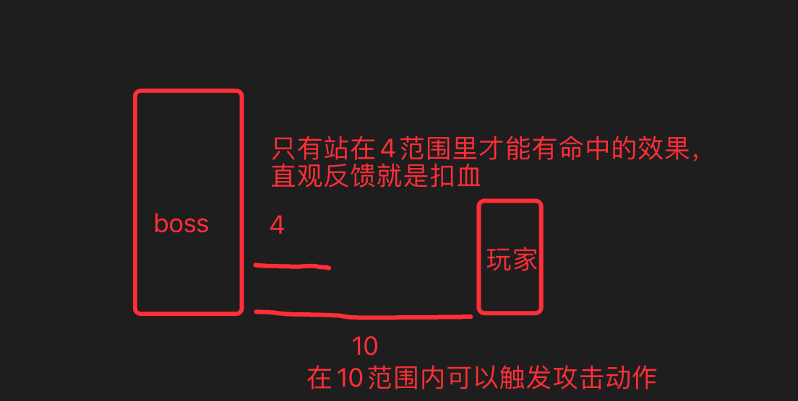

## AnimState:SetBank()与AnimState:SetBuild()区别

以下总结来自龙飞整理 原文：https://www.jianshu.com/p/2cc5538236ec

> Bank是一个集合，记录着一些Animation的名字。一个entity的bank决定了它能播放哪些动画。当它试图播放一个不存在于Bank中的动画时，就会在游戏中显示为透明。
>
> Build是材质包，也就是存放在MOD文件夹或游戏的data文件夹下的anim文件夹下的那些.zip文件。可以使用同一套Bank，不同的Build来表现不同的形态。比如说人物都是统一使用名为“wilson”的Bank，但每个人物都有自己的Build，通常与人物的prefab名相同。

## 以replica结尾的组件与RPC有什么区别

比如

- health.lua 与 health_replica.lua
- hunger.lua 与 hunger_replica.lua
- sanity.lua 与 sanity_replica.lua

replica 翻译过来有复制的意思，顾名思义就是对原组件的一个复制，常用于客机获取组件数据

一般联机游戏的数据分发都是由主机来完成的，比如打怪：玩家打了怪物一下伤害是34 -> 通过rpc传输给主机 -> 主机拿到这个操作及伤害数值 —> 分发给所有的客机 -> 客机拿到数值后更新怪物的血量

正因为数据都是由主机来分发的，所以凡是涉及到net相关操作的mod都是服务端mod

在mod里想与主机通信，做法一般分两步

1. 定义AddModRPCHandler()
2. 发送SendModRPCToServer()

当玩家进入游戏，默认会监听所有RPCHandler，某一位玩家在客机触发了RPCToServer，则其它客机也都能收到

用replica组件来获取数据也是一样，比如玩家饥饿值随游戏时间增加而慢慢减少，每次减少主机都会将更新后的饥饿值封装到replica组件里，说白了就是**饥荒底层里对这些以 replica 后缀结尾的组件进行了特殊处理**

## 代码里的inst是什么意思

简单的理解 inst 就代码的是 prefab，在创建一个prefab的时候，会调用 CreateEntity() 方法生成一个实例，这个实例对象的命名约定的都是inst

它上面有哪些方法，哪些固有属性可以去 [prefab](https://tomoya92.github.io/dstmod-tutorial/#/prefab) 里查看

## Combat:SetRange(attack, hit) hit是什么意思？

- attack 是攻击范围
- hit 是命中范围

举个例子，SetRange(10, 4)

## FindEntity(inst, radius, ...)radius是几块地皮

在饥荒源码里经常见到围绕某一个实例找周围的实体，第二个参数传的就是查找范围，一般以16，20居多，换成地皮的放，4是一块地皮的范围

## inventory 与 inventoryitem 和 container 的区别

有`inventory`组件的实体表示物品栏，特指玩家身上的格子，并带有装备栏，另外鼠标上的物品也属于物品栏

有`container`组件的实体表示容器，比如：箱子，锅，冰箱。

有`inventoryitem`组件的实体是可以放进带有`inventory`或者`container`组件的实体里的

