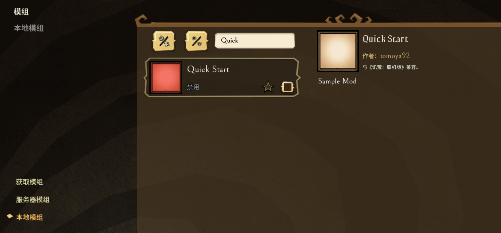
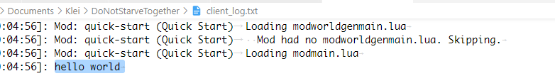

## 创建mod

在DST安装目录下的mods文件夹里创建一个文件夹，比如 `quick-start`

**切记，文件夹名不要以workshop-开头**

然后在 `quick-start` 里添加两个文件 `modinfo.lua` `modmain.lua`

## modinfo.lua

```lua
-- 名称
name = "Quick Start"
-- 描述
description = "Sample Mod"
-- 作者
author = "tomoya92"
-- 版本
version = "0.1"
-- klei官方论坛地址，为空则默认是工坊的地址
forumthread = ""
-- modicon 下一篇再介绍怎么创建的
-- icon_atlas = "images/modicon.xml"
-- icon = "images/modicon.tex"
-- dst兼容
dst_compatible = true
-- 是否是客户端mod
client_only_mod = true
-- 是否是所有客户端都需要安装
all_clients_require_mod = false
-- 饥荒api版本，固定填10
api_version = 10

-- mod的配置项，后面介绍
configuration_options = {}
```

## modmain.lua

这个文件里可以任意写符合lua语法的代码，当然也可以通过调用饥荒暴露出来的api来开发自己想要的功能

```lua
print("hello world")
```

## 进游戏看看

因为上面在modinfo.lua里定义的时候是客户端mod `client_only_mod = true` 所以这个mod就会出现在`本地模组`里



## 启动游戏

因为这个mod是客户端mod，所以日志文件在 `C:/Users/{你的用户名}/Documents/Klei/DoNotStarveTogether/client_log.txt` 里，如下图



## 总结

到此一个最简单的完全没有功能的饥荒mod就开发好了，给新手几点建议

1. 虽然说这篇文章没有任何功能，但一定要新手做一遍
2. 能复制的，绝对不要手写

祝你好运！
