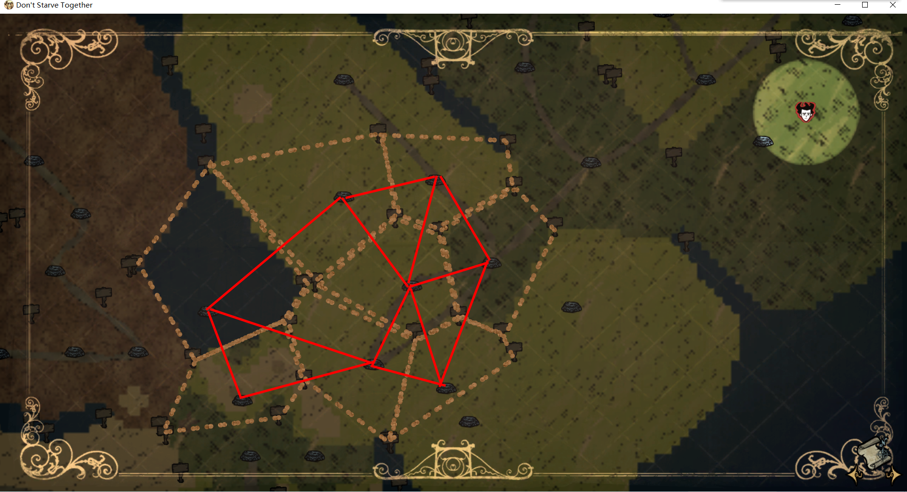
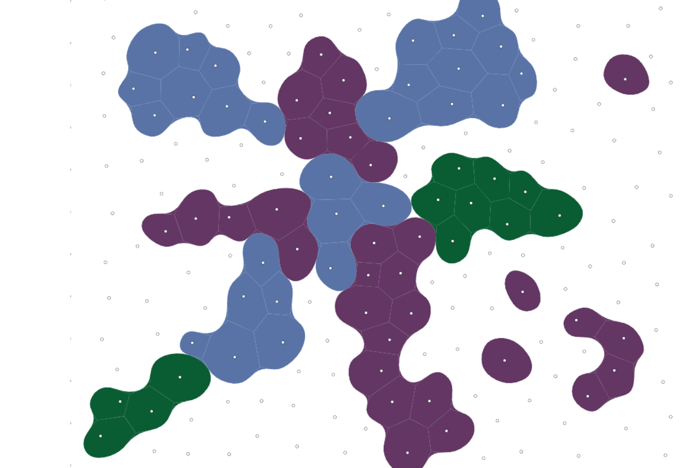
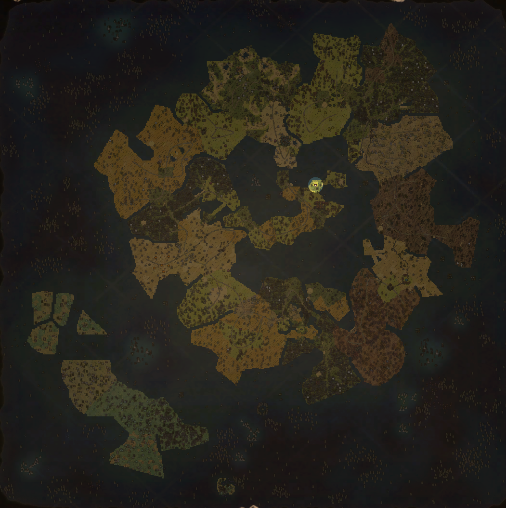

> 声明：本篇文章是来自`五年一班 月`通过读源码总结出的

大家有没有好奇过

- 为啥一上月岛，背景音乐就变了
- 为啥夏天去沙漠地形立即就刮起了沙尘暴
- 眼骨为啥会刷新在固定地形上
- 茶几为啥刷新位置也是在固定的地形上

## 检测地形节点

玩家身上有个组件 `areaaware` ，这个组件会每帧去检查当前玩家所处的区域，然后根据不同区域的标签来做一些处理（比如更换背景音乐，触发沙尘暴，反转SAN值等）

关于地图上的节点，有如下这些（有可能还有其它的）

**陆地**

- Chester_Eyebone 切斯特骨眼
- StagehandGarden 舞台

**月岛**

- moonhunt 月岛
- nohasslers 无障碍的
- lunacyarea 精神异常
- not_mainland 不在大陆
- ForceDisconnected 强制断开
- RoadPoison 道路恶化

**蚁狮沙漠**

- sandstorm 沙尘暴
- RoadPoison

**其它**

- ExitPiece 最多单标签节点
- nohunt 禁止狩猎
- nohasslers 没有麻烦

对应源码文件 `scripts/map/maptags.lua`

## room,level,task

- room 节点
- level 世界（地上是森林，地下是洞穴，还有目前关闭的 熔炉，暴食）
- task 地区 （比如沙漠地形，森林地形，混合地形等）

level由taks组成，taks由room组成（比如蚁狮沙漠。它由多个room组成，绿洲room，蚁狮刷新点room等）

**节点类型**

节点类型被用来定义地形生成时的的一些特性，比如可否与其它节点相连，是否可通过等，NODE_TYPE被定义在 constants.lua 文件里

```lua
NODE_TYPE =
{
    Default = 0,		--可以接触任务中范围内的任何其他默认节点,会与其他room全部连接
    Blank = 1,			--地面无法通行的空房间,海洋会填充
    Background = 2,     --背景，森林使用
    Random = 3,         --随机的
    Blocker = 4,		--在其旁边添加2个空白节点
    Room = 5,			--Land只能接触通过图形连接到的房间（使用单个Land bidge在其参数周围添加不可通行）,像洞穴里的蝙蝠地形之类的，一条主道，向两边延伸多个凸形模样
    BackgroundRoom = 6, --背景房，洞穴使用
	SeparatedRoom = 7,	-- 月岛群的几个小岛,room周围全部填充空白节点
}
```

**level类型**

跟节点类型一样，被定义在 constants.lua 文件里

LEVELTYPE = {
    SURVIVAL = "SURVIVAL", -- 生存
    CAVE = "CAVE", -- 洞穴
    ADVENTURE = "ADVENTURE", -- 冒险
    LAVAARENA = "LAVAARENA", -- 熔炉
    QUAGMIRE = "QUAGMIRE", -- 暴食
    TEST = "TEST", -- 测试
    UNKNOWN = "UNKNOWN", -- 未知
    CUSTOM = "CUSTOM", -- 自定义
    CUSTOMPRESET = "CUSTOMPRESET", -- 自定义预设
}

生成世界的时候，从众多节点中选择一些相近节点组成的节点集，作为组成世界的room。

在游戏中，节点的体现如下图所示，每个虚线的区域就是一个room，一个room一般周围会有5个room相邻



下图是生成这类地图的算法（比如饥荒，缺氧的地图都是这种算法生成的），名为：Voronoi 有兴趣可以去这个网站了解更多 https://www.redblobgames.com/



## 自定义room,task,level

借助api `AddTask()` `AddLevel()` `AddRoom()` 可以添加自定义的task,level,room

大致用法如下

```lua
AddLevel(LEVELTYPE,{  --世界类型
	id = "", --世界ID
	name = "", --世界名称
	desc = "", --世界说明
	overrides =  {}, --覆盖世界设置
	override_triggers =  {}, --覆盖仅在触发时发生
	substitutes=   {},--  level替代品
	tasks=  {}, --保证产生的关卡任务
	optionaltasks =   {}, --随机选择的任务
	numoptionaltasks =  0 ， --选择的随机任务数
	set_pieces =   {}, --设置保证产生的碎片
	random_set_pieces =   {},  --设置随机选择的片段
	numrandom_set_pieces =  0, --选择的随机设置的数量
	ordered_story_setpieces =  { }, --传送产生的镶嵌物
	required_prefabs =   {}, --确保显示所需的预制件（EX传送组件）
	teleportaction =  nil, --使用Teleportato时要采取的动作
	teleportmaxwell =  nil, --释放角色时将角色设置为maxwell，属于冒险模式？
	min_playlist_position =  0, --冒险模式下的最小播放列表位置
	max_playlist_position =  999, --冒险模式下的最大播放列表位置
	background_node_range =  { 0 ,2}, --minimum和最大BG节点每个任务的数
})
```

```lua
AddRoom("", { --节点名称
	colour={r=.45,g=.5,b=.85,a=.50}, --颜色？
	value =, -- 节点的地面
	tags = {}, -- 节点的标签，用于探险地图和遗迹
	contents =  { -- 节点内容清单
		custom_tiles={} -- 用于更复杂的节点，特别是在洞穴中。
		countstaticlayouts = {} -- 数和 类型的静态布局在一个节点
		countprefabs= {}, -- 创建预制件以放置在节点中

		distributepercent = 0,-- 要分发的项目的密度
		distributeprefabs = {}-- 要分发的物品及其频率

		prefabdata = {} --用于在预制件上定义更具体的信息
	}
})
```

```lua
AddTask("", {  -- 地形名称
	locks = LOCKS , --  locks地形
	keys_given = KEYS ,--  keys一个地形给出的
	entrance_room_chance =  0 , --进入节点的机会
	entrance_room =  { } , --那个入口节点应该是什么
	room_choices = { } , --地形中的节点
	room_bg = GROUND, -地板
	background_room = "", --后台节点
	color = {r = 0 , g = 0 , b = 0 , a = 0 }  --调试功能
	make_loop =  false --假-导致一个圆环形的地形
	crosslink_factor =  0 --确定交联系数
	maze_tiles =  {}  --在迷宫中使用
 })
```

```lua
INVALID = 255,
IMPASSABLE = 1,
c_give("FUNGUS",1)
ROAD = 2, 卵石路
ROCKY = 3, 岩石地皮
DIRT = 4, 沙漠地皮
SAVANNA = 5,热带草原地皮
GRASS = 6, 长草地皮
FOREST = 7,森林地皮
MARSH = 8, 沼泽地皮
WEB = 9,
WOODFLOOR = 10, 木地板
CARPET = 11,
CHECKER = 12,

-- CAVES
CAVE = 13, 鸟粪地皮
FUNGUS = 14,菌类地皮
FUNGUSRED = 24,
FUNGUSGREEN = 25,
SINKHOLE = 15,粘滑地皮
UNDERROCK = 16,洞穴岩石地皮
MUD = 17,泥泞地皮
BRICK = 18,
BRICK_GLOW = 19,
TILES = 20,
TILES_GLOW = 21,
TRIM = 22,
TRIM_GLOW = 23,


--EXPANDED FLOOR TILES
DECIDUOUS = 30,桦树地皮
DESERT_DIRT = 31,
SCALE = 32,

LAVAARENA_FLOOR = 33,
LAVAARENA_TRIM = 34,

QUAGMIRE_PEATFOREST = 35,
QUAGMIRE_PARKFIELD = 36,
QUAGMIRE_PARKSTONE = 37,
QUAGMIRE_GATEWAY = 38,
QUAGMIRE_SOIL = 39,
QUAGMIRE_CITYSTONE = 41,

PEBBLEBEACH = 42,岩石海滩地皮
METEOR = 43,月球环山地皮
SHELLBEACH = 44,贝壳海滩地皮

ARCHIVE = 45,远古月岛迷宫地皮
FUNGUSMOON = 46,

FARMING_SOIL = 47,

-- PUBLIC USE SPACE FOR MODS is 70 to 89 --

--NOISE -- from 110 to 127 -- TODO: move noise tile range to > 255
FUNGUSMOON_NOISE = 120,
METEORMINE_NOISE = 121,
METEORCOAST_NOISE = 122,
DIRT_NOISE = 123,
ABYSS_NOISE = 124,
GROUND_NOISE = 125,
CAVE_NOISE = 126,
FUNGUS_NOISE = 127,

UNDERGROUND = 128, -- todo: incrase this to OCEAN_START once WALL_X have been removed

WALL_ROCKY = 151,
WALL_DIRT = 152,
WALL_MARSH = 153,
WALL_CAVE = 154,
WALL_FUNGUS = 155,
WALL_SINKHOLE = 156,
WALL_MUD = 157,
WALL_TOP = 158,
WALL_WOOD = 159,
WALL_HUNESTONE = 160,
WALL_HUNESTONE_GLOW = 161,
WALL_STONEEYE = 162,
WALL_STONEEYE_GLOW = 163,

FAKE_GROUND = 200, -- todo: change to 254 and retrofit maps

-- OCEAN TILES [201, 247]
OCEAN_START = 201, -- enum for checking if tile is ocean water

-- KLEI OCEAN TILES [201, 230]
OCEAN_COASTAL = 201,
OCEAN_COASTAL_SHORE = 202,
OCEAN_SWELL = 203,
OCEAN_ROUGH = 204,
OCEAN_BRINEPOOL = 205,
OCEAN_BRINEPOOL_SHORE = 206,
OCEAN_HAZARDOUS = 207,

-- MODS OCEAN TILES [231, 247]  <--PUBLIC USE SPACE FOR MODS --

OCEAN_END = 247, -- enum for checking if
```

## 用处

```lua
-- 地图的定义对象
--[[
_G.TheWorld.topology:
	edgeToNodes
		编号1 = false or {编号1=1,编号2=2}
		...(总计:1414,每个地图不一样)
	ids
		编号1 = "Befriend the pigs:0:Marsh"
		...(268)
	colours
		编号 = {a=1,r=1,b=1,g=0}
		...(44)
	level_type SURVIVAL
	story_depths
		编号 = 数量？
		...(269) 编号269=0
	overrides (设置)
		"klaus" = "default"
		...
	flattenedPoints
		编号 = {100,-12}
		...(614)
	nodes
		编号 ={
			neighbours = {编号1=31...} --相邻节点
			type = 0/1/2...?
			c = 0/1/2...?
			tags = {编号1="ExitPiece"...}
			cent= {编号1=112.1，编号2=-121.5}
			y=-120
			x=-44
			poly={编号1={}...}--组成这个节点多边形的全部顶点坐标
			validedges={编号1=11，编号2=34...}
			area= 110 --地区编号？
		}
		...(268)
	edges
		编号1 = {n1=12,n2=4,c=1}
		...(288)
	flattenedEdges
		编号1 = false or {编号1=1,编号2=2}
		...(1414)
]]

-- 下面方法大致可以将地图某个节点给修改成月岛的地形（不是指换地皮，而是走在上面有月岛上的效果，比如周围有月灵，精神会反转）
AddPrefabPostInit("world",function(inst)
	inst:DoTaskInTime(0, function(inst)
        local topology = GLOBAL.TheWorld.topology
		for k,node in pairs(topology.nodes) do
			table.insert(node.tags, "lunacyarea")
		end
	end)
end)
```

> 猜测 借助 `scripts/map/storygen.lua` 里的方法应该也能对room添加标签或者修改一些地形的操作

## 20210815补充

海洋生成和静态布局补充

首先必须了解一点地面世界生成的流程:

1. 率先生成全部的大陆task
2. 再是月岛task
3. 然后生成海洋部分

生成海洋需要level里开启了海洋

海洋部分生成流程：

1. 明确是当前世界
2. 进行预填充部分，ocean_prefill_setpieces表，类型是静态布局
3. 将非陆地地皮(此时都是IMPASSABLE类型，值为1)转换为海水(海水有不同的类型)
4. 填充海洋生物内容，ocean_population表，类型是room ...\scripts\map\rooms\forest\terrain_ocean.lua

现阶段，第2步ocean_prefill_setpieces表里的内容有3类盐堆区和水中木区，都是静态布局。
它们都是直接使用Ocean_PlaceSetPieces函数进行放置的。

...\scripts\map\ocean_gen.lua

Ocean_PlaceSetPieces函数

这个函数会遍历ocean_prefill_setpieces，将通过key来找到对应的layout，将添加到待生成区域表里。
待生成区域表洗牌打乱依次生成(PlaceOceanLayout函数)。最终数量可能为0，概率很低。

PlaceOceanLayout函数

通过findLayoutPositions函数来找一个合适的位置，
有，Ocean_PlaceSetPieces函数内置ReserveAndPlaceLayoutFn函数执行放置工作，并且将这个区域内全部地皮格，添加为预留状态。并返回true
无，返回false

ReserveAndPlaceLayoutFn函数

主要执行ReserveAndPlaceLayout函数 ...\scripts\map\object_layout.lua
    执行放置，有禁止旋转，或者如果有指定旋转的话执行目标旋转类型，不然就是随机是否旋转
    执行添加对象，add_entity函数，这里是...\scripts\map\forest_map.lua 的 add_fn
布局有add_topology内容，那么往当前拓跋结构添加一个节点，现就蟹奶奶岛用到了

GetLayoutSize函数

有地图层，就返回地图层行数作为布局大小
没有，通过对象层里的对象的坐标来确认布局大小

findLayoutPositions函数

在世界范围内找合适区域。
区域大小 = 世界大小 - 2*边缘大小 - 布局大小
开始坐标 = 随机 0~区域大小
从开始坐标遍历，查找符合，坐标位置的类型地皮否是指定的类型且没有被预留，然后遍历这个点开始的布局大小区域内地皮是否全部符合。
是，添加到表中，否，跳过i个点，继续遍历。
遍历结束条件是，找到数量大于等于目标数量，或者到达遍历坐标到达区域大小
最后返回查找的结果

第4步，此时已经充满了海水。
PopulateOcean函数内，依次遍历ocean_population表，执行PopulateWaterType函数。

PopulateWaterType函数，就跟填充room类似
有静态布局，执行Ocean_PlaceSetPieces函数，用于添加实体的PopulateWorld_AddEntity函数，需要查找到的目标地皮类型是room.value。
应用通过更改room.value的类型，来修改room的位置。让蟹奶奶岛离岸近些AddRoomPreInit("OceanRough",function(room)room.value = GROUND.SAVANNA end)
有预制件，则添加预制件
有分配百分比和分配对象，按pickspawnprefab函数查找合适对象，然后添加
PopulateWaterPrefabWorldGenCustomizations函数，自定义填充额外实体


关于布局一点补充

...\scripts\map\static_layout.lua
...\scripts\map\object_layout.lua

```lua
["静态布局名称"] = StaticLayout.Get("静态布局文件",
{
	--添加一个节点
	add_topology = {room_id = "StaticLayoutIsland:HermitcrabIsland", tags = {"RoadPoison", "nohunt", "nohasslers", "not_mainland"}},
	min_dist_from_land = 0,
	layout_position =LAYOUT_POSITION.CENTER,
	areas ={
		--在 静态布局文件 objects表中的 type=tree_area ，width，height表示在这个区域内。
		--object_layout文件里使用到，会将下面表内容随机分布在区域内，这个区域要在布局范围内
		--下面最终都是一张张预制体表，将会根据静态布局进行填充
		tree_area = function() return math.random() < 0.9 and {"moon_tree"} or nil end,
		fissure_area = {"moon_fissure"},
	},
}),
local Layouts = require("map/layouts").Layouts
local StaticLayout = require("map/static_layout")
Layouts["静态布局的引用名字"] = StaticLayout.Get("map/static_layouts/文件名", {}）
AddTaskSetPreInit("default",function(data)
	--向海洋里添加一个静态布局，神话的桃岛也是添到这里
	data.ocean_prefill_setpieces["HermitcrabIsland"] = 1  --添加蟹奶奶岛静态布局，一个世界就有两蟹奶奶岛
end)
--自定义房间里添加自定义静态布局
AddRoom("房间名字", {contents =  {countstaticlayouts ={["静态布局的引用名字"] = 1, }}})
--往饥荒的房间里添加静态布局
AddRoomPreInit("OceanRough",function(room)
	room["contents"]["countstaticlayouts"]["HermitcrabIsland"] = 2 --蟹奶奶岛变两个
end)
```

## 20210830补充

就只谈拓扑结构，仅是个人根据饥荒所知，有局限性，没有学过好好学过拓扑结构

### 一、类型：

- Story 拓扑结构  核心是也是图，全部的地形形成的图，都是它的子图
- task地形数据 转换为 Graph(图)来使用，记录全部节点和全部边(节点与节点是否连接)
- room房间数据 转换为 Node(节点)来使用，这也是拓扑结构基本单位。


### 二、大陆的形成

拓扑结构最终形成为一张很大的网，由节点和边组成。

怎么形成的？

根据传入的数据，哪种世界(森林、洞穴、其他)、已经选择了哪些task地形和世界设置等生成一个Story拓扑结构。

接下来就是执行GenerationPipeline函数

1. 这个函数会先生成全部mainland(大陆)类型的task地形，包括地形的节点和边，地形内节点之间连接，地形与地形的连接。
2. 然后对大陆地形进行添加BG节点，使得地形不规整
3. 再对大陆增加凹节点，进一步平滑一些
4. 然后添加其他没有被添加的setpieces
5. 最后添加海洋room的内容

就完成了大陆地形的生成

### 三、一个地形的形成

task表内的入口房间(entrance_room)和选中房间(room_choices)汇总(用的是堆栈)，创建一个图，并记录到WorldSim中再，遍历房间集（堆栈弹出一个值）

生成room房间对应的Node节点，是否存在hub_room中心room，存在记录下这个对应的节点

- 是否形成一圈make_loop，是，则将上一个非中心room的节点连接成边结束遍历，后
- 是否形成一圈make_loop，是，将只有一条边的两个节点连接成边
- 是否存在hub_room中心room，是，将对应节点与图内其他节点连接成边
- 是否存在crossLinkFactor，是，图内节点随机连接(最大次数20次)

一个地形的图就生成了

### 四、地形之间的连接

本质上也是节点与节点之间的连接

valid_start_tasks 起始地形 存在，那么由它开始，没有则从地形集里随机一个为起始地形。
然后，根据布局类型，森林使用LinkNodesByKeys函数，洞穴、熔岩竞技场使用RestrictNodesByKey函数，来对全部地形进行连接
更改LinkNodesByKeys函数，更改各个地形连接的节点就能宏观控制地形的生成
地形连接完成后，返回了的最后地形的节点，再随机一个起始地形的节点，
再看是否要以新的图的一个空白节点(type=1,value=1)来分别和起始节点、结束节点连接成边

### 五、创建图、节点、边

全部的图都要是拓扑结构的子图，而且必须要与其他至少一个图连接，不然报错

```lua
--创建图
local task_id1 = "id不要有重复，不然报错1"
local task_id2 = "id不要有重复，不然报错2"
--具体看源码
local node_task1 = Graph(task_id1, {parent=self.rootNode, default_bg=GROUND.IMPASSABLE, colour = {r=0,g=0,b=0,a=1}, background="BGImpassable" })
local node_task2 = Graph(task_id2, {parent=self.rootNode, default_bg=GROUND.IMPASSABLE, colour = {r=0,g=0,b=0,a=1}, background="BGImpassable" })

--要注册，不然无效的图
WorldSim:AddChild(self.rootNode.id, task_id1, GROUND.IMPASSABLE, 0, 0, 0, 1, "blank")
WorldSim:AddChild(self.rootNode.id, task_id2, GROUND.IMPASSABLE, 0, 0, 0, 1, "blank")

--创建图的节点
--图:AddNode{id,data={--[[对应room内的数据]]}}
local n1 = node_task1:AddNode({
	id="节点id不可以重复，不然报错",
	data={
			type=NODE_TYPE.Background, --房间类型，值=1，空白的，被海水填充
			name="这个可以重复",
			tags = {"RoadPoison", "ForceDisconnected"},	--可以没有tags RoadPoison是禁止生成道路
			colour={r=0.3,g=.8,b=.5,a=.50},
			value = GROUND.OCEAN_COASTAL --地皮类型，这里是海水的一种
			}
}))
local n2 = node_task2:AddNode({
	id="节点id不可以重复，不然报错2",
	data={
			type=NODE_TYPE.Background, --房间类型，值=1，空白的，被海水填充
			name="这个可以重复",
			tags = {"RoadPoison", "ForceDisconnected"},	--可以没有tags RoadPoison是禁止生成道路
			colour={r=0.3,g=.8,b=.5,a=.50},
			value = GROUND.OCEAN_COASTAL --地皮类型，这里是海水的一种
			}
}))
local n3 = node_task2:AddNode({
	id="节点id不可以重复，不然报错3",
	data={
			type=NODE_TYPE.Background, --房间类型，值=1，空白的，被海水填充
			name="这个可以重复",
			tags = {"RoadPoison", "ForceDisconnected"},	--可以没有tags RoadPoison是禁止生成道路
			colour={r=0.3,g=.8,b=.5,a=.50},
			value = GROUND.OCEAN_COASTAL --地皮类型，这里是海水的一种
			}
}))

--图内部节点连接，连接了n1和n2形成了一条边
node_task2:AddEdge({id = "不能有重复id", node1id=n2.id, node2id=n3.id})


--连接两个图
self.rootNode:LockGraph("id不能重复啊", 	n1.node, n2, {type="none", key=KEYS.NONE, node=nil})
```

### 六、例子

modworldgenmain.lua
```lua
GLOBAL.setmetatable(env,{__index=function(t,k) return GLOBAL.rawget(GLOBAL,k) end})

require("map/network")
require("util")

local GetRoomByName = require("map/rooms").GetRoomByName
local GetTaskByName = require("map/tasks").GetTaskByName

AddGlobalClassPostConstruct("map/storygen","Story",function(self, id, tasks, terrain, gen_params, level)
	local function LinkNodes_MOD(self)
		local task_id = "MOD_TASK_"..tostring(self.region_link_tasks)
		local node_task = Graph(task_id, {parent=self.rootNode, default_bg=GROUND.IMPASSABLE, colour = {r=0,g=0,b=0,a=1}, background="BGImpassable" })
		WorldSim:AddChild(self.rootNode.id, task_id, GROUND.IMPASSABLE, 0, 0, 0, 1, "blank")

		local n1 = node_task:AddNode({
							id=task_id..":REGION_LINK_SUB_"..tostring(1),
							data={
									type= 1, --房间类型，值=1，空白的，被海水填充
									name="REGION_LINK_SUB",
									tags = {"RoadPoison", "ForceDisconnected"},
									colour={r=0.3,g=.8,b=.5,a=.50},
									value = GROUND.OCEAN_COASTAL
							}
					})
		local n2 = node_task:AddNode({
					id=task_id..":REGION_LINK_SUB_"..tostring(2),
					data={
							type=1, --房间类型，值=1，空白的，被海水填充
							name="REGION_LINK_SUB",
							tags = {"RoadPoison", "ForceDisconnected"},
							colour={r=0.3,g=.8,b=.5,a=.50},
							value = GROUND.OCEAN_COASTAL
							--value = GROUND.GRASS
					}
			})
		-- local n3 = node_task:AddNode({
		-- 			id=task_id..":REGION_LINK_SUB_"..tostring(3),
		-- 			data={
		-- 					type=0, --房间类型，值=1，空白的，被海水填充
		-- 					name="REGION_LINK_SUB",
		-- 					--tags = {"RoadPoison"},
		-- 					colour={r=0.3,g=.8,b=.5,a=.50},
		-- 					value = GROUND.GRASS
		-- 			}
		-- 	})

		-- node_task:AddEdge({node1id=n1.id, node2id=n3.id})
		-- node_task:AddEdge({node1id=n2.id, node2id=n3.id})
		node_task:AddEdge({node1id=n1.id, node2id=n2.id})

		self.region_link_tasks = self.region_link_tasks + 1
		return n1,n2
	end
	local function LinkNodesByKeysCS(self, startParentNode, unusedTasks)
		local function GetRandomNodeForEntrance_(task,rooms)
			local room = task:GetRandomNodeForEntrance()
			while table.removearrayvalue(rooms,room) or (task.entrancenode and room == task.entrancenode) do
				room = task:GetRandomNodeForEntrance()
			end
			return room
		end
		local function GetRandomNodeForExit_(task,rooms)
			local room = task:GetRandomNodeForExit()
			while table.removearrayvalue(rooms,room) do
				room = task:GetRandomNodeForExit()
			end
			return room
		end
		local lastNode = startParentNode
		local usedTasks = {}
		local currentNode = nil
		startParentNode.story_depth = 0  --故事深度
		local story_depth = 1

		local bm = 1

		--记录已经与其他地形链接的room
		local rooms = {}

		while GetTableSize(unusedTasks) > 0 do
			local effectiveLastNode = startParentNode

			local currentNode = GetRandomItem(unusedTasks)

			currentNode.story_depth = story_depth --当前节点故事深度=当前故事深度
			story_depth = story_depth + 1 --循环一次+1

			local lastNodeExit = GetRandomNodeForExit_(effectiveLastNode,rooms)
		    local currentNodeEntrance = GetRandomNodeForEntrance_(currentNode,rooms)
		    table.insert(rooms,lastNodeExit)
		    table.insert(rooms,currentNodeEntrance)

		 	local n1,n2 = LinkNodes_MOD(self)

			self.rootNode:LockGraph(effectiveLastNode.id..'->'..n1.id, lastNodeExit, n1, {type="none", key=self.tasks[currentNode.id].locks, node=nil})
			self.rootNode:LockGraph(currentNode.id..'->'..n2.id, currentNodeEntrance, n2, {type="none", key=self.tasks[currentNode.id].locks, node=nil})

		    unusedTasks[currentNode.id] = nil
	        usedTasks[bm] = currentNode
	        bm = bm + 1
	        lastNode = currentNode
	        currentNode = nil
		end

		for k,v in pairs(usedTasks) do
			local task1 = v
			local task2 = usedTasks[k+1] or usedTasks[1]
			local lastNodeExit = GetRandomNodeForExit_(task1,rooms)
		    local currentNodeEntrance = GetRandomNodeForEntrance_(task2,rooms)
		    table.insert(rooms,lastNodeExit)
		    table.insert(rooms,currentNodeEntrance)
			self.rootNode:LockGraph(task1.id..'->'..task2.id, lastNodeExit, currentNodeEntrance, {type="none", key=self.tasks[task1.id].locks, node=nil})
		end
		return startParentNode:GetRandomNodeForExit()
	end

	self.LinkNodesByKeys = function(self, startParentNode, unusedTasks)
		return LinkNodesByKeysCS(self, startParentNode, unusedTasks)
	end
end)
```

生成的效果图 

