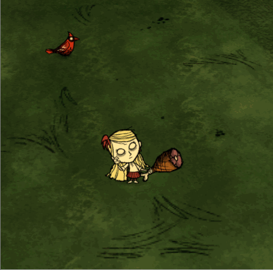

## 前言

饥荒里有远程武器就是神，有AOE伤害的武器可以当个半神

下面就来给火腿棒添加个AOE伤害



> 代码来自棱镜的花剑

## 实现

modmain.lua
```lua
AddPrefabPostInit("hambat", function(inst)
    if not TheWorld.ismastersim then return inst end
    if hambat_stable_damage or hambat_aoe then
        if inst.components.weapon then
            -- 查找被攻击对象周围的实体过滤标签
            local exclude_tags = { "INLIMBO", "companion", "wall", "abigail", "shadowminion" }
            -- hook onattack() 函数
            inst.components.weapon.onattack = function(inst, attacker, target)
                -- 获取被攻击对象的世界坐标
                local x2, y2, z2 = target.Transform:GetWorldPosition()
                -- 通过 TheSim:FindEntities() 函数查找周围的实体
                local ents = TheSim:FindEntities(x2, y2, z2, 4, { "_combat" }, exclude_tags)
                -- 遍历找到的实体
                for i, ent in ipairs(ents) do
                    -- 对找到的实体再次的过滤
                    -- 我多加了个限制，只找与被攻击对象同类的实体 ent.prefab == target.prefab，比如正在攻击蜘蛛，AOE伤害就只会伤害到周围的蜘蛛，如果旁边也有蜘蛛战士就不会受AOE的伤害，加这个是为了不会误伤一些不想被攻击的生物
                    if ent.prefab == target.prefab and ent ~= target and ent ~= attacker and attacker.components.combat:IsValidTarget(ent) and
                        (attacker.components.leader ~= nil and not attacker.components.leader:IsFollower(ent)) then
                            -- 推送事件给服务器来计算其它实体的血量以及通知其它玩家，当前多少实体正在被攻击
                            attacker:PushEvent("onareaattackother", { target = ent, weapon = inst, stimuli = nil })
                            -- 给予实体伤害，这里的伤害值传多少就是多少，如果玩家当前身上有一些攻击的buff，这里要获取一下传进去，我这图省事就只传了个火腿棒的伤害
                            ent.components.combat:GetAttacked(attacker, TUNING.HAMBAT_DAMAGE, inst, nil)
                    end
                end
            end
        end
    end
end)
```
