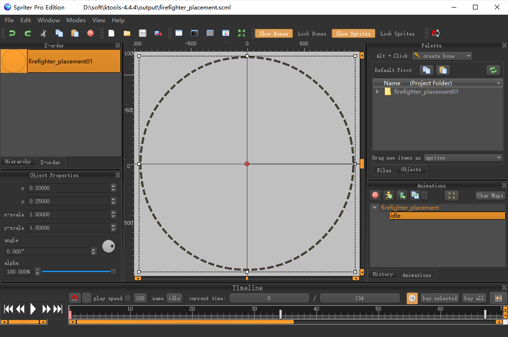
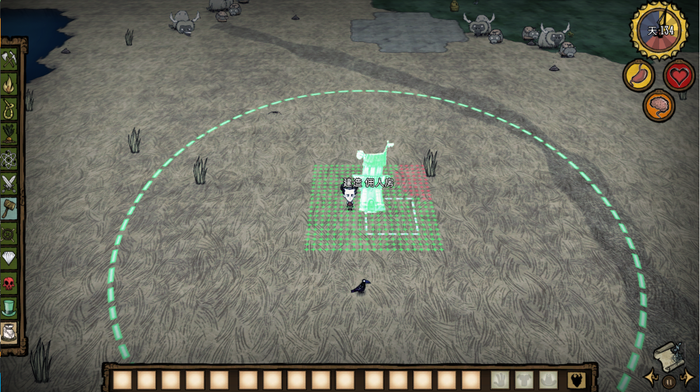

## 前言

> 写[佣人](https://steamcommunity.com/sharedfiles/filedetails/?id=2566307453)mod时，添加了一个建筑`佣人房`，佣人活动范围是以佣人房为中心周围5格地皮内进行一些物资的收集
>
> 给建筑添加了一个范围显示的功能，方便放置箱子，种植等

**实现思路是参考灭火器，官方有个名为 firefighter_placement 的圆圈贴图，在放置建筑的时候，显示这个圆圈**



## 给建筑添加放置辅助组件

范围显示的功能使用的是 `deployhelper` 组件

在初始化实例的fn()函数里添加上这个组件，并实现`onenablehelper`方法

```lua
-- 范围显示贴图的缩放大小
local PLACER_SCALE = 1.78

local function OnEnableHelper(inst, enabled)
    if enabled then
        if inst.helper == nil then
            inst.helper = CreateEntity()

            --[[Non-networked entity]]
            inst.helper.entity:SetCanSleep(false)
            inst.helper.persists = false

            inst.helper.entity:AddTransform()
            inst.helper.entity:AddAnimState()

            inst.helper:AddTag("CLASSIFIED")
            inst.helper:AddTag("NOCLICK")
            inst.helper:AddTag("placer")

            inst.helper.Transform:SetScale(PLACER_SCALE, PLACER_SCALE, PLACER_SCALE)

            inst.helper.AnimState:SetBank("firefighter_placement")
            inst.helper.AnimState:SetBuild("firefighter_placement")
            inst.helper.AnimState:PlayAnimation("idle")
            inst.helper.AnimState:SetLightOverride(1)
            inst.helper.AnimState:SetOrientation(ANIM_ORIENTATION.OnGround)
            inst.helper.AnimState:SetLayer(LAYER_BACKGROUND)
            inst.helper.AnimState:SetSortOrder(1)
            inst.helper.AnimState:SetAddColour(0, .2, .5, 0)

            inst.helper.entity:SetParent(inst.entity)
        end
    elseif inst.helper ~= nil then
        inst.helper:Remove()
        inst.helper = nil
    end
end

local function fn()
    -- xxxx

    if not TheNet:IsDedicated() then
        inst:AddComponent("deployhelper")
        inst.components.deployhelper.onenablehelper = OnEnableHelper
    end

    inst.entity:SetPristine()

    -- 在判断是否是主机前添加，这样不管是主机还是客机都会有范围显示的功能
    if not TheWorld.ismastersim then
        return inst
    end

    -- xxx
end
```

## 修改MakePlacer默认的贴图

```lua
function MakePlacer(name, bank, build, anim, onground, snap, metersnap, scale, fixedcameraoffset, facing, postinit_fn, offset, onfailedplacement) end
```

将 MakePlacer 方法里默认的贴图换成范围圆圈的贴图，并添加一个放置完后的勾子函数 `postinit_fn`，相当于建筑的默认贴图是范围显示的圆圈，在范围显示的圆圈这个实例里再添加一层建筑的实例，这样两个贴图就都能显示了

代码如下

```lua
local function placer_postinit_fn(inst)
    -- Show the flingo placer on top of the flingo range ground placer

    -- 再创建一个建筑的实例
    local placer2 = CreateEntity()

    --[[Non-networked entity]]
    placer2.entity:SetCanSleep(false)
    placer2.persists = false

    placer2.entity:AddTransform()
    placer2.entity:AddAnimState()

    placer2:AddTag("CLASSIFIED")
    placer2:AddTag("NOCLICK")
    placer2:AddTag("placer")

    local s = 1 / PLACER_SCALE
    placer2.Transform:SetScale(s, s, s)

    -- 指定建筑的贴图
    placer2.AnimState:SetBank("servant_house")
    placer2.AnimState:SetBuild("servant_house")
    placer2.AnimState:PlayAnimation("idle")
    placer2.AnimState:SetLightOverride(1)

    placer2.entity:SetParent(inst.entity)

    inst.components.placer:LinkEntity(placer2)
end

return Prefab("servant_house", fn, assets, prefabs),
    MakePlacer("servant_house_placer", "firefighter_placement", "firefighter_placement", "idle", true, nil, nil,
        PLACER_SCALE, nil, nil, placer_postinit_fn)
```

