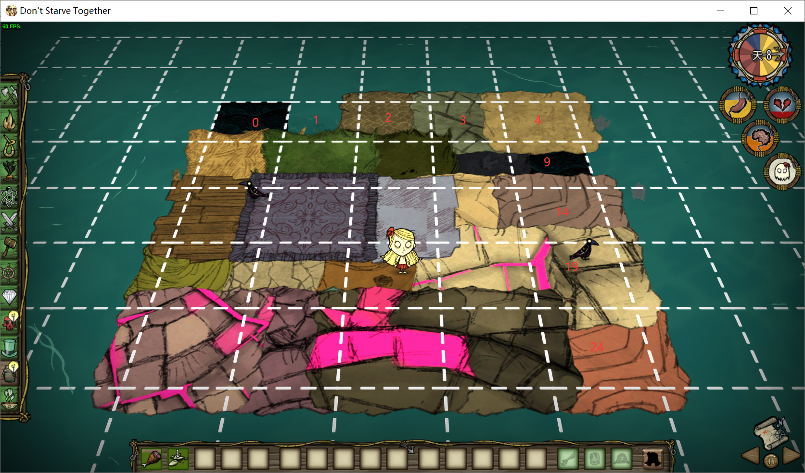

## 前言

在单机里有个填海造陆mod，挺好用的，联机里没有找到

在 `花花` 的帮助下，借助 `debugcommands.lua` 里的 `d_ground()` 函数成功的把海填起来了

## 命令

进游戏按 ESC 下面那个按键调出控制台，然后在里面输入 `require("debugcommands")d_ground(4)` 回车即可

其中 `d_ground(4)` 里的4是地皮的编号

填海成功后，保存退出重进游戏就可以在上面行走了

## 地皮

地皮与编号对应关系

## 尾语

貌似可以封装成一个mod