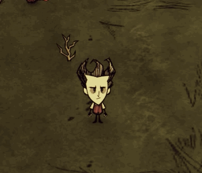

## 前言

不知道工坊模组最先研究飞行的是不是《神话书说》，本文是借鉴神话里的飞行实现的

> 实在飞行能力很简单，但要想写好飞行能力，很难（麻烦）

模组已上传工坊 https://steamcommunity.com/sharedfiles/filedetails/?id=2677360806

## 原理

饥荒里是有x,y,z三个维度的坐标，当然速度也是有三个维度的

**高是y轴**

通过刷帧给人物y轴一个向上的速度，就能保持人物稳定的在一个高度从而不掉下来，至于脚下的云，或者其它什么东西，那是特效，目的是为了掩盖人物高度上变化带来的突兀的感觉

先看效果



## 实现

既然是飞行能力，那就是人物的一个属性，既然是属性，在饥荒里对应的就是组件了，所以创建一个飞行组件

py_fly.lua
```lua
local PYFLY = Class(function(self, inst)
    self.inst = inst
    self.height = 1
    self.owner = nil
end)

-- 生成云特效，并设置成跟随人物移动
local function spawncloud(self, inst)
    if inst._pycloud == nil then
        inst:DoTaskInTime(0.1, function(inst)
            inst._pycloud = SpawnPrefab("pycloud")
            inst._pycloud.entity:AddFollower()
            inst._pycloud.entity:SetParent(self.owner.entity)
        end)
    end
end

-- 移除云特效
local function removecloud(self, inst)
    if inst._pycloud ~= nil then
        inst:DoTaskInTime(1.7, function(inst)
            inst._pycloud:Remove()
            inst._pycloud = nil
        end)
    end
end

-- 获取飞行的设定高度
function PYFLY:GetHeight()
    return self.height
end

-- 起飞
function PYFLY:Fly(doer, target)
    if doer == target then
        self.owner = doer
        -- 添加一个标签，用于判断动作名以及其它用处
        doer:AddTag("pyflying")
        -- 生成一个云在脚下
        spawncloud(self, self.inst)
        -- 飞起来后就移除碰撞体积
        if self.inst.Physics then
			RemovePhysicsColliders(self.inst)
		end
        -- 给移动组件上挂一个变量，用于hook移动组件时给人物维持在飞行高度上移动
        if self.inst.components.locomotor then
            self.inst.components.locomotor.pyfly_height_override = self.height
		end
        -- 落水组件置为失效
		if self.inst.components.drownable then
			self.inst.components.drownable.enabled = false
		end
        -- 开始刷帧
        self.inst:StartUpdatingComponent(self)
        return true
    else
        return false
    end
end

-- 着陆
function PYFLY:Land(doer, target)
    if doer == target then
        self.owner = nil
        -- 移除飞行标签
        doer:RemoveTag("pyflying")
        -- 移除云特效
        removecloud(self, self.inst)
        -- 将人物的碰撞体积加回来
        if self.inst.Physics then
			ChangeToCharacterPhysics(self.inst)
		end
        -- 将人物的移动组件上的高度设置为0，这样从物在行走时就是贴地的了
        if self.inst.components.locomotor then
            self.inst.components.locomotor.pyfly_height_override = 0
		end
        -- 将落水组件置为生效
		if self.inst.components.drownable then
			self.inst.components.drownable.enabled = true
		end
        -- 停止刷帧
        self.inst:StopUpdatingComponent(self)
        return true
    else
        return false
    end
end

-- 刷帧
function PYFLY:OnUpdate(dt)
    if self.inst.Physics then
        -- 获取到玩家的三个方向的速度
        local x,y,z = self.inst.Physics:GetMotorVel()
        -- 获取到玩家的位置
        local pt = self.inst:GetPosition()
        --[[
            一帧是1/30秒，这里乘的是32，应该是神话里经过不断调试出来的一个最优解，我就直接拿来用了，感谢神话的作者
            self.height - pt.y 正常人物的y轴一直是0，这里减与不减是一样的，但鬼知道有没有什么特殊情况下y轴坐标不是0的，所以这里为了维持飞行的高度不变，还是减了一下人物的高度，神话代码的严谨性，赞！！
        ]]
        self.inst.Physics:SetMotorVel(x, (self.height - pt.y) * 32, z)
    end
end

return PYFLY
```

给人物加上飞行能力（组件）

modmain.lua
```lua
AddPlayerPostInit(function(inst)
    if not TheWorld.ismastersim then return inst end
    inst:AddComponent("py_fly")
end)
```

添加上触发动作（神话里是通过制作栏触发的，我就添加一个动作来直接鼠标放在人物身上触发）

modmain.lua
```lua
-- 创建新动作 PY_FLY
local PY_FLY = Action()
PY_FLY.id = "PY_FLY"
PY_FLY.strfn = function(act)
    -- 根据人物身上有没有 pyflying 标签，来显示不同的动作名
    return act.target:HasTag("pyflying") and "LAND" or "FLY"
end
-- 动作触发函数
PY_FLY.fn = function(act)
    if act.target ~= nil then
        -- 根据人物身上有没有 pyflying 标签来判断调用“起飞”，还是“着陆”
        if not act.target:HasTag("pyflying") then
            return act.target.components.py_fly:Fly(act.doer, act.target)
        elseif act.target:HasTag("pyflying") then
            return act.target.components.py_fly:Land(act.doer, act.target)
        end
    end
    return false
end
AddAction(PY_FLY)

-- 给动作添加名字
STRINGS.ACTIONS.PY_FLY = {
    FLY = "起飞",
    LAND = "着陆",
}
-- 添加组件动作
AddComponentAction("SCENE", "py_fly", function(inst, doer, actions, right)
    if not (doer.replica.rider ~= nil and doer.replica.rider:IsRiding()) --骑牛时不能飞
        and inst:HasTag("player") --必须要是玩家
        and not inst:HasTag("playerghost") --不能是鬼魂状态
        and right then --右键触发
        table.insert(actions, ACTIONS.PY_FLY)
    end
end)

-- 给组件动作添加sg，我这偷懒了，没做动画，就用的捡东西的动画
AddStategraphActionHandler("wilson", ActionHandler(ACTIONS.PY_FLY, function(inst, action)
    return "doshortaction"
end))
AddStategraphActionHandler("wilson_client", ActionHandler(ACTIONS.PY_FLY, function(inst, action)
    return "doshortaction"
end))
```

接着hook移动组件，将高度固定（如果不hook这个并修改高度，飞起来后走路时会不断下降，当停止走路时，人物又会突然飞起来，很怪）

modmain.lua
```lua
-- hook移动组件
AddComponentPostInit("locomotor",function(self)
	self.pyfly_height_override = 0

	local oldRunForward=self.RunForward
	function self:RunForward(direct, ...)
		oldRunForward(self, direct, ...)
		if self.pyfly_height_override ~= 0 then
			local a,b,c = self.inst.Physics:GetMotorVel()
			local y = self.inst:GetPosition().y
            -- 起飞时设置的飞行高度
			local h = self.inst.components.py_fly and self.inst.components.py_fly:GetHeight()
			if y and h then
				self.inst.Physics:SetMotorVel(a, (h-y)*32, c)
			end
		end
	end
end)
```

最后人物都飞起来了，按WASD键走路时，人物就保持不动就行了，接下来要修改人物走路的sg，sg名是 `run`

> 下面这段代码直接拷贝的神话

modmain.lua
```lua
local function runfnhook(self)
    local run = self.states.run
	if run then
		local old_enter = run.onenter
		function run.onenter(inst, ...)
			if old_enter then
				old_enter(inst, ...)
			end
			if inst:HasTag("pyflying") then
                -- 我没做飞行状态的动画，就用的idle
				if not inst.AnimState:IsCurrentAnimation("idle_loop") then
					inst.AnimState:PlayAnimation("idle_loop", true)
				end
				inst.sg:SetTimeout(inst.AnimState:GetCurrentAnimationLength() + 0.01)
			end
		end
	end

	local run_start = self.states.run_start
	if run_start then
		local old_enter = run_start.onenter
		function run_start.onenter(inst, ...)
			if old_enter then
				old_enter(inst, ...)
			end
			if inst:HasTag("pyflying") then
				inst.AnimState:PlayAnimation("idle_loop")
			end
		end
	end

	local run_stop = self.states.run_stop
	if run_stop then
		local old_enter = run_stop.onenter
		function run_stop.onenter(inst, ...)
			if old_enter then
				old_enter(inst, ...)
			end
			if inst:HasTag("pyflying") then
				inst.AnimState:PlayAnimation("idle_loop")
			end
		end
	end
end

AddStategraphPostInit("wilson", runfnhook)
AddStategraphPostInit("wilson_client", runfnhook)
```

忘了，还有云特效，我是百度图片上随便找了一张云的图片，做了个静态动画

scripts/prefabs/pycloud.lua
```lua
local assets=
{
	Asset("ANIM", "anim/pycloud.zip"),
}

local function fn()
	local inst = CreateEntity()
	inst.entity:AddTransform()
	inst.entity:AddAnimState()
    inst.entity:AddNetwork()
	inst.entity:AddSoundEmitter()
	inst.entity:AddPhysics()

    inst.AnimState:SetBank("pycloud")
    inst.AnimState:SetBuild("pycloud")
    inst.AnimState:PlayAnimation("idle")

    inst:AddTag("FX")

    if not TheWorld.ismastersim then return inst end

    return inst
end

return Prefab("pycloud", fn, assets)
```

到此就完成了！！

## 总结

功能实现了，但还有很多优化的地方，比如

- 飞起来还能做采摘，捡东西等等众多的动作吗？
- 飞起来还能打怪吗？
- 飞起来经过特殊地形（比如蚁蛳坑）要不要减速呢？
