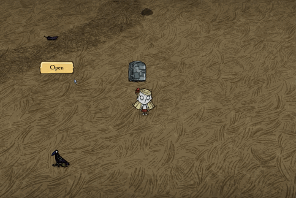

实现一下 `widgets/button` 的鼠标跟随效果



翻看 `widgets/button` 的时候无意看到了一个回调 `SetWhileDown()` 跟随效果就可以用它来实现了

```lua
local TEMPLATES = require "widgets/redux/templates"
AddClassPostConstruct("screens/playerhud", function(self)
    self.openbutton = self:AddChild(TEMPLATES.StandardButton(function()
        print("openbutton: ", self.openbutton:GetWorldPosition())
    end , "Open", {100, 50}))
    self.openbutton:SetVAnchor(ANCHOR_BOTTOM)
    self.openbutton:SetHAnchor(ANCHOR_LEFT)
    self.openbutton:SetScaleMode(SCALEMODE_PROPORTIONAL)
    self.openbutton:SetMaxPropUpscale(MAX_HUD_SCALE)

    self.openbutton.x = 0
    self.openbutton.y = 0

    -- 这个方法在button.lua里是被放在OnUpdate()里被调用的，没有参数
    -- 因为在它被调的时候还有一层判断，判断是否被点击了，被点击了才会调这个回调方法，所以不能把设置位置的代码直接放在 OnUpdate() 里
    self.openbutton:SetWhileDown(function()
        -- 获取鼠标坐标
        local mousepos = TheInput:GetScreenPosition()
        self.openbutton.x = mousepos.x
        self.openbutton.y = mousepos.y
    end)

    -- 在组件更新方法里更新它的位置
    local _OnUpdate = self.OnUpdate
    self.OnUpdate = function(self, dt)
        _OnUpdate(self, dt)
        self.openbutton:SetPosition(self.openbutton.x, self.openbutton.y)
    end
end)
```

---

`widgets/widget.lua` 里还有两个方法 `FollowMouse()` `StopFollowMouse()` 配合着使用，效果要比上面那种方式更好，而且因为这两个方法是被定义在 widget 里的，所以它适用于所有的控件

通过翻 widget 的代码，又找到了一个 `OnMouseButton` 的函数，它有四个参数 `OnMouseButton(button, down, x, y)`

- button 鼠标按下的按键，鼠标左键 1000，右键是1001，在constants.lua里可以找到对应的值
- down 鼠标按下时为true，松开时为false
- x，y 当前鼠标的坐标

> 在我测试时，我用的是 TEMPLATES.StandardButton() 这个模板里的按钮，这个方法有五个参数，第一个是新增的参数，为当前按钮上的文本，后四个参数就是这默认的四个参数，在用时还是要先打印一下参数的值再做判断

用法如下

```lua
local TEMPLATES = require "widgets/redux/templates"
-- local TarnsferPanel = GLOBAL.require("screens/transferpanel")
AddClassPostConstruct("screens/playerhud", function(self)
    self.openbutton = self:AddChild(TEMPLATES.StandardButton(function()
        print("openbutton: ", self.openbutton:GetWorldPosition())
    end , "Open", {100, 50}))
    self.openbutton:SetVAnchor(ANCHOR_BOTTOM)
    self.openbutton:SetHAnchor(ANCHOR_LEFT)
    self.openbutton:SetScaleMode(SCALEMODE_PROPORTIONAL)
    self.openbutton:SetMaxPropUpscale(MAX_HUD_SCALE)
    -- self.openbutton.x = 400
    -- self.openbutton.y = 600

    self.openbutton.OnMouseButton = function(text, button, down, x, y, z, a, b, c)
        print("====", text, button, down, x, y, z, a, b, c)
        if button == MOUSEBUTTON_LEFT and down then
            print("mouse down", down)
            self.openbutton:FollowMouse() -- 判断鼠标按下时开启控件的鼠标跟随
        else
            print("mouse up", down)
            self.openbutton:StopFollowMouse() -- 判断鼠标松开时，停止控件的跟随
            self.openbutton:SetPosition(TheInput:GetScreenPosition()) -- 并把当前鼠标的位置坐标设置成控件的坐标
        end
    end
end)
```

**以上方法都没有对控件最终位置做保存，也就是说下次打开控件或者下次进游戏时还是会出现在默认设置的位置。**
