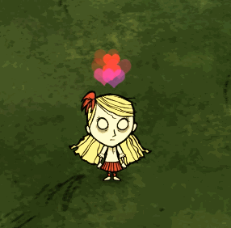

## 原理

**特效就是预制体**

特效比预制体多了个粒子发射器，多了个 `FX` 的标签，粒子是在客户端展示的

上图



## 贴图


将这张png图放在mod文件里的 `images/fx/heart.png` 位置，然后运行游戏打包成 tex 文件

## 创建特效

上面说到，特效就是prefab，所以创建方法是一样的

```lua
local ANIM_HEART_TEXTURE = resolvefilepath("images/fx/heart.tex") -- 这里一定要用 resolvefilepath() 包装一下，否则会出现找不到贴图的错误
local REVEAL_SHADER = "shaders/vfx_particle_reveal.ksh" -- 系统里的一个shader，跟渲染有关，具体原理不是太清楚

local COLOUR_ENVELOPE_NAME = "heart_colourenvelope"
local SCALE_ENVELOPE_NAME = "heart_scaleenvelope"

local assets =
{
    Asset("IMAGE", ANIM_HEART_TEXTURE),
    Asset("SHADER", REVEAL_SHADER),
}

--------------------------------------------------------------------------

local function IntColour(r, g, b, a)
    return { r / 255, g / 255, b / 255, a / 255 }
end

local function InitEnvelope()
    -- 添加颜色变化，猜测表中第一个元素是一个类似渐变或者时间的东西
    -- 比如0表示生命周期的初始，1表示100%
    -- 后面是颜色值，对应rgba，最后一个a是透明度
    EnvelopeManager:AddColourEnvelope(
        COLOUR_ENVELOPE_NAME,
        {
            { 0,    IntColour(217, 39, 39, 160) },
            { .19,  IntColour(217, 39, 39, 160) },
            { .35,  IntColour(217, 39, 390, 80) },
            { .51,  IntColour(217, 39, 39, 60) },
            { .75,  IntColour(217, 39, 39, 40) },
            { 1,    IntColour(217, 39, 39, 0) },
        }
    )

    local glow_max_scale = .3
    -- 添加位置变化，与上面颜色变化一样，猜测表中第一个元素是一个类似渐变或者时间的东西
    -- 后面参数是缩放的大小了
    EnvelopeManager:AddVector2Envelope(
        SCALE_ENVELOPE_NAME,
        {
            { 0,    { glow_max_scale * 0.7, glow_max_scale * 0.7 } },
            { .55,  { glow_max_scale * 1.2, glow_max_scale * 1.2 } },
            { 1,    { glow_max_scale * 1.3, glow_max_scale * 1.3 } },
        }
    )

    InitEnvelope = nil
    IntColour = nil
end

--------------------------------------------------------------------------
local GLOW_MAX_LIFETIME = 1

-- 粒子触发器里第三个参数fn里调用的方法，展示粒子大小，方向，速度，生命周期等等信息
local function emit_glow_fn(effect, emitter_fn)
    local vx, vy, vz = .005 * UnitRand(), 0, .005 * UnitRand()
    local lifetime = GLOW_MAX_LIFETIME --* (.9 + math.random() * .1)
    local px, py, pz = emitter_fn()

    px = px + math.random(-1,1) * .2 -- 给x轴一个偏移量
    py = py + 3.2                    -- 给y轴一个偏移量，测试发现y轴才是高度轴
    pz = pz + math.random(-1,1) * .2 -- 给z轴一个偏移量。给坐标偏移量是为了让出现的心不会在一块挤着
    local uv_offset = math.random(0, 3) * .25
    effect:AddRotatingParticle(
        0,
        lifetime,           -- lifetime  生命周期
        px, py, pz,         -- position  位置
        vx, vy, vz,         -- velocity  速度
        uv_offset,-- angle               角度
        0    -- angle velocity           角速度
    )
end

local function fn()
    local inst = CreateEntity()

    inst.entity:AddTransform()
    inst.entity:AddNetwork()

    inst:AddTag("FX")

    inst.entity:SetPristine()

    inst.persists = false

    --Dedicated server does not need to spawn local particle fx
    if TheNet:IsDedicated() then
        return inst
    elseif InitEnvelope ~= nil then
        InitEnvelope() -- 初始化颜色和形状变化的设置
    end

    -- 给prefab添加粒子特效
    local effect = inst.entity:AddVFXEffect()
    -- 初始化有几个触发器
    effect:InitEmitters(1)
    -- 渲染的资源，就是做的贴图与一个shader
    effect:SetRenderResources(0, ANIM_HEART_TEXTURE, REVEAL_SHADER)
    -- 最大粒子数
    effect:SetMaxNumParticles(0, 128)
    -- 循环状态开启
    effect:SetRotationStatus(0, true)
    -- 最大生命周期
    effect:SetMaxLifetime(0, GLOW_MAX_LIFETIME)
    -- 颜色变化
    effect:SetColourEnvelope(0, COLOUR_ENVELOPE_NAME)
    -- 形状变化
    effect:SetScaleEnvelope(0, SCALE_ENVELOPE_NAME)
    -- 粒子混合模式，在 constants.lua 里有定义，有几个值，具体不清楚都什么效果
    effect:SetBlendMode(0, BLENDMODE.AlphaBlended)
    effect:EnableBloomPass(0, true)
    effect:SetSortOrder(0, 0)
    effect:SetSortOffset(0, 0)
    effect:SetKillOnEntityDeath(0, true)
    effect:SetFollowEmitter(0, true)

    -----------------------------------------------------


    local tick_time = TheSim:GetTickTime()

    local glow_desired_pps = 3
    local glow_particles_per_tick = glow_desired_pps * tick_time
    local glow_num_particles_to_emit = 0

    local sphere_emitter = CreateSphereEmitter(.03)
    -- 添加粒子触发器，第三个参数是个fn，在 emitters.lua 里会被PostUpdate()重复调用
    EmitterManager:AddEmitter(inst, nil, function()
        while glow_num_particles_to_emit > 1 do
            emit_glow_fn(effect, sphere_emitter)
            glow_num_particles_to_emit = glow_num_particles_to_emit - 1
        end
        glow_num_particles_to_emit = glow_num_particles_to_emit + glow_particles_per_tick * math.random() * 3
    end)

    return inst
end

return Prefab("heartfx", fn, assets)
```

## 测试

在modmain.lua里要初始化一下
```lua
PrefabFiles = {"heartfx"} -- 跟prefab初始化一样

AddPlayerPostInit(function(inst)
    if not TheWorld.ismastersim then return inst end

    local fx = SpawnPrefab("heartfx") -- 生成一个特效
    fx.entity:SetParent(inst.entity) -- 设置成跟随玩家

end)
```
