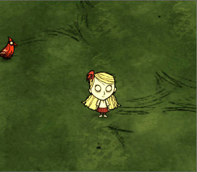

## 前言

- 玩家死亡时**服务端**会发出 `ms_becameghost` 事件
- **服务端**发出 `respawnfromghost` 事件时玩家会复活

有了这两个事件，就可以搞点事情了，比如当玩家死亡时，在玩家界面上显示个按钮，玩家点击后则立即复活



> **这是一个服务端mod**

## 定义按钮

modmain.lua
```lua
local TEMPLATES = require "widgets/redux/templates"
AddClassPostConstruct("screens/playerhud", function(self)
    local _CreateOverlays = self.CreateOverlays -- hook CreateOverlays 方法
    function self:CreateOverlays(owner)
        _CreateOverlays(self, owner)
        -- 添加按钮
        self.rebornbtn = self:AddChild(TEMPLATES.StandardButton(function()
            --SendModRPCToServer(MOD_RPC["modname"]["reborn"])
            self.rebornbtn:Hide()
        end , "我要复活", {100, 50}))
        -- 设置按钮的位置与缩放
        self.rebornbtn:SetVAnchor(ANCHOR_MIDDLE)
        self.rebornbtn:SetHAnchor(ANCHOR_MIDDLE)
        self.rebornbtn:SetScaleMode(SCALEMODE_PROPORTIONAL)
        self.rebornbtn:SetMaxPropUpscale(MAX_HUD_SCALE)
        -- 延时一下，在刚进游戏时检测一下玩家身上有没有 playerghost 标签，有的话，就把按钮显示出来，没有就隐藏掉
        -- 这里延时是为了等玩家的prefab全都初始化好之后再来判断有没有标签
        self.owner:DoTaskInTime(0, function(inst)
            if self.owner:HasTag("playerghost") then
                self.rebornbtn:Show()
            else
                self.rebornbtn:Hide()
            end
        end)
    end
end)
```

进游戏就会发现按钮被添加到了玩家屏幕上了

## 实现复活

复活事件要由服务端来发才能生效，点击按钮是客户端的行为，所以定义一个rpc用来通知服务端玩家干了啥

modmain.lua
```lua
AddModRPCHandler("modname", "reborn", function(player)
    -- 进来判断一下玩家是否处在死亡状态，如果是就由服务端通过玩家实体触发一个事件来复活玩家
    if player:HasTag("playerghost") then
        player:PushEvent("respawnfromghost")
    end
end)
```

在按钮点击时调用一下即可
modmain.lua
```lua
AddClassPostConstruct("screens/playerhud", function(self)
    function self:CreateOverlays(owner)
        -- 添加按钮
        self.rebornbtn = self:AddChild(TEMPLATES.StandardButton(function()
            SendModRPCToServer(MOD_RPC["modname"]["reborn"]) -- 发送rpc通知服务端复活玩家
            self.rebornbtn:Hide()
        end , "我要复活", {100, 50}))
    end
end)
```

## 监听死亡事件

监听玩家死亡事件后，将按钮显示出来

上面介绍到当玩家死亡时，会触发 `respawnfromghost` 事件，所以只需要监听这个事件就知道玩家什么时候死亡了

问题是这个事件是服务端发出的，那就需要在服务端去监听，然后再想办法通知给客户端

我这里解决办法是借用 AddPlayerPostInit() 函数来实现的

modmain.lua
```lua
AddPlayerPostInit(function(inst)
    -- 判断当前机器是不是服务端，不是的话就返回，不往下执行监听死亡事件的代码
    if not TheWorld.ismastersim then return inst end
    -- 监听玩家死亡事件
    inst:ListenForEvent("ms_becameghost", function(inst)
        -- 监听到玩家死亡时，同样的使用rpc通知客机，让客机收到rpc事件后，将按钮显示出来
        SendModRPCToClient(CLIENT_MOD_RPC["modname"]["ms_becameghost"], inst.userid, inst)
    end)
end)
```

既然要发rpc，肯定要定义了，这次是服务端通知客户端，所以要用 `AddClientModRPCHandler()` api来定义

modmain.lua
```lua
AddClientModRPCHandler("modmain", "ms_becameghost", function(player)
    -- 显示按钮
    player.HUD.rebornbtn:Show()
end)
```

## 完整代码

modmain.lua
```lua
local MOD_NAME = "modmain"
AddModRPCHandler(MOD_NAME, "reborn", function(player)
    if player:HasTag("playerghost") then
        player:PushEvent("respawnfromghost")
    end
end)
AddClientModRPCHandler(MOD_NAME, "ms_becameghost", function(player)
    player.HUD.rebornbtn:Show()
end)
local TEMPLATES = require "widgets/redux/templates"
AddClassPostConstruct("screens/playerhud", function(self)
    local _CreateOverlays = self.CreateOverlays
    function self:CreateOverlays(owner)
        _CreateOverlays(self, owner)
        self.rebornbtn = self:AddChild(TEMPLATES.StandardButton(function()
            SendModRPCToServer(MOD_RPC[MOD_NAME]["reborn"])
            self.rebornbtn:Hide()
        end , "我要复活", {100, 50}))
        self.rebornbtn:SetVAnchor(ANCHOR_MIDDLE)
        self.rebornbtn:SetHAnchor(ANCHOR_MIDDLE)
        self.rebornbtn:SetScaleMode(SCALEMODE_PROPORTIONAL)
        self.rebornbtn:SetMaxPropUpscale(MAX_HUD_SCALE)
        self.owner:DoTaskInTime(0, function(inst)
            if self.owner:HasTag("playerghost") then
                self.rebornbtn:Show()
            else
                self.rebornbtn:Hide()
            end
        end)
    end
end)
AddPlayerPostInit(function(inst)
    if not TheWorld.ismastersim then return inst end

    inst:ListenForEvent("ms_becameghost", function(inst)
        SendModRPCToClient(CLIENT_MOD_RPC[MOD_NAME]["ms_becameghost"], inst.userid, inst)
    end)
end)
```

## 注意

- 客户端通知服务端rpc的api是 `AddModRPCHandler()`，调用api是 `SendModRPCToServer(MOD_RPC["modname"]["reborn"])` 注意，第一个参数是 `MOD_RPC`
- 服务端通知客户端rpc的api是 `AddClientModRPCHandler()` 调用的api是 `SendModRPCToClient(CLIENT_MOD_RPC[MOD_NAME]["ms_becameghost"], inst.userid, inst)` 第一个参数是 `CLIENT_MOD_RPC` 第二个参数必须要传 `inst.userid`，再后面的参数就是传的变量了
- 服务端的事件客户端是收不到的，相反，客户端的事件服务端也是收不到的