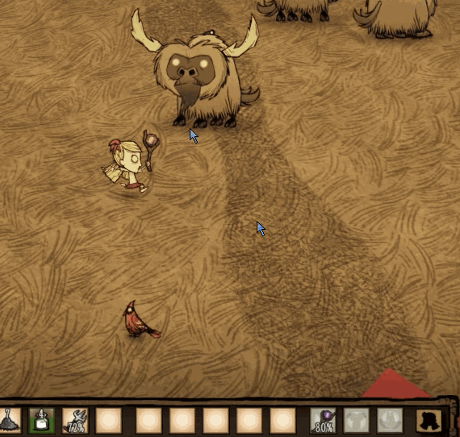

> 武器使用后，有个冷却的倒计时，这个功能本是熔炉里的，后来klei把熔炉给关了，神话模组里就给扣出来自用了，所以下面这个 `rechargeable` 组件我是从神话里扣出来的
>
> 与其说是冷却功能，但组件名是充能的意思，嘛，习惯了，下面就叫冷却了

> **喜大普奔，官方在这次旺达更新时把冷却组件给加回来了，这样用起来就更简单了**

看看效果



## 流程

给prefab添加 `rechargeable` 组件后，当需要冷却时，就只需调用一下 `Discharge()` 方法即可，在这个方法里会推送一个事件 `rechargechange` 然后在玩家的 `inventoryitem_replica` 组件里会接收这个事件进行效果的展示

所以我们就只缺一个 `rechargeable` 组件而已，把组件添加到mod里，在合适的位置调用一下 `Discharge()` 方法就有效果了

## 组件

**这个组件代码已经不需要了**，直接往下翻，看使用方法即可

scripts/components/rechargeable.lua
```lua
local Rechargeable = Class(function(self, inst)
    self.inst = inst
    self.recharge = -2
    self.rechargetime = 255
    self.recharging = false
    self.target_time = nil
end)

function Rechargeable:SetRechargeTime(time)
    self.rechargetime = time -- totaltime
    self.recharge = 0
end

function Rechargeable:SetRechargeRate(fn)
    self.rechargingrate = fn
end

function Rechargeable:StartRecharging()
    self.recharging = true

    if self.target_time == nil then
        local rate = self.rechargingrate ~= nil and self.rechargingrate(self.inst) or 1

        self.target_time = self.rechargetime * rate
    end
    if self.rechargingfn ~= nil then
        self.rechargingfn(self.inst)
    end
    self.inst:PushEvent("rechargechange", {
        percent = self:GetPercent()
    })

    if self.inst.replica.inventoryitem ~= nil then
        self.inst.replica.inventoryitem:SetChargeTime(self:GetRechargeTime())
    end
    if self.inst.components.aoetargeting ~= nil then -- turn off
        self.inst.components.aoetargeting:SetEnabled(false)
    end

    self.inst:StartUpdatingComponent(self)
end

function Rechargeable:StopRecharging()
    self.inst:StopUpdatingComponent(self) -- to stop

    self.recharging = false
    self.recharge = 0
    self.target_time = nil

    if self.stoprechargfn ~= nil then
        self.stoprechargfn(self.inst)
    end

    self.inst:PushEvent("rechargechange", {
        percent = self:GetPercent()
    })

    if self.inst.components.aoetargeting ~= nil then -- turn on
        self.inst.components.aoetargeting:SetEnabled(true)
    end
end

function Rechargeable:OnUpdate(dt)
    self.recharge = self.recharge + dt

    if self.recharge >= self.target_time then
        self:StopRecharging()
    end
end

function Rechargeable:GetPercent()
    if self.recharging == true then
        return math.min(1, self.recharge / (self.target_time ~= nil and self.target_time or self.rechargetime))
    else
        return 1
    end
end

function Rechargeable:GetDebugString()
    if self.recharging == true then
        return string.format("percent: %2.2f ", self:GetPercent())
    else
        return "recharged"
    end
end

function Rechargeable:GetRechargeTime()
    return self.recharging == true and (self.target_time ~= nil and self.target_time or self.rechargetime) or 0
end

function Rechargeable:OnSave()
    return {
        time = self.recharge,
        target_time = self.target_time
    }
end

function Rechargeable:OnLoad(data)
    if data ~= nil and data.time ~= nil and data.time ~= 0 then
        if data.target_time ~= nil then
            self.target_time = data.target_time
        end
        self.recharge = data.time
        self:StartRecharging()
    end
end

return Rechargeable
```

用法

我这里用的是传送魔杖做的例子

```lua
AddPrefabPostInit("telestaff", function(inst)
    -- 增加一个冷却标签标签
    inst:AddTag("rechargeable")

    if not TheWorld.ismastersim then
        return inst
    end
    -- 判断有没有冷却组件，没有的话，就添加上
    if not inst.components.rechargeable then
        inst:AddComponent("rechargeable") -- 添加冷却组件
        inst.components.rechargeable:SetRechargeTime(15) -- 15秒冷却时间
        inst:RegisterComponentActions("rechargeable") -- 注册冷却动作，我没测过不加的话是否可行，有兴趣的可以试一下
    end

    -- hook 施法函数，在施法完成时开启冷却
    -- 我这只做了效果，没做功能（就是说没限制施法完后在冷却阶段是不能施法的，这个我没限制）
    if inst.components.spellcaster then
        local spellfn = inst.components.spellcaster.spell
        inst.components.spellcaster:SetSpellFn(function(inst, target)
            spellfn(inst, target)

            -- 开启冷却
            inst.components.rechargeable:StartRecharging()
        end)
    end
end)
```

## 使用

使用官方的冷却组件，我这里用的是传送魔杖做的例子

```lua
AddPrefabPostInit("telestaff", function(inst)
    if not TheWorld.ismastersim then
        return inst
    end
    -- 判断有没有冷却组件，没有的话，就添加上
    if not inst.components.rechargeable then
        inst:AddComponent("rechargeable") -- 添加冷却组件
    end

    -- hook 施法函数，在施法完成时开启冷却
    -- 我这只做了效果，没做功能（就是说没限制施法完后在冷却阶段是不能施法的，这个我没限制）
    if inst.components.spellcaster then
        local spellfn = inst.components.spellcaster.spell
        inst.components.spellcaster:SetSpellFn(function(inst, target)
            spellfn(inst, target)

            -- 开启冷却
            inst.components.rechargeable:Discharge(20) -- 20是冷却时间
        end)
    end
end)
```