## 准备

饥荒里的音乐制作也有工具 名为 `fmod_designer`

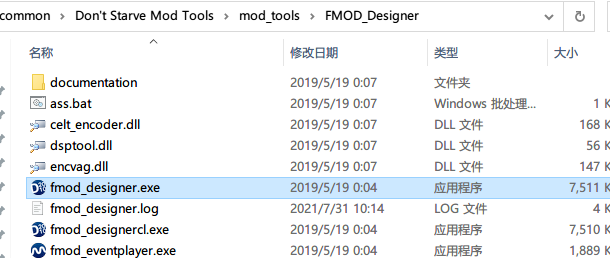

有了工具，接着找素材，我在网上找了两个音频

- [人物死亡时发出的Oh No](sound/oh_no.mp3)
- [走进特定地形时触发的背景音乐](sound/bg_room.mp3)

## 制作

上面准备的mp3素材是没法在饥荒里直接使用的，要通过 `fmod_designer` 软件加工一下

打开 `fmod_designer` 软件，新建一个项目，我这创建的项目名为 `demo_0`

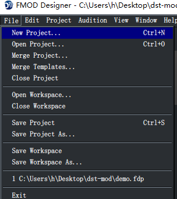

然后进行如下操作

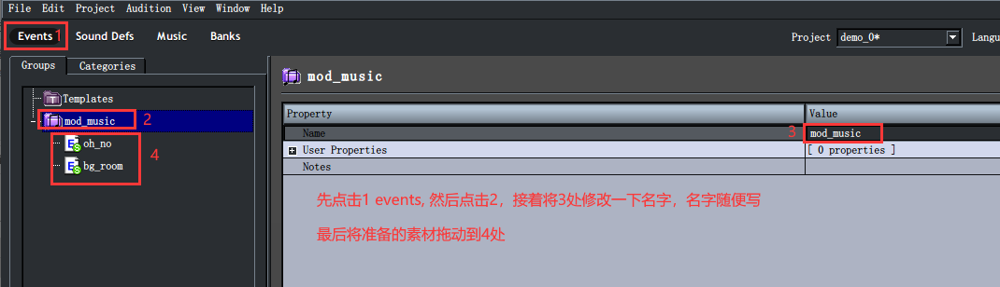

然后点击 categories 分类，对master点击右键，选择Add Event Category

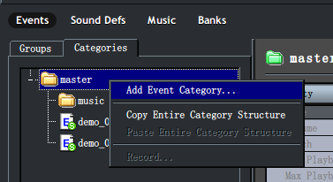

这个Event Category的命名是固定的，我准备的两个素材里一个是音效，一个是背景音乐，所以这里要创建两个

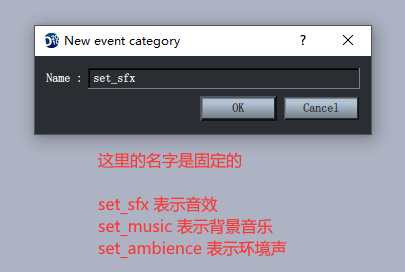

创建好之后，将对应的音乐拖动进去即可

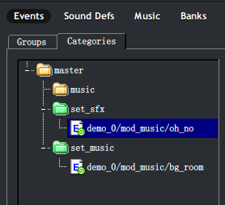

注意一点，前景音乐一般是重复播放的，所以还要将前景音乐的播放模式选成循环播放模式

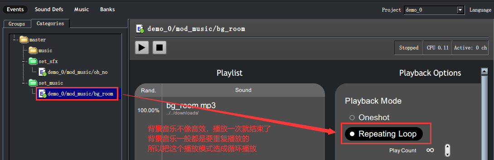

最后设置一下banks(可选的，改不改都行)


最后按 Ctrl+B 或者点击Project->Build也可以对项目进行编译

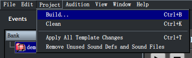

编译要把bank给勾选上

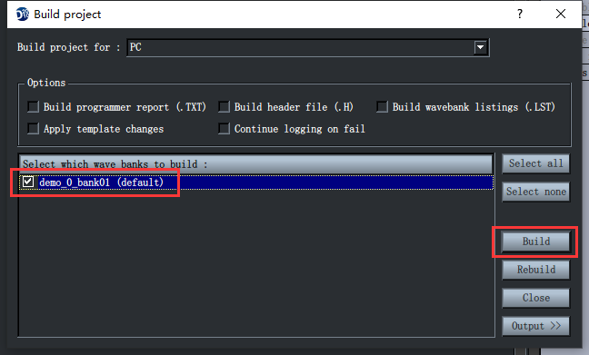

成功之后在项目文件地址里就可以看到多出来两个新文件 `demo_0.fev` `demo_0_bank01.fsb`

可以看到 fsb 文件的文件名就是刚在软件里设置的bank名

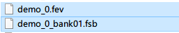

## 创建mod

创建mod不多说了

在mod文件夹里创建一个 `sound` 文件夹，然后将上面生成的两个文件拷贝到这个目录下

在modmain.lua里要引入一个这两个音乐文件

```lua
Assets = {Asset("SOUNDPACKAGE", "sound/demo_0.fev"), Asset("SOUND", "sound/demo_0_bank01.fsb")}
```

然后通过api对玩家死亡事件进行监听，进而触发音效

```lua
Assets = {Asset("SOUNDPACKAGE", "sound/demo_0.fev"), Asset("SOUND", "sound/demo_0_bank01.fsb")}

AddPlayerPostInit(function(inst)
    inst:ListenForEvent("death", function(cause, afflicter)
        inst.SoundEmitter:PlaySound("demo_0/mod_music/oh_no")
    end)
end)
```

**inst.SoundEmitter:PlaySound()这个方法里的这个路径是怎么来的？**

这个路径可以在软件里看到，如下图

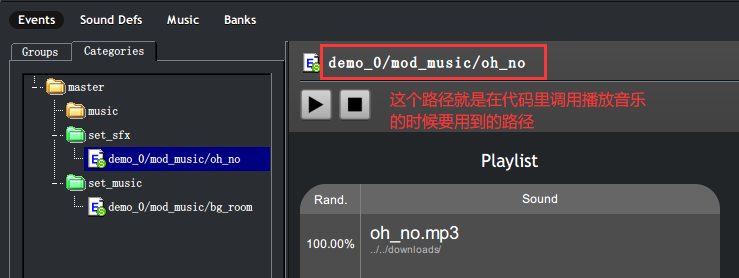

下面来自定义一个地形，这部分教程在 [map](https://tomoya92.github.io/dstmod-tutorial/#/map) 篇里有讲，这里我就直接放代码了

在mod文件夹里创建 `modworldgenmain.lua` 文件，添加下面代码
```lua
local MapTags = require("map/maptags")

--------------------------------------------------------------------------------

-- 这部分代码是给room添加自定义的标签

local NewMapTags = function()
    local oldMapTags = MapTags()
    oldMapTags.Tag["CUS_NewRoom"] = function(tagdata)
        return "TAG", "CUS_NewRoom"
    end
    return oldMapTags
end

GLOBAL.package.loaded["map/maptags"] = NewMapTags

--------------------------------------------------------------------------------

AddRoom("CUS_MoonLand", { -- 名字随便取，不过不要跟游戏默认的重复了
    colour = { -- 调试用的，不用管它
        r = .5,
        g = .8,
        b = .5,
        a = .50
    },
    value = GLOBAL.GROUND.METEOR, -- 地皮，我这选择的是月岛的地皮，可去 constants.lua 文件里查看 GROUND 对象
    tags = {"ExitPiece", "CUS_NewRoom"}, -- room的标签，用于触发一些事件的，比如月岛地形走上去反转理智
    contents = { -- 这里定义的是地形上的资源分布
        countprefabs = {},
        distributepercent = .6,
        distributeprefabs = { -- 分布的资源（都是预制体名）后面数字是占比，下面添加的都是月岛上的实体
            moon_tree = 0.3, -- 月树
            sapling_moon = 0.3,
            carrat_planted = 0.2,
            moon_tree_blossom_worldgen = 0.2,
            ground_twigs = 0.1,
            rock_avocado_bush = 0.1,
            moonglass_rock = 0.05, -- 玻璃
            moon_fissure = 0.2
        }
    }
})

AddTask("CUS_MoonLand_TASK", { -- 名字随便取，也不要跟游戏默认的重复了
    locks = {GLOBAL.LOCKS.NONE},
    keys_given = {},
    room_tags = {"CUS_NewRoom"},
    room_choices = { -- 给当前task添加room，我这就只添加上面定义的那一个room，后面数字是节点数，节点数越大，地形就越大
        ["CUS_MoonLand"] = 3
    },
    room_bg = GLOBAL.GROUND.METEOR, -- 地皮类型
    background_room = "CUS_MoonLand",
    colour = {
        r = 0.6,
        g = 0.6,
        b = 0.0,
        a = 1
    }
})

AddTaskSetPreInit("default", function(task)
    table.insert(task.tasks, "CUS_MoonLand_TASK")
end)
```

在 modmain.lua 里对玩家进入特定区域进行监听，从而进行前景音乐的播放

```lua
Assets = {Asset("SOUNDPACKAGE", "sound/demo_0.fev"), Asset("SOUND", "sound/demo_0_bank01.fsb")}

AddPlayerPostInit(function(inst)
    inst:ListenForEvent("death", function(cause, afflicter)
        inst.SoundEmitter:PlaySound("demo_0/mod_music/oh_no")
    end)

    -- 对玩家当前所处位置变动进行监听
    inst:ListenForEvent("changearea", function(inst, area)
        local cus_newroom = area ~= nil and area.tags and table.contains(area.tags, "CUS_NewRoom") -- 判断玩家所在地形是否含有 CUS_NewRoom 标签
        if cus_newroom then
            inst.SoundEmitter:PlaySound("demo_0/mod_music/bg_room", "bg_room") -- 第二个参数是给当前音乐起个名字，用于停止这个音乐的播放的
        else
            inst.SoundEmitter:KillSound("bg_room")
        end
    end)
end)
```

进游戏看效果

<video width="800" height="450" controls>
    <source src="video/1627701055547.mp4" type="video/mp4">
    Your browser does not support the video tag.
</video>
