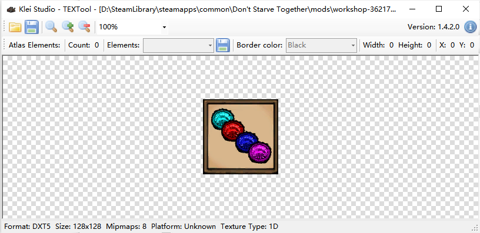
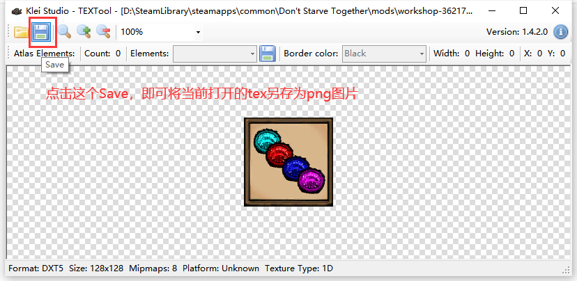
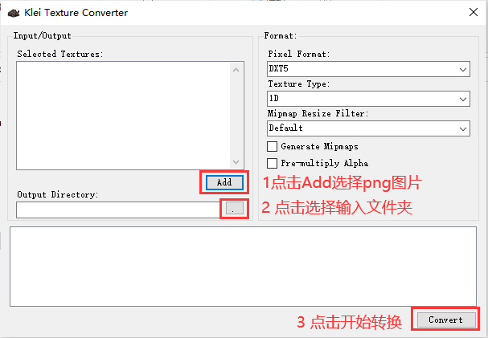

## 打开TEX文件

饥荒里的贴图都被转成了 `.tex` 后缀的文件，打开它需要使用 textool 工具，下载地址 [txtool1.4.2.zip](attachment/txtool1.4.2.zip)

解压，再打开 `.tex` 后缀的文件，就使用里面的 `TEXTool.exe` 打开即可（或者直接把tex文件拖动到`TEXTool.exe`上去也是可以打开的）

## TEX转PNG

## PNG转TEX

打开 `txtool1.4.2` 文件夹，里面除了 `TEXTool.exe` 这个程序外还有一个 `TEXCreator.exe` 程序，打开它

---

**还有种更简单的方法**

在 `..\SteamLibrary\steamapps\common\Don't Starve Together\mods` 文件夹下创建一个mod，比如我这演示用的 `quick-start`

在 `quick-start` 里创建 `images` 文件夹，然后把要转成tex的图片给放到这个文件夹里，运行 `Don't Starve Mod Tools` 里的 `autocompiler.exe` 即可

