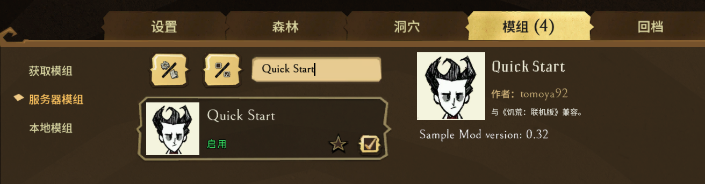
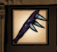

这一篇来介绍一下利用最常用的一个api `AddPrefabPostInit()` 来去掉触手尖刺的使用次数限制

> 在modmain.lua里使用 modutil.lua 里的api是不需要添加 GLOBAL 变量的，但比如像一些 `TheWorld` `TheInput` `TheSim` `TheNet` 等等 这些东西就需要使用GLOBAL才能获取到，因此一般都写作 `GLOBAL.TheWorld` `GLOBAL.TheInput` `GLOBAL.TheSim` `GLOBAL.TheNet`

> 关于本篇中出现的 prefab, components, tentaclespike, finiteuses 等，在进阶中的mod常见api那篇里会有详细说明

打开modmain.lua文件，在里面添加上如下代码

```lua
AddPrefabPostInit("tentaclespike", function(inst)
    if inst.components.finiteuses then
        inst:RemoveComponent("finiteuses")
    end
end)
```

因为修改触手尖刺的使用次数限制是直接作用于 prefab(预制体) 上，所以这个mod必须要是服务端mod才行，所以还需要对 modinfo.lua 进行修改

```lua
-- 是否是客户端mod
client_only_mod = false
-- 是否是所有客户端都需要安装
all_clients_require_mod = true
```

修改好之后，保存，启动游戏，在服务端模组里勾选上



进游戏看看效果，可以看到尖刺上的100%耐久已经没有了


