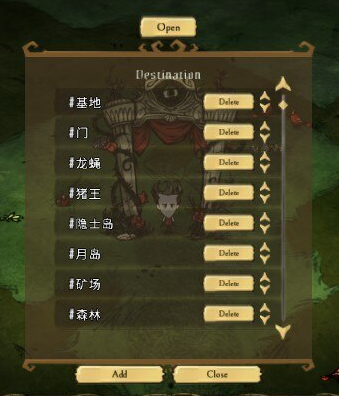

## 前言

> ui与widget那篇用法是一样的，只不过，ui里用到了好多控件官方都给封装好了

之前不会写mod时，看到木牌传送这种mod就特别好奇，那个弹窗是怎么弄出来的？还有弹窗里的滚动条是怎么出来的？弹窗里的按钮是怎么添加上的，都是自己画的么？

其实这些官方都封装好了，不需要自己画，也不需要自己去一点一点组装，官方给的就有模板

> 其实创建存档时的界面就是ui

这些控件的模板都在 `scripts/widgets/redux/templates.lua` 文件里

下面就来写个带滚动条的弹窗，模组链接：https://steamcommunity.com/sharedfiles/filedetails/?id=2605922351



## 声明面板

首先定义一个矩形面板，矩形面板里，上面有个文本 `Destination` 下面有两个按钮，中间先不管，代码如下

scripts/screens/transferpanel.lua
```lua
local TEMPLATES = require "widgets/redux/templates"

local TransferPanel = Class(Screen, function(self, owner)
    Screen._ctor(self, "TransferPanel")
    self.owner = owner

    -- TEMPLATES.RectangleWindow() 方法的构造方法参数如下
    -- TEMPLATES.RectangleWindow(sizeX, sizeY, title_text, bottom_buttons, button_spacing, body_text)
    -- sizeX: 宽
    -- sizeY: 高
    -- title_text 面板title
    -- bottom_buttons 底部按钮
    -- button_spacing 按钮间距
    -- body_text 面板的文本
    self.panel = self:AddChild(TEMPLATES.RectangleWindow(400, 500, "Destination", {
        {text = "Add", cb = function()end, offset = nil},
        {text = "Close", cb = function()end, offset = nil},
    }))
end)
```

添加到playerhud.lua里去

modmain.lua
```lua
local TarnsferPanel = GLOBAL.require("screens/transferpanel")
AddClassPostConstruct("screens/playerhud", function(self)
    -- 在屏幕顶部添加一个按钮，用来触发面板的显示与关闭
    self.openbutton = self:AddChild(TEMPLATES.StandardButton(function() self:ChangeTransferPanelState() end , "Open", {100, 50}))
    self.openbutton:SetVAnchor(ANCHOR_TOP)
    self.openbutton:SetHAnchor(ANCHOR_MIDDLE)
    self.openbutton:SetScaleMode(SCALEMODE_PROPORTIONAL)
    self.openbutton:SetMaxPropUpscale(MAX_HUD_SCALE)

    function self:ChangeTransferPanelState()
        self:ShowTarnsferPanel()
    end

    -- 显示面板
    self.ShowTarnsferPanel = function(_, attach)
        self.transferpanel = TarnsferPanel(self.owner)
        self:OpenScreenUnderPause(self.transferpanel)
        return self.transferpanel
    end
    -- 关闭面板
    self.CloseTarnsferPanel = function(_)
        if self.transferpanel then
            self.transferpanel:Close()
            self.transferpanel = nil
        end
    end
end)
```

进游戏，打开应该就能看到一个矩形面板了，上面有个title，下面有两个按钮

## 添加滚动条

滚动条也是个控件，在 `templates.lua` 里，名字叫 `ScrollingGrid()` 下面就将其添加进panel里就可以了

scripts/screens/transferpanel.lua
```lua
local TEMPLATES = require "widgets/redux/templates"

local TransferPanel = Class(Screen, function(self, owner)
    Screen._ctor(self, "TransferPanel")
    self.owner = owner

    -- TEMPLATES.RectangleWindow() 方法的构造方法参数如下
    -- TEMPLATES.RectangleWindow(sizeX, sizeY, title_text, bottom_buttons, button_spacing, body_text)
    -- sizeX: 宽
    -- sizeY: 高
    -- title_text 面板title
    -- bottom_buttons 底部按钮
    -- button_spacing 按钮间距
    -- body_text 面板的文本
    self.panel = self:AddChild(TEMPLATES.RectangleWindow(400, 500, "Destination", {
        {text = "Add", cb = function()end, offset = nil},
        {text = "Close", cb = function()end, offset = nil},
    }))

    ------------------------------------scroll-----------------------------------------
    -- 初始化每一项的方法
    local function DestItemCtor(content, index)
        local widget = Widget("widget-"..index)

        widget:SetOnGainFocus(function()
            self.scrollpanel:OnWidgetFocus(widget)
        end)
        -- self:InitDestItem() 每一项里的控件布局
        widget.destitem = widget:AddChild(self:InitDestItem())

        return widget
    end

    -- 给每一项赋值，添加事件的方法
    local function DestApply(context, widget, data, index)
        widget.destitem:Hide()
        if data then
            widget.destitem.name:SetString(data.name)
            widget.destitem.backing:SetOnClick(function()end)
            widget.destitem:Show()
            widget.destitem.name._index = data.index
        end
    end

    -- 滚动条控件的数据源
    self.destitems = {
        {index = 1, name = "abc1", x = 0, y = 0, z = 0},
        {index = 2, name = "abc2", x = 0, y = 0, z = 0},
        {index = 3, name = "abc3", x = 0, y = 0, z = 0},
        {index = 4, name = "abc4", x = 0, y = 0, z = 0},
        {index = 5, name = "abc5", x = 0, y = 0, z = 0},
        {index = 6, name = "abc6", x = 0, y = 0, z = 0},
        {index = 7, name = "abc7", x = 0, y = 0, z = 0},
        {index = 8, name = "abc8", x = 0, y = 0, z = 0},
        {index = 9, name = "abc9", x = 0, y = 0, z = 0},
        {index = 10, name = "abc10", x = 0, y = 0, z = 0},
    }
    -- 将滚动条添加到self.panel里去
    self.scrollpanel = self.panel:AddChild(TEMPLATES.ScrollingGrid(self.destitems, {
        num_columns = 1,             -- 有几个滚动条
        num_visible_rows = 8,        -- 滚动条内最多显示多少行
        item_ctor_fn = DestItemCtor, -- 每一项的构造方法
        apply_fn = DestApply,        -- 给每一项赋值，添加事件等
        widget_width = 380,          -- 每一项的宽
        widget_height = 50,          -- 每一项的高
        end_offset = nil,
    }))
    -----------------------------------------------------------------------------------

    -- 最后要把滚动条挂到父组件上的 self.default_focus 对象上去
    self.default_focus = self.scrollpanel
end)

-- 定义每一项内的控件布局
function TransferPanel:InitDestItem()
    local dest = Widget("destination")
    local width, height = 380, 50
    dest.backing = dest:AddChild(TEMPLATES.ListItemBackground(width, height, function() end))
    dest.backing.move_on_click = true

    -- 名字文件控件,TextEdit是可编辑控件
    dest.name = dest:AddChild(TextEdit(BODYTEXTFONT, 35))
    dest.name:SetColour(255, 255, 255, 1)
    dest.name:SetEditTextColour(255, 255, 255, 1)
    dest.name:SetIdleTextColour(255, 255, 255, 1)
    dest.name:SetVAlign(ANCHOR_MIDDLE)
    dest.name:SetHAlign(ANCHOR_LEFT)
    dest.name:SetPosition(-90, 0, 0)
    dest.name:SetRegionSize(150, 40)
    -- 编辑完成后，当点回车时的回调
    dest.name.OnTextEntered = function(text)
        -- todo()
    end

    -- 删除按钮
    dest.deletebtn = dest:AddChild(TEMPLATES.StandardButton(function()end , "Delete", {90, 40}))
    dest.deletebtn:SetPosition(100, 0)

    -- 上移按钮
    dest.up_button = dest:AddChild(ImageButton("images/global_redux.xml", "scrollbar_arrow_up.tex"))
    dest.up_button:SetPosition(160, 10)
    dest.up_button:SetScale(0.2)
    dest.up_button:SetOnClick(function()end)

    -- 下移按钮
    dest.down_button = dest:AddChild(ImageButton("images/global_redux.xml", "scrollbar_arrow_down.tex"))
    dest.down_button:SetPosition(160, -10)
    dest.down_button:SetScale(0.2)
    dest.down_button:SetOnClick(function()end)

    -- 将定义好的组件返回
    return dest
end
```

再次启动游戏，滚动条就会出现了，并且上面也会有数据被渲染出来了

## 一些方法

- SetItemsData() 用于更新滚动条数据源的，用法：`self.scrollpanel:SetItemsData(newdestitems)`
- GetScale() 用于获取控件的缩放比例的，返回值是 (x,y,z) 可以参与边距坐标的运算，从而实现屏幕不管放大还是缩小，都能保持固定的位置
