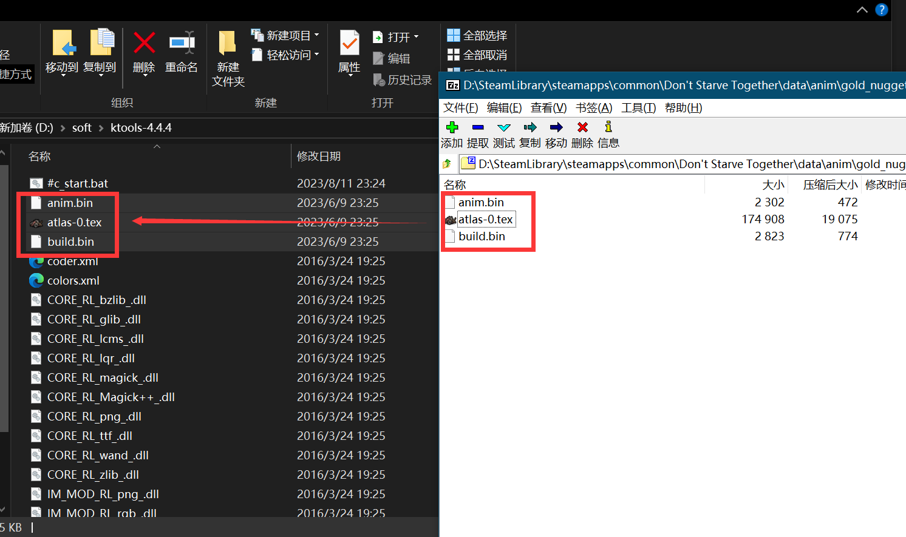
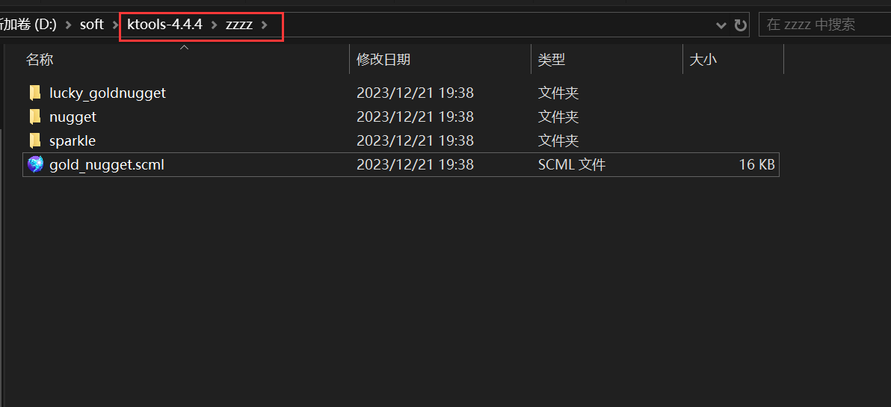
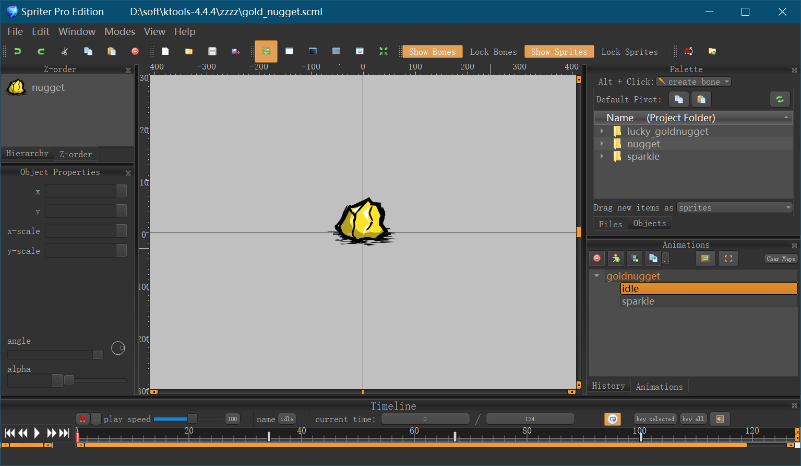

> 开发mod中少不了解压官方的动画看看，这篇就来介绍一下官方动画是怎么解压出来的

## 工具

解压工具需要用到 [ktools](https://atjiu.github.io/dstmod-tutorial/attachment/ktools-4.4.4.zip) 将其下载后解压到电脑上

**注意：存放路径不能有中文**

比如存放在 `D:/ktools-4.4.4`

## 官方动画

官方动画位置在 `Don't Starve Together\data\anim` 里，这里以金块为例

找到金块的预制体文件 `goldnugget.lua` ，打开，在文件的最上面定义的就是动画

```lua
local assets =
{
    Asset("ANIM", "anim/gold_nugget.zip"),
}
```

下面就演示一下将`gold_nugget.zip`解压出来

## 解压动画

打开 `gold_nugget.zip` 将里面的所有文件都拖放到 `D:/ktools-4.4.4` 里



双击运行 `D:/ktools-4.4.4/#c_start.bat` 结束后就会在当前文件里生成一个 `zzzz` 的文件夹



## 打开动画

官方给我们准备好了打开 `.scml` 文件的工具，位置在 `SteamLibrary\steamapps\common\Don't Starve Mod Tools\mod_tools\Spriter\Spriter.exe`

使用 `Spriter.exe` 打开 `gold_nugget.scml` 文件即可查看具体的动画内容



