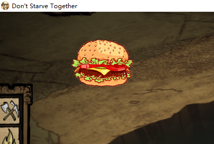
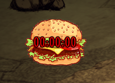
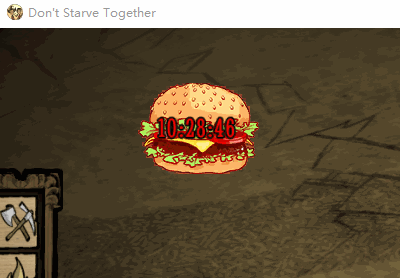

## 前言

饥荒里所有界面上能显示的文字，徽章，图片，按钮等都是widget，包括screen

常见的例子：三围(badge)，装备栏(item_solt)，打开地图(button)等等

## 官方封装好的

- text
- button
- image
- badge
- uianim
- imagebutton
- menu
- ...

非常多的widget，有兴趣可以去 widgets 目录下翻查

## 创建一个widget

创建自己的widget很简单，只需要继承父类widget即可

文件位置：`scripts/widgets/currentdatewidget.lua`
```lua
local Widget = require "widgets/widget"

local CurrentDateWidget = Class(Widget, function(self, owner)
    Widget._ctor(self, "CurrentDateWidget")
    self:SetScale(2, 2) -- 将badge放大为三围大小的两倍
end)

return CurrentDateWidget
```

上面代码只是定义了一个空的 widget, 里面还啥都没有，要想里面有点啥，还要借助一些官方定义好的子类，比如添加图片的 image, 添加动画的 uianim, 添加文本的 text

## 添加贴图

同样的找一张png的图片，放在mod文件夹下的images文件夹里，自动编译生成 tex，xml文件

在一个widget里添加其它的widget用到的方法是 AddChild()，它的返回值就是被添加的widget

```lua
local Widget = require "widgets/widget"
local Image = require "widgets/image" -- 引入image控件

local CurrentDateWidget = Class(Widget, function(self, owner)
    Widget._ctor(self, "CurrentDateWidget")
    self:SetScale(2, 2) -- 将badge放大为三围大小的两倍

    -- 在widget里添加上图片 下面self.myimage 里的 myimage 是随便定义的，就是用来接收AddChild()添加的图片控件的对象的
    self.myimage = self:AddChild(Image("images/current_date.xml", "current_date.tex"))
    self.myimage:SetScale(0.5, 0.5) -- 设置添加的image控件的缩放大小
end)

return CurrentDateWidget
```

> 可能有人会问了，self:AddChild(Image("images/current_date.xml", "current_date.tex")) 这段代码里的Image()函数里面你咋就知道第一个传的是xml，第二个传的是tex呢？
>
> 这个参数其实是在 `widgets/image` 里定义Image对象的时候就把参数指定好了，打开 `widgets/image.lua` 文件，可以看到这么一段代码 `Image = Class(Widget, function(self, atlas, tex, default_tex)` 可以看其实有三个参数，最后一个是指定默认的贴图的，防止贴图没找到widget显示有问题的

定义好了还要在modmain.lua里通过api给添加到主界面里去

```lua
-- 引入widget里添加的素材
Assets = {Asset("ATLAS", "images/current_date.xml"), Asset("IMAGE", "images/current_date.tex")}

local CurrentDateWidget = require("widgets/currentdatewidget")
AddClassPostConstruct("widgets/controls", function(self, owner)
    self.CurrentDateWidget = self:AddChild(CurrentDateWidget(self.owner)) -- 相似的写法，将CurrentDateWidget又当成子项给添加进widgets/controls里面去

    self.CurrentDateWidget:SetHAnchor(1) -- 设置原点x坐标位置，0、1、2分别对应屏幕中、左、右
    self.CurrentDateWidget:SetVAnchor(1) -- 设置原点y坐标位置，0、1、2分别对应屏幕中、上、下

    self.CurrentDateWidget:SetPosition(200, -100) -- 设置widget的位置，上面通过 SetHAnchor，SetVAnchor两个函数设置了大致位置，这里的坐标原点就是以这两个函数设置的方向为基础计算的，左减右加，上加下减
    -- 举例：如上设置是将widget放在左上，那么屏幕的左上角的坐标就是(0,0)根据左减右加，上加下减，就可以知道，SetPosition(200, -100)是将widget往右移了200单位，往下移了100单位

    self.CurrentDateWidget:Show()
end)
```

进游戏看效果



## 添加文本

重新打开 `currentdatewidget.lua` 文件，同样的使用AddChild()方法将text控件给添加到父widget里去

```lua
local Widget = require "widgets/widget"
local Image = require "widgets/image"
local Text = require "widgets/text"

local CurrentDateWidget = Class(Widget, function(self, owner)
    Widget._ctor(self, "CurrentDateWidget")
    self:SetScale(2, 2) -- 将badge放大为三围大小的两倍

    -- 在widget里添加上图片
    self.myimage = self:AddChild(Image("images/current_date.xml", "current_date.tex"))
    self.myimage:SetScale(0.5, 0.5)

    -- 在widget里添加上文本
    -- NUMBERFONT 字体名，在 fonts.lua 里可以找到，有很多字体可选
    -- 18是字体大小
    -- "00:00:00" 显示的内容
    -- {255, 0, 0, 1} 文本的颜色，对应rgba，最后a是透明度，1完全不透明，0完全透明，我选的这个值是个红色的
    self.mytext = self:AddChild(Text(NUMBERFONT, 18, "00:00:00", {255, 0, 0, 1}))
end)

return CurrentDateWidget
```

进游戏看效果



## 动起来

有了贴图，也有了文本，是时候让文本有变化了，我这里用的是实时更新当前时间的例子

在`currentdatewidget.lua`文件里定义一个方法，其实不在widget里定义也是可以的，在modmain.lua里拿到`CurrentDateWidget`对象后，文本的实例就在 `CurrentDateWidget.mytext` 上，但编程讲究封装，好处自然是清晰，易读

```lua
local Widget = require "widgets/widget"
local Image = require "widgets/image"
local Text = require "widgets/text"

local CurrentDateWidget = Class(Widget, function(self, owner)
    Widget._ctor(self, "CurrentDateWidget")
    self:SetScale(2, 2) -- 将badge放大为三围大小的两倍

    -- 在widget里添加上图片
    self.myimage = self:AddChild(Image("images/current_date.xml", "current_date.tex"))
    self.myimage:SetScale(0.5, 0.5)

    -- 在widget里添加上文本
    self.mytext = self:AddChild(Text(NUMBERFONT, 18, "00:00:00", {255, 0, 0, 1}))
end)

-- 定义一个更新文本内容的方法
function CurrentDateWidget:OnUpdate(time)
    self.mytext:SetString(time)
end

return CurrentDateWidget
```

在modmain.lua里获取当前时间并调用 OnUpdate() 方法更新

```lua
Assets = {Asset("ATLAS", "images/current_date.xml"), Asset("IMAGE", "images/current_date.tex")}

local CurrentDateWidget = require("widgets/currentdatewidget")
AddClassPostConstruct("widgets/controls", function(self, owner)
    self.CurrentDateWidget = self:AddChild(CurrentDateWidget(self.owner))

    self.CurrentDateWidget:SetHAnchor(1) -- 设置原点x坐标位置，0、1、2分别对应屏幕中、左、右
    self.CurrentDateWidget:SetVAnchor(1) -- 设置原点y坐标位置，0、1、2分别对应屏幕中、上、下

    self.CurrentDateWidget:SetPosition(200, -100) -- 设置widget的位置，上面通过 SetHAnchor，SetVAnchor两个函数设置了大致位置，这里的坐标原点就是以这两个函数设置的方向为基础计算的，左减右加，上加下减
    -- 举例：如上设置是将widget放在左上，那么屏幕的左上角的坐标就是(0,0)根据左减右加，上加下减，就可以知道，SetPosition(200, -100)是将widget往右移了200单位，往下移了100单位

    self.CurrentDateWidget:Show()

    -- 创建一个空实例，用来启动定时器的
    local inst = GLOBAL.CreateEntity()
    inst:DoPeriodicTask(1, function()
        -- 获取时分秒
        local hour = GLOBAL.os.date("%H")
        local minute = GLOBAL.os.date("%M")
        local second = GLOBAL.os.date("%S")

        -- 更新文本信息
        self.CurrentDateWidget:OnUpdate(hour .. ":" .. minute .. ":" .. second)
    end)

end)
```

进游戏看效果



## 总结

上面仅介绍了widget的定义和列举了image, text两个widget的用法，至于其它的widget怎么用，可以按照这个思路去自动摸索
